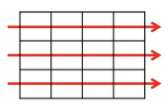
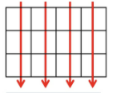
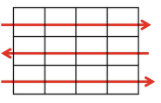
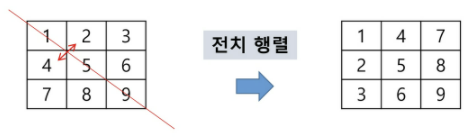

# Array

## 2차 배열

### 선언

- 차원에 따라 index 선언
- 세로 길이 (행의 개수), 가로 길이 (열의 개수) 필요


```py'
arr = [[0, 1, 2, 3], [4, 5, 6, 7]]
```

### 행 우선 순회



```python
# i 행의 좌표
# j 열의 좌표
for i in range(len(Array)):
    for j in range(len(Array[i])):
    	Array[i][j]
```

### 열 우선 순회



```python
# i 행의 좌표
# j 열의 좌표
for i in range(len(Array[0])):
    for j in range(len(Array)):
    	Array[i][j]
```

### 지그재그 순회



```python
# i 행의 좌표
# j 열의 좌표
for i in range(len(Array)):
    for j in range(len(Array[0]))
    	Array[i][j + (m - 1 - 2 * j) * (i % 2)]
```

### 델타 이용

- 한 좌표에서 4 방향의 인접 배열 요소 탐색 (기준으로)

```python
arr[0...n-1][0...n-1]
dx[] = [0, 0, -1, 1] # 상하좌우
dy[] = [-1, 1, 0, 0] 
    
for x in range(len(ary)):
    for y in range(len(ary[x])):
        for i in range(4):
            textX <- x + dx[mode] # 0, 1, 2, 3
            testY <- y + dy[mode]
            test(ary[testX][testY])
    
d = [[0, -1], [0, 1], [-1, 0], [1, 0]]
```

- 8 방향

### 전치 행렬



- 열, 행 우선을 한개로 가능

```python
# i : 행의 좌표, len(arr)
# j : 열의 좌표, len(arr[0])
arr = [[1, 2, 3], [4, 5, 6], [7, 8, 9]] # 3*3 행렬

for i in range(3):
    for j in range(3):
        if i < j:
            arr[i][j], arr[j][i] = arr[j][i], arr[i][j]
```

### 연습문제

```python
"""
델타검색
5x5 2차 배열에 무작위로 25개의 숫자로 초기화 한 후
25개의 각 요소에 대해서 그 요소와 이웃한 요소와의 차의 절대값을 구하시오.
예를 들어 아래 그림에서 7 값의 이웃한 값은 2, 6, 8, 12 이며 차의 절대값의 합은 12 이다.
| 2 – 7 | + | 6 – 7 | + | 8 – 7 | + | 12 – 7 | = 12


25개의 요소에 대해서 모두 조사하여 총합을 구하시오.
벽에 있는 요소는 이웃한 요소가 없을 수 있음을 주의하시오.
예를 들어 [0][0]은 이웃한 요소가 2개이다.
"""

dr = [-1, 1, 0, 0]
dc = [0, 0, -1, 1]

T = int(input())
for t in range(1, T + 1):
    # 2차원 배열 입력 받기
    arr = [list(map(int, input().split())) for _ in range(5)]
    # 각 요소에서의 이웃한 요소와의 차의 절대값의 전체 합을 담을 변수
    total = 0
    for i in range(5):
        for j in range(5):
            for k in range(4):
                nr = i + dr[k]
                nc = j + dc[k]
                # 상하좌우 중에 이차원 배열을 벗어나는 인덱스를 갖게 되는 경우, 혹은 인덱스가 -1인 경우가 아닐 때만 실행
                if 0 <= nr < 5 and 0 <= nc < 5:
                    dif = arr[nr][nc] - arr[i][j]
                    # 절대값을 구해야하므로 음수이면 -부호를 붙인다.
                    if dif < 0:
                        dif = -dif
                    total += dif
    print('#%d %d' %(t, total))
```

## 부분집합 생성

### 부분집합 합 문제

```python
"""
유한 개의 정수로 이루어진 집합이 있을 때, 이 집합의 부분집합 중에서
그 집합의 원소를 모두 더한 값이 0 이 되는 경우가 있는지 알아내는 문제
예를 들어, [-7, -3, -2, 5, 8]라는 집합이 있을 때, [-3, -2, 5]라는
이 집합의 부분집합이면서 (-3)+(-2)+5=0이므로 답은 참이 된다.
"""
arr = [-7, -3, -2, 5, 8]
n = len(arr)
count = 0

sum = 0
for i in range(1, 1 << n):
    sum = 0
    for j in range(n):
        if i & (1 << j):
            sum += arr[j]
    if sum == 0:
        count += 1
        for j in range(n):
            if i & (1 << j):
                print(arr[j], end=" ")
        print()
print(f"개수: {count}")
```

### 부분집합의 수

```python
bit = [0, 0, 0, 0]
for i in range(2):
    bit[0] = i # 0번째 원소
    for j in range(2):
        bit[1] = j # 1번째 원소
        	for k in range(2):
                bit[2] = k # 2번째 원소
                for l in range(2):
                    bit[3] = l # 3번째 원소
                    print(bit) # 생성된 부분집합 출력
```

### 비트 연산자

|   &    |                     AND                      |
| :----: | :------------------------------------------: |
| **\|** |                    **OR**                    |
| **<<** |   **왼쪽 이동 : 자리가 비다면 0으로 채움**   |
| **>>** | **오른쪽 이동 : 맨 오른쪽에 있던 것은 지움** |

- `1 << n` : 원소 n개일 경우 모든 부분집합의 수 -> 2^n

```python
arr = [3, 6, 7, 1, 5, 4]
n= len(arr)

for i in range(1 << n): # same with 2 ** n, 2^n만큼 반복
    for j in range(n + 1):
        if 1 & (1 << j):
            print(arr[j], end = ", ")
    print()
print()
```

```python
for i in range(16):
    for j = 0, 1, 2, 3 in range(4):
        if i & (1 << j):
            print(arr[j])
```

| i    | 1 << j |
| ---- | ------ |
| 0000 | 0001   |
| 0001 | 0010   |
| 0010 | 0100   |
| 0011 | 1000   |
| 1111 |        |

### 부분집합 합 문제 구현

```python

```


## Binary Search

- 검색 범위를 반으로 줄여가면서
- 자료가 정렬된 상태

```python
def binarySearch(a, key)
	start = 0
    end = length(a) - 1
    while start <= end:
        middle = (start + end) // 2
        if a[middle] == key:
            return True
        elif a[middle] > key:
            end = middle - 1
        else:
            start = middle + 1
    return False
```

```python
def binarySearch2(a, low, high, key):
    if low > high:
        return False
    else:
        middle = (low + high) // 2
        if key == a[middle]:
            return True
        elif key < a[middle]
        	return binarySearch2(a, low, middle-1, key)
        elif a[middle] < key:
            return binarySearch2(a, middle + 1, high, key)
```

## Selection Algorithm

- k번째로 큰 or 작은 원소 찾는 방법
- 최소, 최대, 중간값 찾는 알고리즘

```python
# k번째로 작은 원소
def select(list, k):
    for i in range(0, k):
        minIndex = i
        for j in range(i+1, len(list)):
            if list[minIndex] > list[j]:
                minIndex = j
        list[i], list[minIndex] = list[minIndex], list[i]
    return list[k-1]
```


## 선택 정렬 (Selection Sort)

- 가장 작은 원소부터 차례대로 선택
- 최소값 -> 리스트 맨 앞과 교환

```python
def SelectionSort(a[], n):
	for i from 0 to n - 1
    	a[i],...,a[n-1] 원소 중 최소값 a[k] 찾음
        a[i]와 a[k] 교환
```

```python
def selectionSort(a):
	for i in range(0, len(a)-1):
        min = i
        for j in range(i + 1, len(a)):
            if a[min] > a[j]:
                min = j
        a[i], a[min] = a[min], a[i]
```

