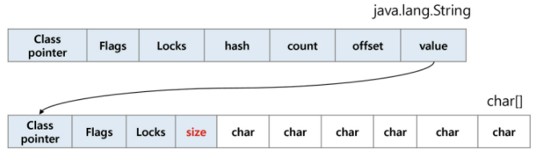
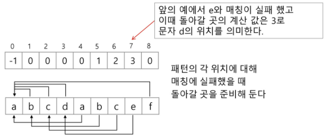
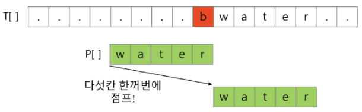
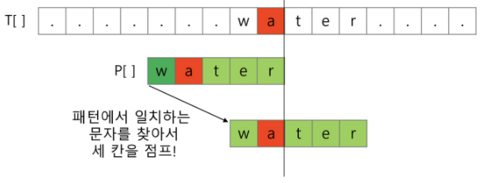
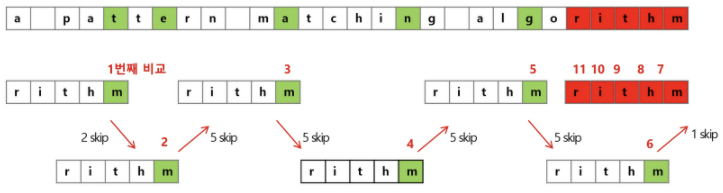

## String

### fixed length

### variable length

- length controlled : `java`

  - 
  - hash, count (문자열 길이), offset (문자열 시작점), value (참조)
  - `String` 클래스

  ```java
  String str="abc"
  String str = new String("abc")
  ```

  - 연산 : 연산자, 메소드 - `+`, `length()`, `split()`, `substring()`
  - `UTF16`, 2 byte

  ```java
  String name = "홍길동";
  System.out.println(name.length()); // 3
  ```

- delimited : `c`

  - 항상 끝에 \ 문자

  ```c
  char ary[]={'a', 'b', 'c', '\0'};
  char ary[]="abc";
  ```

  - 연산 : 함수 형태 - `strlen()`, `strcpy()`, `strcmp()`
  - ASCII 코드

  ```c
  char * name = "홍길동";
  int count = strlen(name);
  printf("%d", count); // 6
  ```

- `python`

  - char X
  - 문자열 기호 - `''`, `""`, `'''`, `"""`
  - 연결 : `+`
  - 반복 : `*`
  - 시퀀스 자료형 : indexing, slicing
  - 메소드 : `replace()`, `split()`, `isalpha()`, `find()`
  - immutable
  - `UTF8`

  ```python
  name = "홍길동"
  print(len(name)) # 3
  ```

### 뒤집기

- 자기 문자열에서 : swap 임시 변수 필요, 반복 수행 - 길이 반만
- 새로운 빈 문자열 : 뒤에서부터 읽기

### 비교

- `c` : `strcmp()`
- `java` : `equals()`
- `python` : `==` (내부적으로 특수 메서드 `__eq__()` 호출, `is`

### 정수 변환

- `c` : `atoi()`, `itoa()` (역함수)
- `java` : `parse` (숫자 클래스), `toString()` (역함수)
- `python` : `int`, `float`, `str`, `repr`

## 패턴 매칭

### 고지식한 패턴 검색 (Brute Force)

- 처음부터 끝까지 차례대로, 일일이 비교

```python
p = "is" # 찾을 패턴
t = "This is a book~!" # 전체 텍스트
M = len(p) # 찾을 패턴의 길이
N = len(t) # 전체 텍스트의 길이

def BruteForce(p, t):
    i = 0 # t의 인덱스
    j = 0 # p의 인덱스
    while j < M and i < N:
        if t[i] != p[j]:
            i = i - j
            j = -1
        i = i + 1
        j = j + 1
    if j == M:
        return i - M # 검색 성공
    else:
        return - 1 # 검색 실패
```

- 시간 복잡도
  - 최악 : `O(MN)`

### 카프-라빈 

- `O(n)`

### KMP

- 불일치가 발생한 앞 부분에서 비교 X
- 패턴 전처리 : 배열 `next[M]` -> 잘못된 시작 최소화
  - `next[M]` : 불일치 -> 이동할 다음 위치
  - 매칭 실패 시 돌아갈 곳 계산
- 시간 복잡도 : `O(M+N)`




### 보이어-무어

- 오른쪽에서 왼쪽
- 오른쪽 끝 문자 불일치 + 패턴 내 존재 X -> 이동 거리 : 패턴 길이
- 문자 다 보지 않고, 오른쪽부터 비교
- 최악 : `O(mn)`







