# Stack	

- 자료를 쌓아 올린 -> 선형 구조

  - `c` : 배열
  - 마지막 삽입 원소 위치 : `top`

- 연산

  - 삽입 : `push`

  ```python
  def push(item):
      s.append(item)
  ```

  - 삭제 : `pop`

  ```python
  def pop():
      if len(s) == 0:
          # underflow
          return
      else:
          return s.pop(-1)
  ```

  - `isEmpty`
  - `top` `item` : `peek`

- LIFO

## 재귀 호출

- factorial

```python
def fibo(n):
    if n < 2:
        return n
    else:
        return fibo(n-1) + fibo(n-2)
```

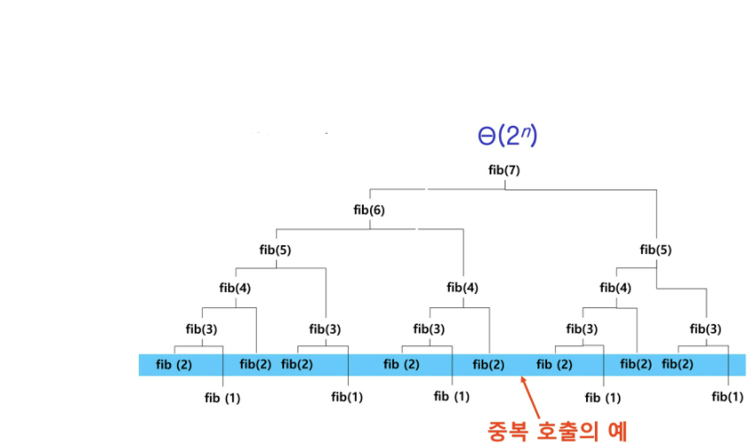

## Memoization

- 이전 계산 값 메모리에 저장

```python
# 재귀
def fibo1(n):
    global memo
    if n >= 2 and len(memo) <= n:
        memo.append(fibo1(n-1) + fibo1(n-2))
    return memo[n]

memo = [0, 1]
```

## Dynamic Programming

- 최적화 문제 해결
- 입력 크기 작은 문제 모두 해결 -> 큰 크기 해결

```python
# 순회 
def fibo2(n):
    f = [0, 1]
    
    for i in range(2, n + 1):
        f.append(f[i-1] + f[i-2])
        
    return f[n]
```

## Depth First Search (깊이 우선 탐색)

- 비선형구조 그래프
- LIFO 스택 : 되돌아가서 다시 탐색

```python
visited[], stack[] 초기화
DFS(v)
	v 방문;
    visited[v] <- true;
    do {
        if (v의 인접 정점 중 방문 안한 w 찾기)
        	push(v);
        while(w) {
            w 방문;
            visited[w] <- true;
            push(w);
            v <- w;
            v의 인접 정점 중 방문 안한 w 찾기
        }
        v <- pop(stack);
    } while (v)
end DFS
```

초기 : `visited` `false`로 초기화, 공백 스택

```python
A 방문;
visited[A] <- true;
```

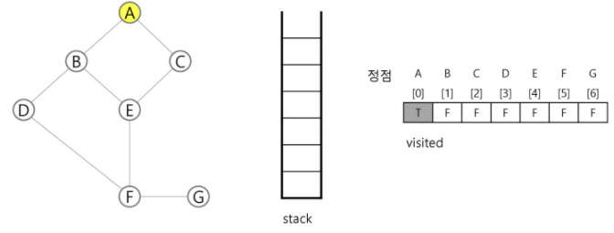

```python
push(A);
B 방문;
visited[B] <- true;
```

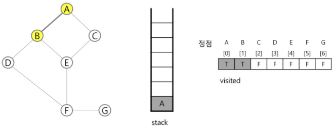

```python
push(B);
D 방문;
visited[D] <- true
```

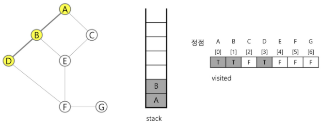

```python
push(D);
F 방문;
visited[F] <- true;
```

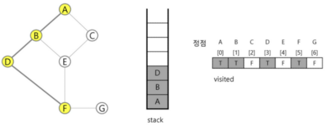

```python
push(F);
E 방문;
visited[E] <- true;
```

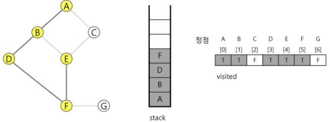

```python
push(E);
C 방문
visited[C] <- true;
```

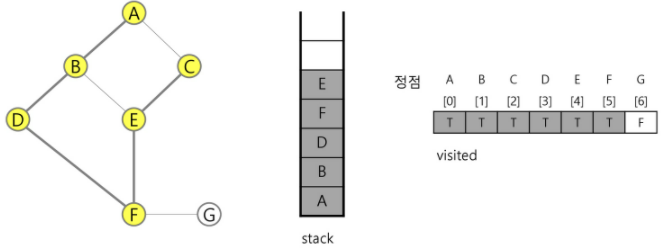

```python
pop(stack);
```

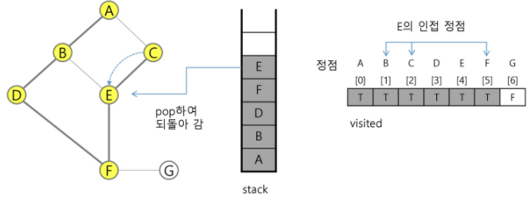

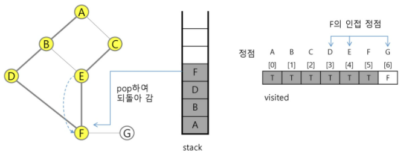

```python
push(F);
G 방문;
visited[G] <- true;
```

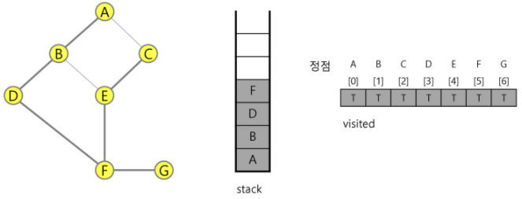

```python
pop(stack);
```

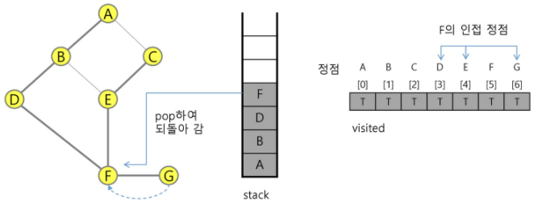

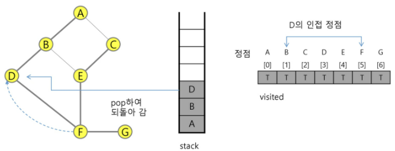

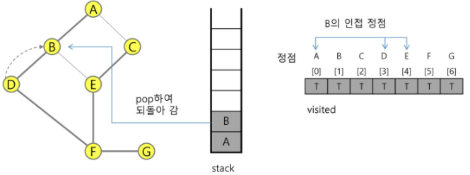

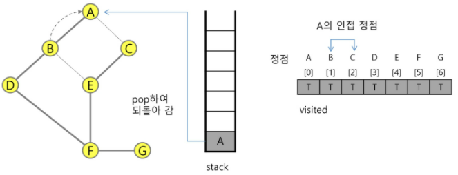

