## Tree

- 비선형 구조, 원소 간 1:n 관계, 계층 관계

- 한 개 이상 노드 -> 유한 집합

  - 루트 (Root) : 노드 중 최상위 노드

  - 나머지 : n개의 분리 집합 (서브트리, SubTree)

    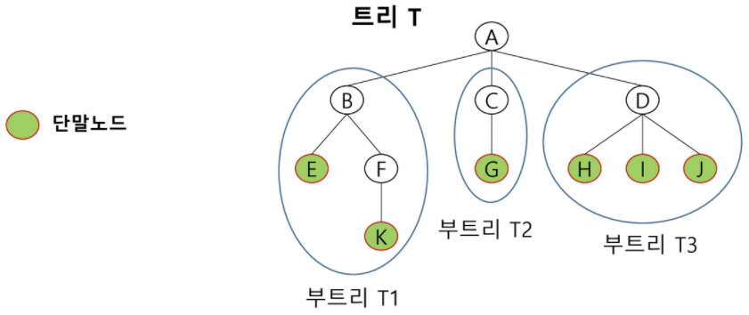

### 구성 요소

- 노드 (node)

  - 루트 노드 (Root Node) : 시작 노드 - A
  - 형제 노드 (Sibling Node) : B, C, D / E, F / H, I, J
  - 조상 노드 : K의 조상 노드 - F, B, A
  - 서브 트리 : 부모 노드와 연결된 간선 끊었을 때 생성되는 트리 - B, E, F, K / C, G / D, H, I, J
  - 자손 노드 : B의 자손 노드 - E, F, K

- 간선 (edge)

  

- 차수 (Degree) : 자식 노드의 수
  - 트리 차수 : 가장 큰 값
  - 단말 노드 : 차수 0, 자식 노드 X

- 높이 : 루트 노드에서 거리 -> `BFS`

### Binary Tree

- 모든 노드들이 2개의 SubTree
- 레벨 i에서 노드 최대 개수 : 2^i
- 높이 h인 이진 트리 -> 노드 최소 개수 : h + 1개, 최대 개수 : 2^(h + 1) - 1

#### 종류

- 포화 (Full) : 모든 레벨에 노드 포화
  - 2^(h + 1) - 1까지 정해진 위치에 대한 노드 번호
  - 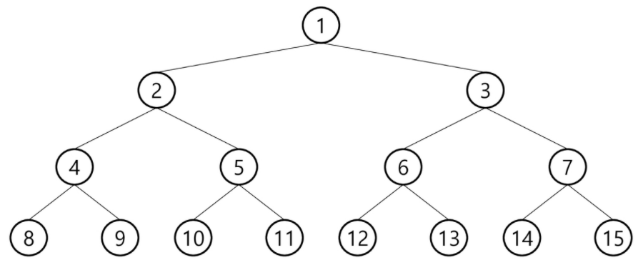
- 완전 (Complete) : full 이진 트리의 노드 번호 1번부터 n번까지 빈 자리 X
  - 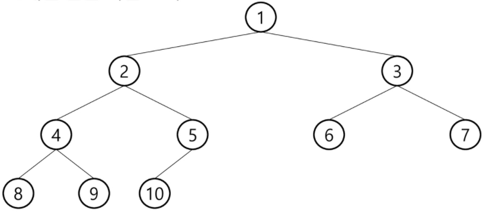
- 편향 (Skewed) : 높이 h에 대한 최소 개수 노드, 한쪽 방향 자식 노드
  - 왼쪽, 오른쪽
  - 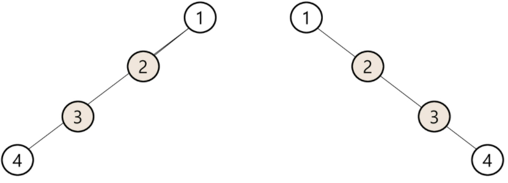

#### 순회

- 중복되지 않게 방문
- 비선형 구조 -> 선후 연결 관계 ?

##### 전위 (preorder)

1. 현재 노드 n
2. 왼쪽 서브 트리
3. 오른쪽 서브 트리

```pseudocode
def preorder_traverse(T):  # 전위순회
	if T:  # T is not None
		visit(T)  # print(T.item)
		preorder_traverse(T.left)
		preorder_traverse(T.right)
```

##### 중위 (inorder)

1. 왼쪽 서브 트리
2. 현재 노드
3. 오른쪽 서브 트리

```pseudocode
def inorder_traverse(T):  # 중위순회
	if T:  # T is not None
		inorder_traverse(T.left)
		visit(T)  # print(T.item)
		inorder_traverse(T.right)
```

##### 후위 (postorder)

1. 왼쪽 서브 트리
2. 오른쪽 서브 트리
3. 현재 노드 n

```pseudocode
def postorder_traverse(T):  # 후위순회
	if T:  # T is not None
		postorder_traverse(T.left)
		postorder_traverse(T.right)
		visit(T)  # print(T.item)
```

#### 표현

- 배열

  - 루트 번호 1
  - 레벨 n 노드 : 왼쪽부터 오른쪽으로 2^n부터 2^(n + 1) - 1까지 번호 차례로

  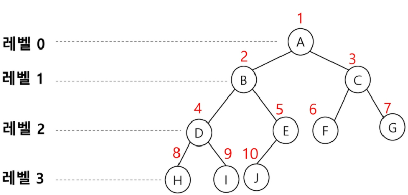

  

  - 노드 번호 i, 부모 노드 번호 : `i/2`
  - 노드 번호 i, 왼쪽 자식 노드 번호 : `2 * i`
  - 노드 번호 i, 오른쪽 자식 노드 번호 : `2 * i + 1`
  - 레벨 n, 노드 번호 시작 번호 : 2^n

  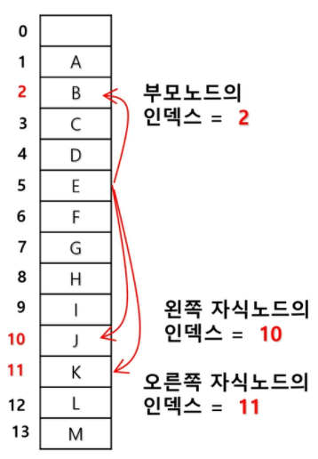

  - 노드 번호 : 배열 인덱스

  - 배열 크기 : 2^(h + 1) - 1

    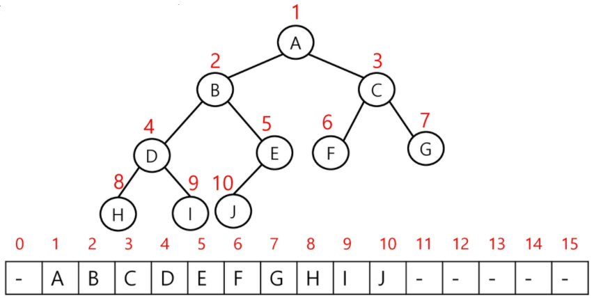

    

  - 단점

    - 편향 : 사용하지 않는 원소에 대한 메모리 공간 낭비
    - 삽입, 삭제 : 배열 크기 변경 hard

- 연결 리스트

  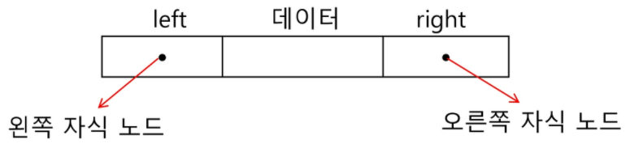

  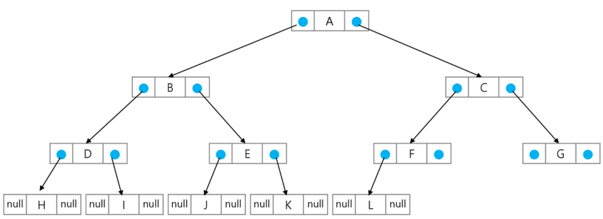

### Binary Search Tree

- 모든 원소 : 서로 다르 ㄴ유일한 키
- key(왼쪽 서브트리) < key (루트 노드) < key (오른쪽 서브트리)
- 중위 순회 : 오름차순

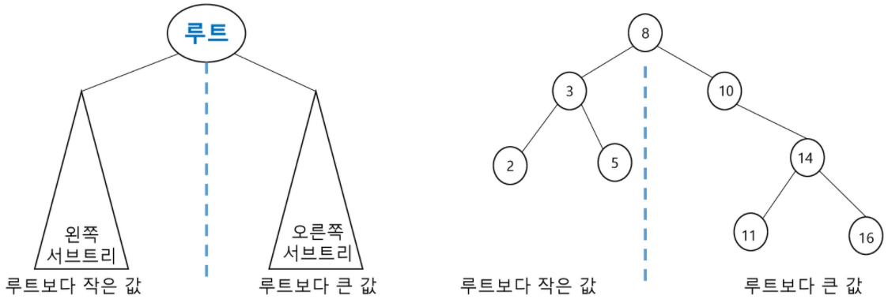

#### 연산

##### 탐색 연산

- 루트에서 시작
- 탐색할 키 값 x 루트 노드 키 값과 비교
  - `=` : 성공
  - `<` 루트노드 : 루트 노드 왼쪽 서브 트리
  - `>` 루트 노드 : 루트 노드 오른쪽 서브 트리
- 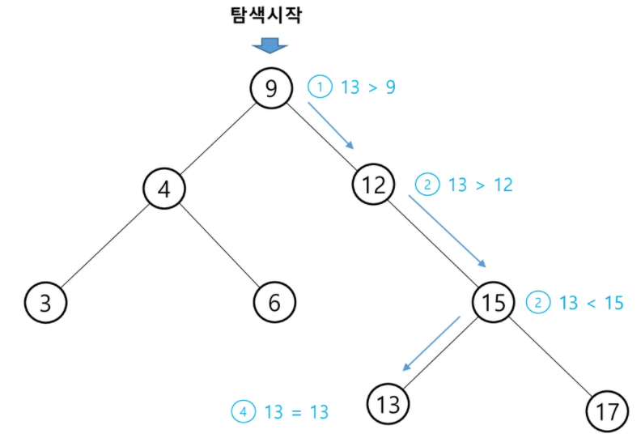

##### 삽입 연산

- 탐색 연산 먼저
- 탐색 실패 위치에 삽입
- 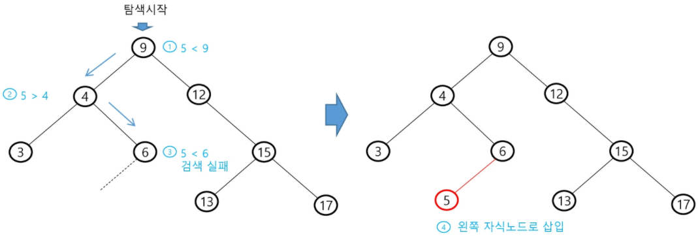

##### 성능

- 트리 높이만큼 : `O(h)`
- 평균 : `O(log n)`, 이진 트리 균형적
- 최악 : `O(n)`, 한 쪽으로 치우친 경사 이진 트리, 순차 탐색 = 시간 복잡도

### 검색 알고리즘 비교

- 리스트 순차 검색 : `O(n)`
- 정렬 리스트 순차 검색 : `O(n)`
- 정렬 리스트 이진 탐섹 : `O(log n)`
  - 고정 리스트 크기, 삽입 삭제 시 추가 연산 필요
- 이진 탐색트리 : `O(log n)`
  - 최악 : `O(n)`
  - 완전 이진 트리, 균형 트리 -> 최악 X
    - 삽입 시 삽입 시간 down
    - 평균 = 최악 : `O(log n)`
- 해쉬 검색 : `O(1)`
  - 추가 저장 공간 필요

### 힙 (Heap)

- 완전 이진 트리 노드 중 키 값이 가장 크거나 작은 노드 찾기 위한 자료 구조

#### 최대 힙

- 부모 노드 > 자식 노드
- 루트 노드 : 키 값 가장 큼

#### 최소 힙

- 부모 < 자식
- 루트 노드 : 키 값 가장 작음

#### 삽입

- 17 삽입
  - 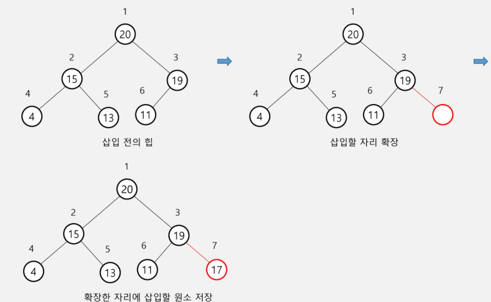
- 23 삽입
  - 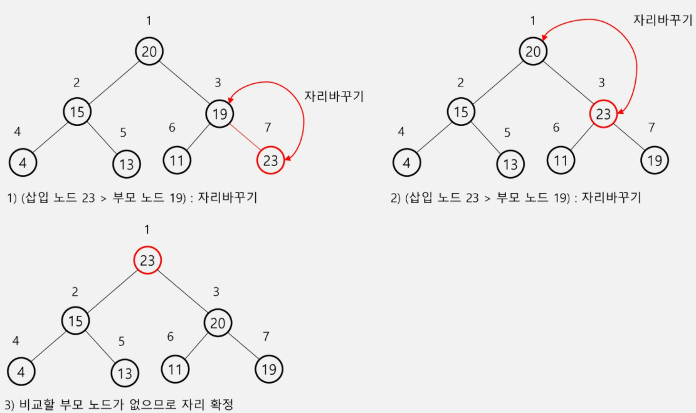

#### 삭제

- 루트 노드 원소만

- 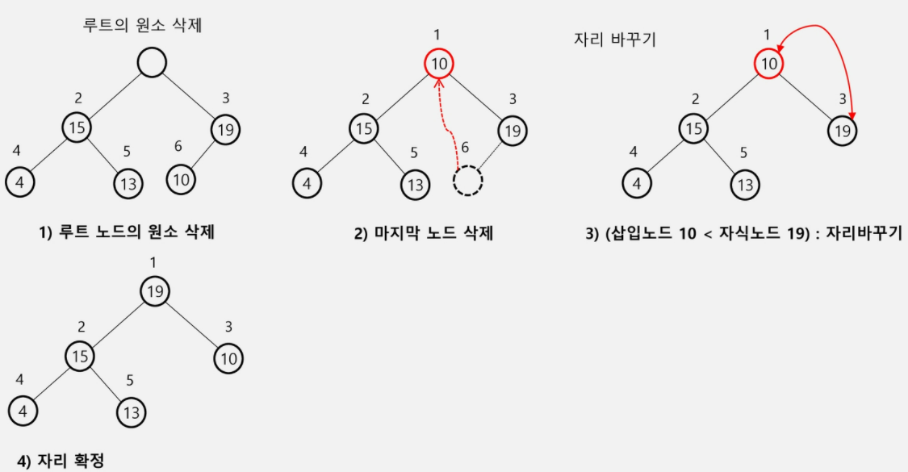

  

