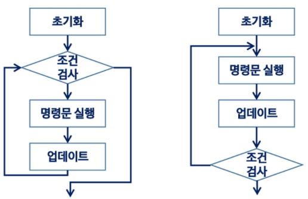

## 완전 검색 & 그리디

### 반복, 재귀

- 반복 : 완료될 때까지

  - for, while

  - 초기화 -> 조건 검사 -> 명령문 실행 -> 업데이트

    

    ```python
    # 선택정렬
    
    def SelectionSort(A):
        n = len(A)
        
        for i in range(0, n - 1):
            minI = i
            for j in range(i + 1, n):
                if A[j] < A[minI]:
                	minI = j
            A[minI], A[i] = A[i], A[minI]
    ```

- 재귀 : 동일하면서 더 작은 문제 해 이용

  - 재귀 함수

    - 기본, 유도 부분

    - 호출 시 스택 사용 -> 메모리, 속도 성능 저하

      ```python
      # 팩토리얼
      
      def fact(n):
          if n <= 1:  # basis part
              return 1
         	else:  # inductive part
              return n * fact(n - 1)
      ```

- n 커질수록 반복이 효율적

  |                |           재귀           |     반복      |
  | :------------: | :----------------------: | :-----------: |
  |      종료      | 함수 호출 종료 base case |   종료 조건   |
  |   수행 시간    |           느림           |     빠름      |
  |  메모리 공간   |           많이           |     적게      |
  | 소스 코드 길이 |        짧고 간결         |      긺       |
  | 소스 코드 형태 |         if else          |  for, while   |
  |  무한 반복 시  |     스택 오버플로우      | CPU 반복 점유 |

  ```pseudocode
  # 반복
  
  Power_of_2(k)
  	i = 0
  	power = 1
  	while i < k:
  		power = power * 2
  		i = l + 1
  	
  	return power
  
  # 재귀
  
  Power_of_2(k)
  	
  	if k == 0:
  		return 1
  	else:
  		return 2 * Power_of_2(k - 1)
  ```

  ```python
  # 선택정렬
  
  def selection(my_list):
      if len(my_list) == 1:
          return
      else:
          print(my_list)
          for j in range(1, len(my_list)):
              if my_list[j] < my_list[0]:
                  k = my_list[j]
                  my_list[j] = my_list[0]
                  
                  
                  my_list[0] = k
              else:
                  pass
          selection(my_list[1:])
  ```

### 완전검색

- brute-force : 첫 번째 자료부터 비교

  ```pseudocode
  SequentialSearch(A[0..n],k):
      A[n] <- k
      i <- 0
      WHILE A[i] != k
      		i++
      IF i < n : RETURN i
    	ELSE : RETURN -1
  ```

- 완전 검색

  - 그리디 기법, 동적 계획법
  - 조합적 문제 (순열, 조합, 부분집합) 에 대한 brute force

### 조합적 문제

- 순열 : `nPr`

  ```pseudocode
  {1, 2, 3} 포함하는 모든 순열
  
  FOR i1 in 1 -> 3
  	FOR i2 in 1 -> 3
  		IF i2 != i1
  			FOR i3 in 1 -> 3
  				IF i3 != i1 AND i3 != i2
  					print(i1, i2, i3)
  ```

  ```pseudocode
  # 재귀 호출
  # arr[] : 데이터가 저장된 배열
  # swap(i, j): arr[i] <--교환--> arr[j]
  # n : 원소의 개수, i : 선택된 원소의 수
  
  perm(n, k):
      if k == n:
          print array  # 원하는 작업 수행
      else:
          for i in k -> n-1:
              swap(k, i)
              perm(n, k+1)
              swap(k, i)
  ```

  ```python
  # n: 숫자를 결정할 인덱스(결정한 개수), k: 순열의 길이
  def perm(n, k):
      if n == k:
          print(A)
      else:
          for i in range(n, k):
              A[n], A[i] = A[i], A[n]  # 현재 숫자 유지부터, 오른쪽 끝까지 교환
              perm(n + 1, k)  # 다음자리 결정하러 이동 (n개 결정)
              A[n], A[i] = A[i], A[n]  # 교환 전으로 복구
  
  A = [1, 2, 3]
  perm(0, 3)
  
  # n : 숫자를 결정할 자리 인덱스, k : 순열의 길이, m : 주어진 숫자의 개수
  def perm(n, k, m):
      if n == k:
          print(A[0:k])
      else:
          for i in range(n, m):  # n번과 바꿀 위치
              A[n], A[i] = A[i], A[n]
              perm(n + 1, k, m)
              A[n], A[i] = A[i], A[n]
  
  
  A = [1, 2, 3, 4, 5]
  perm(0, 3, 5)
  
  def perm(n, k, m):
      if n == k:
          print(p)
      else:
          for i in range(m):
              if u[i] == 0:  #A[i]가 사용전이면
                  u[i] = 1
                  p[n] = A[i]
                  perm(n + 1, k, m)
                  u[i] = 0
  
  
  A = [1, 2, 3, 4, 5]
  p = [0] * 3
  u = [0] * 5
  perm(0, 3, 5)
  ```

  

  

### 탐욕 알고리즘