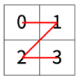
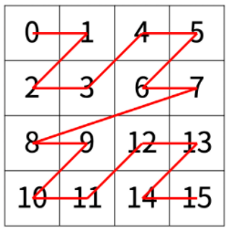
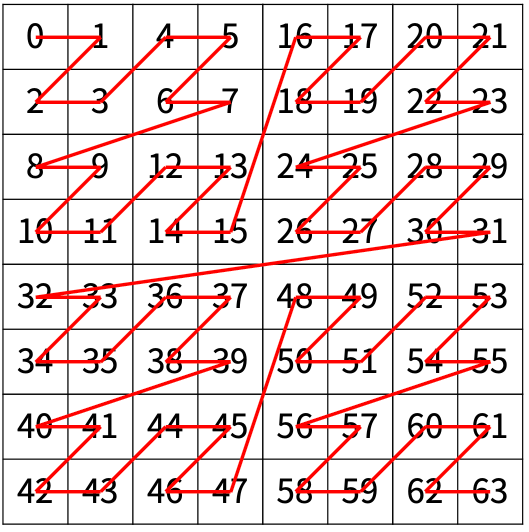

# 1074. Z


> https://www.acmicpc.net/problem/1074
>
> 한수는 크기가 2N × 2N인 2차원 배열을 Z모양으로 탐색하려고 한다. 예를 들어, 2×2배열을 왼쪽 위칸, 오른쪽 위칸, 왼쪽 아래칸, 오른쪽 아래칸 순서대로 방문하면 Z모양이다.
>
> 
>
> 만약, N > 1이 라서 왼쪽 위에 있는 칸이 하나가 아니라면, 배열을 크기가 2N-1 × 2N-1로 4등분 한 후에 재귀적으로 순서대로 방문한다.
>
> 다음 예는 22 × 22 크기의 배열을 방문한 순서이다.
>
> 
>
> N이 주어졌을 때, r행 c열을 몇 번째로 방문하는지 출력하는 프로그램을 작성하시오.
>
> 다음은 N=3일 때의 예이다.
>
> 
>
> ## 입력
>
> 첫째 줄에 정수 N, r, c가 주어진다.
>
> ```
> 2 3 1
> ```
>
> ```
> 3 7 7
> ```
>
> ## 출력
>
> r행 c열을 몇 번째로 방문했는지 출력한다.
>
> ```
> 11
> ```
>
> ```
> 63
> ```
>
> ## 제한
>
> - 1 ≤ N ≤ 15
> - 0 ≤ r, c < 2^N

- 풀이

```python
import sys
n, r, c = map(int, sys.stdin.readline().split())
ans = 0

while n >= 1:
    quad = (2 ** n) // 2
    if n > 1:
        if r < quad <= c:
            ans += quad ** 2
            c -= quad
        elif c < quad <= r:
            ans += (quad ** 2) * 2
            r -= quad
        elif r >= quad and c >= quad:
            ans += (quad ** 2) * 3
            r -= quad
            c -= quad

    elif n == 1:
        if r == 0 and c == 1:
            ans += 1
        elif r == 1 and c == 0:
            ans += 2
        elif r == 1 and c == 1:
            ans += 3
    n -= 1

print(ans)
```

