[TOC]


## List

### 알고리즘 (Algorithm)

- 정확성
- 작업량
- 메모리 사용량
- 단순성
- 최적성

#### 시간 복잡도

```python
def CalcSum(n):
    sum = 0
    for i in range(1, n + 1):
        sum = sum + i
    return sum; # 2n + 1
```

```python
def CalcSum(n):
    return n * (n + 1) // 2 # 3	
```


|            | 기호 | 순서 |    중복    | 데이터변경 |           비고            |
| :--------: | :--: | :--: | :--------: | :--------: | :-----------------------: |
|   tuple    |  ()  |  O   |     O      |     X      |           나열            |
|    list    |  []  |  O   |     O      |     O      |                           |
| dictionary |  {}  |  X   | 키 X, 값 O |     O      | 키 : 값 구조, 불변 객체만 |
|    set     |  {}  |  X   |     X      |     O      |        불변 객체만        |

- 같은 타입 변수들을 하나의 이름으로 열거

|        |        배열        |    리스트     |
| :----: | :----------------: | :-----------: |
| 데이터 | 같은 타입 데이터만 | 다양한 데이터 |
|  크기  |       변경 X       |    변경 O     |


### 시퀀스 자료형

- `indexing`, `slicing`


### 함수

|   함수   |      설명       |
| :------: | :-------------: |
|  len()   |    원소 개수    |
|    +     |      연결       |
|    *     |      반복       |
|    in    |      소속       |
|  not in  |     소속 X      |
|  min()   |      최소       |
|  max()   |      최대       |
| sorted() |      정렬       |
| append() |    끝에 추가    |
| insert() | 특정 위치 삽입  |
|  pop()   | 특정 index 삭제 |
| remove() | 특정 value 삭제 |
| count()  |      개수       |


### 함축 (Comprehension)

```python
mylist = [2, 3, 4, 5, 6]
newlist = [i for i in mylist if i % 2 == 0]
```

### 완전 검색 (Exhaustive Search)

- 모든 경우의 수 나열, 확인
- `Brute Force`, `Generate-and-Test`
- 경우의 수 작을 때
- 수행 속도 low, 정답 확률 high

#### Baby Gin 게임

- 3장의 연속 번호 : run, 3장의 카드 동일 번호 : triplete
- run, triplet으로만 : baby gin

#### 순열 (Permutation)

- `nPr`

```python
# {1, 2, 3}을 포함하는 모든 순열 생성
for i1 in range(1, 4):
    for i2 in range(1, 4):
        if i2 != i1:
            for i3 in range(1, 4):
                if i3 != i1 and i3 != i2:
                    print(i1,i2,i3)
```


### 그리디 (Greedy Algorithm)

- 최적해 : 그 순간에 최적
- 해 선택 : 부분 해 집합에 추가 -> 실행 가능성 검사 : 제약 조건 위반 여부 -> 해 검사 : 문제의 해?

```python
# 거스름돈 줄이기
```

#### Baby Gin 게임

- counts 리스트

```pseudocode
num = 456789 # Baby Gin 확인할 6자리 수
c = [0] * 12 # 6자리 수로부터 각 자리 수 추출하여 개수 누적할 리스트

for i in range(6):
	c[num % 10] += 1
	num // = 10
	
i = 0
tri = run = 0
while i < 10:
	if c[i] >= 3 # triplete 조사 후 데이터 삭제
		c[i] -= 3
		tri += 1
		continue;
	if c[i] >= 1 and c[i+1] >= 1 and c[i+2] >= 1: # run 조사 후 데이터 삭제
		c[i] -= 1
		c[i+1] -= 1
		c[i+2] -= 1
		run += 1
		continue
	i += 1
if run + tri == 2:
	print("Baby Gin")
else:
	print("Lose")
```


### 정렬 (Sort)

#### 버블 정렬 (Bubble Sort)

- 인접한 두 개 원소 비교 -> 자리 계속 교환
- `O(n^2)`

```python
def BubbleSort(a): # 정렬할 List
    for i in range(len(a)-1, 0, -1): # 범위의 끝 위치
        for j in range(0, i):
            if a[j] > a[j+1]:
                a[j], a[j+1] = a[j+1], a[j]
```

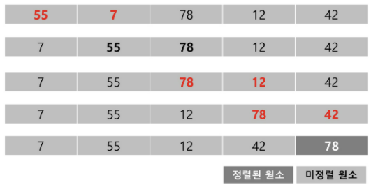

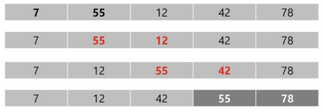

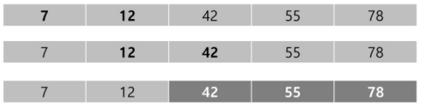

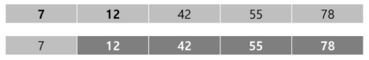

#### 카운팅 정렬 (Counting Sort)

- 집합에 각 항목이 몇 개씩 있는지 count, 선형 시간에 정렬
- 정수로 표현 가능한 자료에만 적용, 정수 항목으로 인덱스되는 카운트 리스트 사용
- 가장 큰 정수 알아야 함
- `O(n+k)` : n (리스트 개수), k (정수 최대값)

{0, 4, 1, 3, 1, 2, 4, 1} 

- 각 항목의 발생 횟수 count, 정수 항목으로 인덱스 되는 배열 counts에 저장

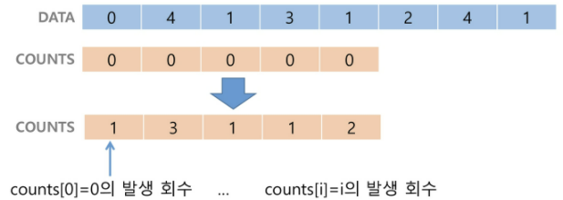

- counts 원소 조정

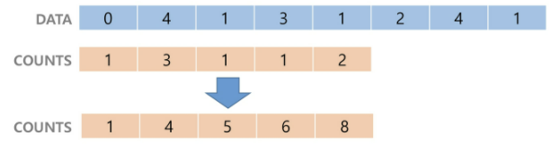

- counts[1] 감소, temp 1 삽입

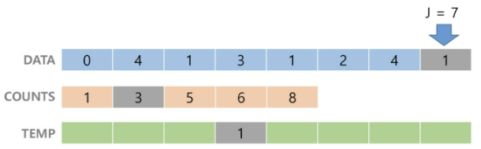

- counts[4] 감소, temp 4 삽입

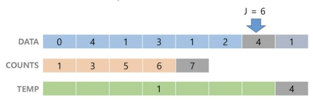

- counts[2] 감소, temp 2 삽입

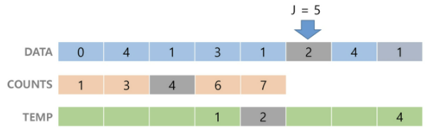

- counts[1] 감소, temp 1 삽입

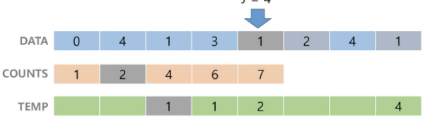

- counts[3] 감소, temp 3 삽입

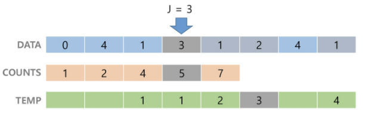

- counts[1] 감소, temp 1 삽입

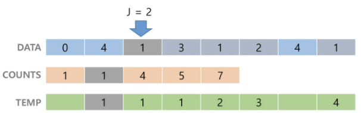

- counts[4] 감소, temp 4 삽입

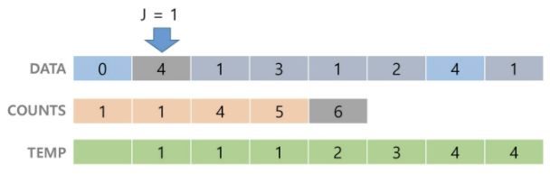

- counts[0] 감소, temp 0 삽입

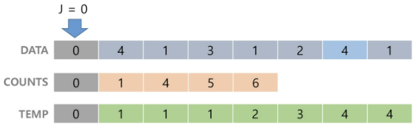

```pseudocode
def CountingSort(A, B, k):
# A [1, ..., n] : 입력 리스트 사용된 숫자 (1~k)
# B [1, ..., n] : 정렬 리스트
# C [1, ..., k] : 카운트 리스트
	C = [0] * k
    for i in range(0, len(B)):
        C[A[i]] += 1
    for i in range(1, len(C)):
        C[i] += C[i-1]
    
    for i in range(len(B)-1, -1, -1):
        B[C[A[i]]-1] = A[i]
        C[A[i]] = 1

a = [0, 4, 1, 3, 1, 2, 4, 1]
b = [0] * len(a)
CountingSort(a, b, 5)
print(B)
```

|  알고리즘   | 평균 수행시간 | 최악 수행시간 | 알고리즘 기법 |          비고           |
| :---------: | :-----------: | :-----------: | :-----------: | :---------------------: |
|  버블 정렬  |    O(n^2)     |    O(n^2)     |  비교, 교환   |        코딩 쉬움        |
| 카운팅 정렬 |    O(n+k)     |    O(n+k)     |    비교환     |        n 작을 때        |
|  선택 정렬  |    O(n^2)     |    O(n^2)     |  비교, 교환   | 교환 횟수 < 버블, 삽입  |
|   퀵 정렬   |  O(n log n)   |    O(n^2)     |   분할 정복   |     평균 가장 빠름      |
|  삽입 정렬  |    O(n^2)     |    O(n^2)     |  비교, 교환   |        n 작을 때        |
|  병합 정렬  |  O(n log n)   |  O(n log n)   |   분할 정복   | 연결 리스트 : 가장 효율 |


### 2차원 

- 세로 길이 (행의 개수), 가로 길이 (열의 개수)

```python
arr = [0, 0, 0, 0, 0]
arr = [0] * 5 
arr = [i for i in range(2, 9) if i % 2 == 0] # [2, 4, 6, 8]

brr = [[1, 2, 3], [1, 2, 3], [1, 2, 3]]
brr = [[1, 2, 3]] * 3
brr = [[1, 2, 3] for i in range(3)]
brr = [[i, j] for i in range(3) for j in range(2)] # [[0, 0], [0, 1], [1, 0], [1, 1], [2, 0], [2, 1]]
```

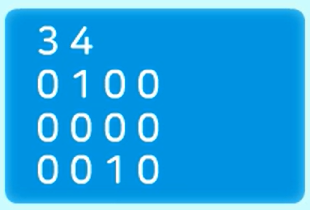

#### 입력

```python
n, m = map(int, input().split())

mylist = [0 for _ in range(n)] # mylist = [0] * n

for i in range(n):
    mylist[i] = list(map(int, input().split()))
```

```python
n, m = map(int, input().split())

mylist = []
for _ in range(n):
    mylist.append(list(map(int, input().split())))
```

```python
n, m = map(int, input().split())
mylist = [list(map(int, input().split())) for _ in range(n)]
```

#### 위치 찾기

```python
# 1이 입력된 [행, 열] 위치 찾기
n, m = map(int, input().split())
newlist = []
mylist = [0 for _ in range(n)]
for i in range(n):
    mylist[i] = list(map(int, input().split()))
    for j in range(m):
        if mylist[i][j] == 1:
            newlist.append([i,j])
```

```python
# 1이 입력된 [행, 열]
n, m = map(int, input().split())
mylist = [list(map(int, input().split())) for _ in range(n)]
newlist = [(i,j) for i in range(n) for j in range(m) if mylist[i][j] == 1]
```

#### 순회

- 행 우선 순회

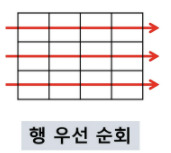

```python
arr = [[0, 1, 2, 3], [4, 5, 6, 7], [8, 9, 10, 11]]
# i : 행의 좌표, n = len(arr)
# j : 열의 좌표, m = len(arr[0])
for i in range(len(arr)):
    for j in range(len(arr[i])):
        arr[i][j]
```

- 열 우선 순회

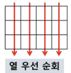

```python
for j in range(len(arr[0])):
    for i in range(len(arr)):
        arr[i][j]
```

- 지그재그 순회

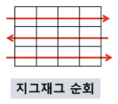

```python
for i in range(len(arr)):
    for j in range(len(arr[0])):
        arr[i][j + (m - 1 - 2 * j) * (1 % 2)]
```

#### 델타 탐색

- 상하좌우 네 방향의 인접 list 요소 탐색
- 델타 : 네 방향의 좌표와 x, y 차이 저장 리스트

```python
# arr[0, ..., n-1][0, ..., n-1] : 2차원 list
dx = [0, 0, -1, 1] # 상하좌우
dy = [-1, 1, 0, 0]

for x in range(len(arr)):
    for y in range(len(arr[x])):
        for i in range(4):
            testX = x + dx[i]
            testY = y + dy[i]
            print(arr[testX][testY])
```


```python
"""
델타검색
5x5 2차 배열에 무작위로 25개의 숫자로 초기화 한 후
25개의 각 요소에 대해서 그 요소와 이웃한 요소와의 차의 절대값을 구하시오.
예를 들어 아래 그림에서 7 값의 이웃한 값은 2, 6, 8, 12 이며 차의 절대값의 합은 12 이다.
| 2 – 7 | + | 6 – 7 | + | 8 – 7 | + | 12 – 7 | = 12


25개의 요소에 대해서 모두 조사하여 총합을 구하시오.
벽에 있는 요소는 이웃한 요소가 없을 수 있음을 주의하시오.
예를 들어 [0][0]은 이웃한 요소가 2개이다.
"""

dr = [-1, 1, 0, 0]
dc = [0, 0, -1, 1]

T = int(input())
for t in range(1, T + 1):
    # 2차원 배열 입력 받기
    arr = [list(map(int, input().split())) for _ in range(5)]
    # 각 요소에서의 이웃한 요소와의 차의 절대값의 전체 합을 담을 변수
    total = 0
    for i in range(5):
        for j in range(5):
            for k in range(4):
                nr = i + dr[k]
                nc = j + dc[k]
                # 상하좌우 중에 이차원 배열을 벗어나는 인덱스를 갖게 되는 경우, 혹은 인덱스가 -1인 경우가 아닐 때만 실행
                if 0 <= nr < 5 and 0 <= nc < 5:
                    dif = arr[nr][nc] - arr[i][j]
                    # 절대값을 구해야하므로 음수이면 -부호를 붙인다.
                    if dif < 0:
                        dif = -dif
                    total += dif
    print('#%d %d' %(t, total))
```


#### 전치 행렬

- 행, 열 반대

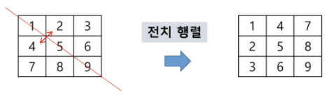

```python
# i : 행의 좌표, n = len(arr)
# j : 열의 좌표, m = len(arr[0])
arr = [[1, 2, 3], [4, 5, 6], [7, 8, 9]]

for i in range(3):
    for j in range(3):
        if i < j:
            arr[i][j], arr[j][i] = arr[j][i], arr[i][j]
```

#### zip(iterable*)

- 동일한 개수로 이루어진 자료형 묶음

```python
alpha = ['a', 'b', 'c']
index = [1, 2, 3]
alpha_index = list(zip(alpha, index))
print(alpha_index) # [('a', 1), ('b', 2), ('c', 3)]

arr = [[1, 2, 3], [4, 5, 6], [7, 8, 9]]
print(list(zip(*arr))) # [(1, 4, 7), (2, 5, 8), (3, 6, 9)]
```

- `zip(*matrix)` : 전치 행렬


### 부분 집합

```python
"""
유한 개의 정수로 이루어진 집합이 있을 때, 이 집합의 부분집합 중에서
그 집합의 원소를 모두 더한 값이 0 이 되는 경우가 있는지 알아내는 문제
예를 들어, [-7, -3, -2, 5, 8]라는 집합이 있을 때, [-3, -2, 5]라는
이 집합의 부분집합이면서 (-3)+(-2)+5=0이므로 답은 참이 된다.
"""
arr = [-7, -3, -2, 5, 8]
n = len(arr)
count = 0

sum = 0
for i in range(1, 1 << n):
    sum = 0
    for j in range(n):
        if i & (1 << j):
            sum += arr[j]
    if sum == 0:
        count += 1
        for j in range(n):
            if i & (1 << j):
                print(arr[j], end=" ")
        print()
print(f"개수: {count}")
```

```python
bit = [0, 0, 0, 0]
for i in range(2):
    bit[0] = i # 0번째 원소
    for j in range(2):
        bit[1] = j # 1번째 원소
        for k in range(2): 
            bit[2] = k # 2번째 원소
            for l in range(2):
                bit[3] = l # 3번째 원소
                print(bit) # 부분집합 출력
```

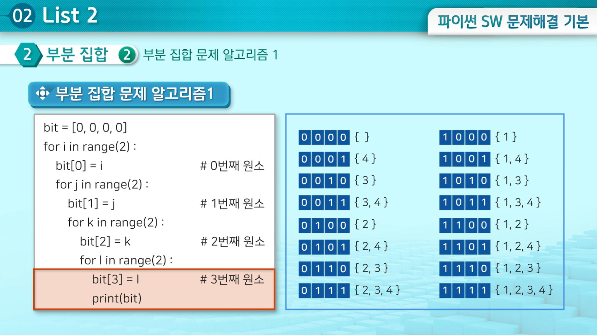

#### 비트 연산자

- 0, 1 이진수 연산

- |   &    |                     AND                      |
  | :----: | :------------------------------------------: |
  | **\|** |                    **OR**                    |
  | **<<** |   **왼쪽 이동 : 자리가 비다면 0으로 채움**   |
  | **>>** | **오른쪽 이동 : 맨 오른쪽에 있던 것은 지움** |
  
  - `1 << n L 2^n` : 원소 n개일 때 모든 부분 집합의 수
  - `i & (1<<j) : ` : i에서 j번째 비트가 1인지

```python
arr = [3, 6, 7, 1, 5, 4]
n = len(arr) # 원소의 개수

for i in range(1<<n): # 부분 집합의 개수
    for j in range(n): # 원소의 수만큼 비트 비교 -> 포함 여부
        if i & (1<<j): # i의 j번째 비트가 1이면 j번째 원소 출력
            print(arr[j], end=",") 
    print()
```


### 검색

#### 순차 검색 (Sequential Search)

- 검색 대상 많으면 비효율

##### 정렬 X

- 첫 번째 원소부터 순서대로 검색 대상과 키 값이 같은 원소가 있는지
- 평균 비교 횟수 : `(n + 1) / 2`
- `O(n)`

```python
def sequentialSearch(a, n, key):
    i = 0
    while i < n and a[i] != key:
        i = i + 1
    
    if i < n:
        return i
    else:
        return -1
```

##### 정렬 O

- 평균 비교 횟수 : 반으로 줄어듦
- `O(n)`

```python
def sequentialSearch2(a, n, key):
    i = 0
    while i < n and a[i] < key:
        i = i + 1
    
    if i < n and a[i] == key:
        return i
    else:
        return -1
```

#### 이진 검색 (Binary Search)

- 가운데 항목 키 값과 비교 -> 다음 검색 위치 결정
- 범위를 반으로 줄여감
- 자료가 정렬된 상태
- `O(log N)`

```python
def binarySearch(a, key):
    start = 0
    end = len(a) - 1
    while start <= end:
        middle = start + (end - start) // 2
        if key == a[middle]: # 검색 성공
            return True
        elif key < a[middle]:
            end = middle - 1
        else:
            start = middle + 1
    return False # 검색 실패
```

```python
# 재귀
def binarySearch2(a, low, high, key):
    if low > high:
        return False
    else:
        middle = (low + high) // 2
        if key == a[middle]:
            return True
        elif key < a[middle]:
            return binarySearch2(a, low, middle - 1, key)
        elif key > a[middle]:
            return binarySearch2(a, middle + 1, high, key)
```

#### 인덱싱 (Indexing)


### 정렬

#### 선택 정렬 (Selection Algorithm)

- k번째로 큰, 작은 원소

  ```python
  # k번째로 작은
  def select(list, k):
      for i in range(0, k):
          minIndex = i
          for j in range(i + 1, len(list)):
              if list[minIndex] > list[j]:
                  minIndex = j
          list[i], list[minIndex] = list[minIndex], list[i]
      return list[k-1]
  ```

  - `O(kn)`

- 작은 값의 원소부터 차례대로 
- `O(n^2)`

```python
def selectionSort(a):
    for i in range(0, len(a) - 1):
        min = i
        for j in range(i + 1, len(a)):
            if a[min] > a[j]:
                min = j
        a[i], a[min] = a[min], a[i]
```

