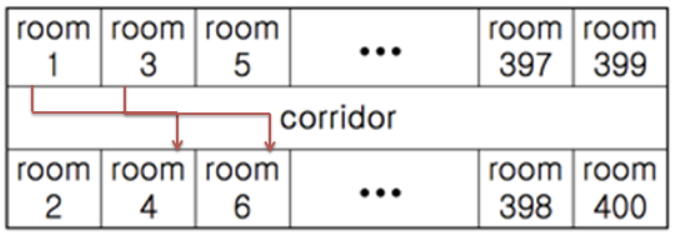

# 4408. 자기 방으로 돌아가기

> https://bit.ly/386bFXn
>
> 고등학교 학생들이 학교에서 수련회를 갔다. 수련회에 간 학생들은 친구들과 음주가무를 즐기다가 밤 12시가 되자 조교들의 눈을 피해 자기방으로 돌아가려고 한다.
>
> 제 시간에 자기방으로 돌아가지 못한 학생이 한 명이라도 발견되면 큰일나기 때문에 최단 시간에 모든 학생이 자신의 방으로 돌아가려고 한다.
>
> 숙소는 긴 복도를 따라 총 400개의 방이 다음과 같이 배열되어 있다.
>
> 
>
> 모든 학생들은 현재 위치에서 자신의 방으로 돌아가려고 하는데, 만약 두 학생이 자기방으로 돌아가면서 지나는 복도의 구간이 겹치면 두 학생은 동시에 돌아갈 수 없다.
>
> 예를 들어 (방1 -> 4) 와 (방3 -> 6) 은 복도 구간이 겹치므로 한 사람은 기다렸다가 다음 차례에 이동해야 한다. 이동하는 데에는 거리에 관계없이 단위 시간이 걸린다고 하자.
>
> 각 학생들의 현재 방 위치와 돌아가야 할 방의 위치의 목록이 주어질 때, 최소 몇 단위시간만에 모든 학생들이 이동할 수 있는지를 구하시오.
>
>
> **[입력]**
> 입력은 T(≤10)개의 테스트 케이스로 되어 있다. 각 테스트 케이스의 첫 줄에는 돌아가야 할 학생들의 수 N이 주어진다.
>
> 다음 N 줄에는 각 학생의 현재 방 번호(≤400)와 돌아가야 할 방의 번호(≤400)가 주어진다. 주어지는 2N개의 방 번호 중 중복되는 것은 없다.
>
> 3  
>
> 4  
>
> 10 20  
>
> 30 40 
>
> 50 60 
>
> 70 80 
>
> 2  
>
> 1 3 
>
> 2 200 
>
> 3 
>
> 10 100 
>
> 20 80 
>
> 30 50
>
> **[출력]**
> 테스트 케이스 T에 대한 결과는 “#T ”을 찍고, 각 테스트 케이스마다 필요한 시간을 한 줄에 하나씩 출력한다.
>
> #1 1 #2 2 #3 3

- 풀이

```python
T = int(input())
for tc in range(1, T + 1):
    N = int(input())
    togo = [list(map(int, input().split())) for _ in range(N)]

    rooms = [0] * 200

    for i, j in togo:
        left = (i - 1) // 2
        right = (j - 1) // 2

        if right >= left:
            for k in range(left, right + 1):
                rooms[k] += 1
        else:
            for k in range(right, left + 1):
                rooms[k] += 1

    ans = 0
    for room in rooms:
        if room > ans:
            ans = room

    print(f'#{tc} {ans}')
```

