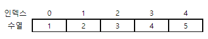
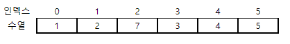
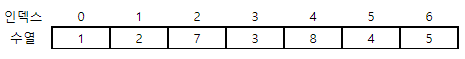

# 5108. 숫자 추가

> https://swexpertacademy.com/main/learn/course/subjectDetail.do?courseId=AVuPDN86AAXw5UW6&subjectId=AWOVJ1r6qfkDFAWg#
>
> N개의 10억 이하 자연수로 이뤄진 수열이 주어진다.
>
> 이 수열은 완성된 것이 아니라 M개의 숫자를 지정된 위치에 추가하면 완성된다고 한다.
>
> 완성된 수열에서 인덱스 L의 데이터를 출력하는 프로그램을 작성하시오.
>
> 다음은 숫자를 추가하는 예이다.
>
> 
>
> 2 7 -> 2번 인덱스에 7을 추가하고 한 칸 씩 뒤로 이동한다.
>
> 
>
> 4 8 -> 4번 인덱스에 8을 추가하고 한 칸 씩 뒤로 이동한다.
>
> 
>
> **[입력]**
>
> 첫 줄에 테스트케이스의 수 T가 주어진다. 1<=T<=50
>
> 다음 줄부터 테스트 케이스의 별로 첫 줄에 수열의 길이 N, 추가 횟수 M, 출력할 인덱스 번호 L이 주어지고, 다음 줄에 수열이 주어진다.
>
> 그 다음 M개의 줄에 걸쳐 추가할 인덱스와 숫자 정보가 주어진다. 5<=N<=1000, 1<=M<=1000, 6<=L<=N+M
>
> 3 
>
> 5 2 5 
>
> 1 2 3 4 5 
>
> 2 7 
>
> 4 8 
>
> 5 5 4 
>
> 13787 32221 32402 32498 4169 
>
> 3 5902 
>
> 3 9752 
>
> 3 27737 
>
> 1 14133 
>
> 0 16547 
>
> 10 10 8 
>
> 16243 26767 22174 25277 17456 13398 29850 22297 1382 31246 
>
> 9 23198 
>
> 7 17514 
>
> 11 24247 
>
> 0 25306 
>
> 2 9104 
>
> 6 28112 
>
> 12 7491 
>
> 10 26972 
>
> 17 22639 
>
> 12 28722
>
> **[출력]**
>
> 각 줄마다 "#T" (T는 테스트 케이스 번호)를 출력한 뒤, 답을 출력한다.
>
> #1 4 
>
> #2 32402 
>
> #3 13398

- 풀이

```python
T = int(input())
for tc in range(1, T + 1):
    N, M, L = list(map(int, input().split()))
    nums = list(map(int, input().split()))
    for _ in range(M):
        i, j = list(map(int, input().split()))
        nums.insert(i, j)

    print("#{0} {1}".format(tc, nums[L]))
```

