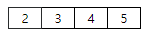
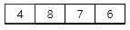
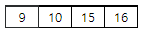
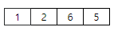
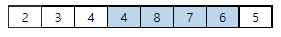
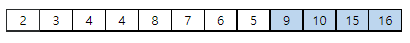
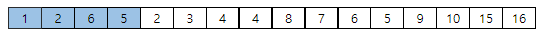

# 5110. 수열 합치기

> https://swexpertacademy.com/main/learn/course/subjectDetail.do?courseId=AVuPDN86AAXw5UW6&subjectId=AWOVJ1r6qfkDFAWg#
>
> 여러 개의 수열을 정해진 규칙에 따라 합치려고 한다. 다음은 3개의 수열이 주어진 경우의 예이다.
>
> 수열 1
>
> 
>
> 수열 2
>
> 
>
> 수열 3
>
> 
>
> 수열 4
>
> 
>
> 수열 2의 첫 숫자 보다 큰 수자를 수열 1에서 찾아 그 앞에 수열 2를 끼워 넣는다.
>
> 
>
> 합쳐진 수열에 대해, 수열 3의 첫 숫자보다 큰 숫자를 찾아 그 앞에 수열 3을 끼워 넣는다. 큰 숫자가 없는 경우 맨 뒤에 붙인다.
>
> 
>
> 마지막 수열까지 합치고 나면, 맨 뒤의 숫자부터 역순으로 10개를 출력한다.
>
> 
>
> **[입력]**
>
> 첫 줄에 테스트케이스의 수 T가 주어진다. 1<=T<=50
>
> 다음 줄부터 테스트 케이스의 별로 첫 줄에 수열의 길이 N, 수열의 개수 M, 이후 M개의 줄에 걸쳐 1000이하의 자연수로 구성된 수열이 주어진다. 4<=N<=1000, 1<=M<=1000
>
> 3 
>
> 4 4 
>
> 2 3 4 5 
>
> 4 8 7 6 
>
> 9 10 15 16 
>
> 1 2 6 5 
>
> 5 5 
>
> 273 415 58 798 251 
>
> 675 193 494 506 365 
>
> 479 390 224 334 387 
>
> 107 402 569 422 183 
>
> 88 709 994 206 916 
>
> 10 10 
>
> 178 778 659 231 274 123 788 16 483 404 
>
> 36 14 602 74 287 689 730 703 611 339 
>
> 445 468 126 821 946 212 218 143 999 923 
>
> 288 792 249 142 996 999 570 757 141 921 
>
> 98 87 800 892 401 244 661 179 403 985 
>
> 474 315 694 816 838 525 288 94 609 6 
>
> 789 433 474 883 927 841 242 233 286 749 
>
> 7 667 875 986 107 957 887 520 430 649 
>
> 721 206 65 776 328 807 845 908 382 836 
>
> 707 811 790 652 805 190 407 257 668 307
>
> **[출력]**
>
> 각 줄마다 "#T" (T는 테스트 케이스 번호)를 출력한 뒤, 완성된 수열의 맨 뒤부터 10개의 숫자를 역순으로 출력한다.
>
> #1 16 15 10 9 5 6 7 8 4 4 
>
> #2 251 798 365 506 494 193 675 387 334 224 
>
> #3 404 483 16 788 123 274 231 659 778 178

- 풀이

```python
def mergeSeq():
    first_seq = list(map(int, input().split()))
    for _ in range(M - 1):
        newSeq = list(map(int, input().split()))
        seq_len = len(first_seq)
        for i in range(len(first_seq)):
            if first_seq[i] > newSeq[0]:
                first_seq[i:0] = newSeq
                break
        if len(first_seq) == seq_len:
            first_seq += newSeq
    return first_seq


for tc in range(1, int(input()) + 1):
    N, M = map(int, input().split())
    ans = mergeSeq()
    print(f'#{tc}', end=' ')
    print(' '.join(str(n) for n in ans[-1:-11:-1]))
```

