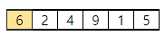
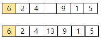
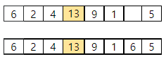
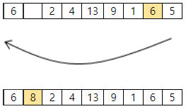

# 5120. 암호

> https://swexpertacademy.com/main/learn/course/subjectDetail.do?courseId=AVuPDN86AAXw5UW6&subjectId=AWOVJ1r6qfkDFAWg#
>
> A사는 창립기념일 이벤트로 비밀번호 맞추기 대회를 열어, 최대 10개인 비밀번호를 맞추는 사람에게 기념품을 제공하기로 했다.
>
> 기념품을 받을 수 있도록 다음 조건에 맞는 비밀번호 찾기 프로그램을 작성하시오.
>  
>
> \- 1000이하의 숫자 N개가 주어진다. 이때 시작 숫자가 정해지고, 첫 번째 지정 위치가 된다.
>
> \- 지정 위치부터 M번째 칸을 추가한다. 여기에 앞칸의 숫자와 뒤로 밀려난 칸의 숫자를 더해 넣는다. 추가된 칸이 새로운 지정 위치가 된다. 밀려난 칸이 없으면 시작 숫자와 더한다.
>
> \- 이 작업을 K회 반복하는데, M칸 전에 마지막 숫자에 이르면 남은 칸수는 시작 숫자부터 이어간다.
>
> \- 마지막 숫자부터 역순으로 숫자를 출력하면 비밀번호가 된다. 숫자가 10개 이상인 경우 10개까지만 출력한다.
>
> 
>
> 다음은 N, M, K가 6, 3, 3이고, 주어진 숫자가 6, 2, 4, 9, 1, 5인 경우의 예이다. 6이 시작 숫자이자 첫번째 지정 위치가 된다.
>
> 
>
> (1) 3번째에 새로운 칸을 추가하고, 앞의 숫자 4와 뒤로 밀려난 9를 더해 칸을 채운다.
>
> 
>
> (2) 다시 3칸 뒤에 새로운 칸을 추가하고, 앞 뒤 숫자를 더해 넣는다.
>
> 
>
> (3) 다시 3칸 뒤에 칸을 추가하고 앞 뒤 숫자를 더해 넣는다.
>
> 
>
> 암호는 역순인 5 6 1 9 13 4 2 8 6이 된다.
>
> 
> **[입력]**
>
> 첫 줄에 테스트케이스의 수 T가 주어진다. 1<=T<=50
>
> 다음 줄부터 테스트 케이스의 별로 첫 줄에 N, M, K가, 다음 줄에 1000이하의 자연수 N개가 주어진다. 3<=N, M, K<=1000
>
> 3 
>
> 6 3 3 
>
> 6 2 4 9 1 5 
>
> 5 3 5 
>
> 958 386 329 169 778 
>
> 10 4 10 
>
> 158 606 636 941 686 774 302 375 954 668
>
> **[출력]**
>
> 각 줄마다 "#T" (T는 테스트 케이스 번호)를 출력한 뒤, 답을 출력한다.
>
> \#1 5 6 1 9 13 4 2 8 6
> \#2 1736 2514 778 169 667 498 329 715 386 958
> \#3 826 1494 668 954 375 1052 677 302 774 2234

- 풀이

```python
T = int(input())
for tc in range(1, T + 1):
    N, K, M = map(int, input().split())
    arr = list(map(int, input().split()))
    ans = 0
    for i in range(M):
        ans += K
        ans = ans % len(arr)
        if ans == 0:
            arr.append(arr[0] + arr[-1])
            ans -= 1
        else:
            arr.insert(ans, arr[ans - 1] + arr[ans])
    if len(arr) > 10:
        print(f"#{tc}", end=' ')
        for i in range(1, 11):
            print(arr[-i], end=' ')
        print()
    else:
        print(f"#{tc}", end=' ')
        for i in range(1, len(arr) + 1):
            print(arr[-i], end=' ')
        print()
```

