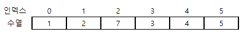
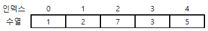
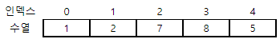

# 5122. 수열 편집

> https://swexpertacademy.com/main/learn/course/subjectDetail.do?courseId=AVuPDN86AAXw5UW6&subjectId=AWOVJ1r6qfkDFAWg#
>
> N개의 10억 이하 자연수로 이뤄진 수열이 주어진다. 이 수열은 완성된 것이 아니라 M번의 편집을 거쳐 완성된다고 한다.
>
> 완성된 수열에서 인덱스 L의 데이터를 출력하는 프로그램을 작성하시오.
>
> 다음은 미완성 수열과 편집의 예이다.
>
> 
>
> I 2 7 -> 2번 인덱스 앞에 7을 추가하고, 한 칸 씩 뒤로 이동한다.
>
> 
>
> D 4 -> 4번 인덱스 자리를 지우고, 한 칸 씩 앞으로 이동한다.
>
> 
>
> C 3 8 -> 3번 인덱스 자리를 8로 바꾼다.
>
> 
>
> 만약 편집이 끝난 후 L이 존재하지 않으면 -1을 출력한다.
>
> 
> **[입력]**
>
> 첫 줄에 테스트케이스의 수 T가 주어진다. 1<=T<=50
>
> 다음 줄부터 테스트 케이스의 별로 첫 줄에 수열의 길이 N, 추가 횟수 M, 출력할 인덱스 번호 L이 주어지고, 다음 줄에 수열이 주어진다.
>
> 그 다음 M개의 줄에 걸쳐 추가할 인덱스와 숫자 정보가 주어진다. 5<=N<=1000, 1<=M<=1000, 6<=L<=N+M
>
> 3 
>
> 5 3 4 
>
> 1 2 3 4 5 
>
> I 2 7 
>
> D 4 
>
> C 3 8 
>
> 5 5 2 
>
> 15171 7509 20764 13445 10239 
>
> C 3 18707 
>
> C 1 20250 
>
> D 2 
>
> D 2 
>
> C 0 7158 
>
> 10 10 8 
>
> 27454 29662 2491 1819 10118 15441 7357 23618 972 398 
>
> D 7 
>
> D 1 
>
> D 6 
>
> I 3 2906 
>
> C 1 27121 
>
> D 3 
>
> D 2 
>
> D 1 
>
> D 2 
>
> C 2 20794
>
> **[출력]**
>
> 각 줄마다 "#T" (T는 테스트 케이스 번호)를 출력한 뒤, 답을 출력한다.
>
> #1 5 
>
> #2 10239 
>
> #3 -1

- 풀이

```python
T = int(input())
for tc in range(1, T + 1):
    N, M, L = map(int, input().split())
    seq = input().split()

    for _ in range(M):
        op = input().split()
        # 추가, 뒤로 이동
        if op[0] == 'I':
            seq.insert(int(op[1]), op[2])
        # 삭제, 앞으로 이동
        elif op[0] == 'D':
            seq.pop(int(op[1]))
        # 변경
        else:
            seq[int(op[1])] = op[2]
    # 존재 안하면
    ans = -1

    if len(seq) > L:
        ans = seq[L]

    print('#{} {}'.format(tc, ans))
```

