## Linked List

### List

- 순서를 가진 데이터 묶음 : 중복 저장 O
- sequence : indexing, slicing, 연산자, 메서드 O
- 크기, 타입 제한 X

|            |   크기    |    데이터 타입     |
| :--------: | :-------: | :----------------: |
|  **배열**  | Immutable |   한가지 타입만    |
| **리스트** |  Mutable  | 다양한 데이터 타입 |

- 순차 리스트 : 배열 기반 리스트
- 연결 리스트 : 메모리 동적할당 기반 리스트

#### 순차 List

- 초기화 : `L = [4, 9, 11, 23]`

- 데이터 접근 : `L[3] = 23`
- 동적 배열

#### 복사

|       |               코드 : 내려갈수록 속도 느림               |                 설명                  |
| :---: | :-----------------------------------------------------: | :-----------------------------------: |
| **1** |                  `new_list = old_list`                  |        주소의 복사, 얕은 복사         |
| **2** |                `new_list = old_list[:]`                 |          slicing, 깊은 복사           |
| **3** |    `new_list = []`<br />`new_list.extend(old_list)`     | extend(): 리스트 추가 함수, 깊은 복사 |
|   4   |               `new_list = list(old_list)`               |           list(), 깊은 복사           |
|   5   |   `import copy`<br />`new_list = copy.copy(old_list)`   |         copy 활용, 깊은 복사          |
|   6   |           `new_list = [i for i in old_list]`            |        리스트 함축, 깊은 복사         |
|   7   | `import copy`<br />`new_list = copy.deepcopy(old_list)` |     리스트 원소까지도, 깊은 복사      |

#### 연결 리스트

- 리스트 단점 보완
  - 개별적으로 위치하고 있는 원소 주소 연결 -> 하나의 전체적인 자료 구조
  - 물리적인 순서를 맞추는 작업 필요 X
  - 메모리 효율적 사용
  - 순차 탐색
- 함수

|     함수명     |         기능          |
| :------------: | :-------------------: |
| `addtoFirst()` |   앞쪽에 원소 추가    |
| `addtoLast()`  |   뒤쪽에 원소 추가    |
|    `add()`     | 특정 위치에 원소 추가 |
|   `delete()`   |  특정 위치 원소 삭제  |
|    `get()`     |  특정 위치 원소 리턴  |

- 노드 : 하나의 원소에 필요한 데이터를 갖고 있는 자료 단위
  - 데이터 필드 : 원소 값 저장 자료 구조
  - 링크 필드 : 다음 노드 저장 자료 구조
- 헤드 : 리스트 처음 노드 레퍼런스
  - 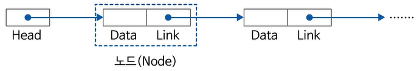

#### 단순 연결 리스트

- 하나의 링크 필드 -> 다음 노드와 연결
- 헤드가 가장 앞의 노드를 가리킴, 각 노드 링크 필드가 다음 노드를 가리킴
- None을 가리키는 노드 : 마지막 노드

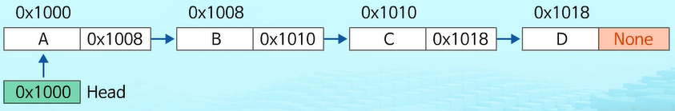

- 삽입 연산

  - 메모리 할당 : 새로운 노드 new 생성

    

  - 새로운 노드 new의 데이터 필드에 'B' 저장

    

  - 삽입될 위치 바로 앞 노드 링크 필드를 new에 복사

    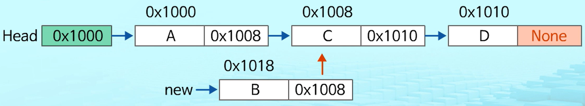

  - new 주소를 앞 노드 링크 필드에 저장

    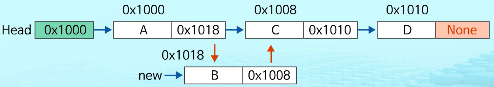

```pseudocode
# 첫번째 노드 삽입
def addtoFirst(data):  # 첫 노드에 데이터 삽입
	global Head
	Head = Node(data, Head)  # 새로운 노드 생성
	
# 가운데 노드 삽입
def add(pre, data):  # pre 다음에 데이터 삽입
	if pre == None:
		print('error')
	else:
		pre.link = Node(data, pre_link)
		
# 마지막 노드 삽입
def addtoLast(data):  # 마지막에 데이터 삽입
	global Head
	if Head == None:  # 빈 리스트이면
		Head = Node(data, None)
	else:
		p = Head
		while p.link != None:  # 마지막 노드 찾을 때까지
			p = p.link
		p.link = Node(data, None)
```

- 삭제 연산

  - 삭제할 노드 앞 노드 (선행노드) 탐색

    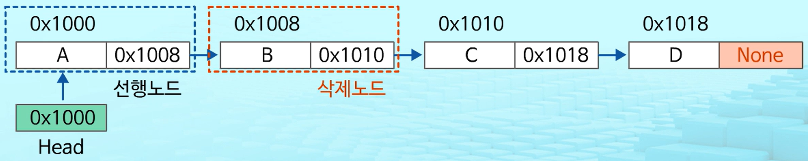

  - 삭제할 노드 링크 필드를 선행노드의 링크 필드에 복사

    

```pseudocode
# 첫 번째 노드 삭제
def deletetoFirst():  # 처음 노드 삭제
	global Head
	if Head == None:
		print('error')
	else:
		Head = Head.link

# 특정 위치 노드 삭제
def delete(pre):  # pre 다음 노드 삭제
	if pre == None or pre.link == None:
		print('error')
	else:
		pre.link = pre.link.link
```

#### 이중 연결 리스트

- 양쪽 순회 가능하도록 노드 연결
- 두개 링크 필드, 한개 데이터 필드

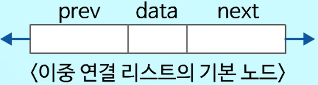


- 삽입 연산

  - 새로운 노드 new 생성, 데이터 필드 'D' 저장

    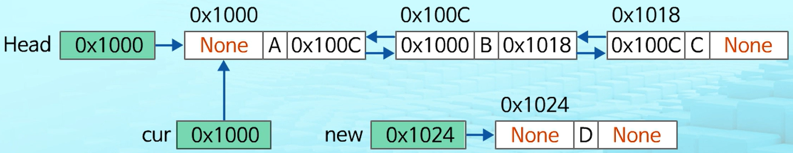

  - cur의 next를 new의 next에 저장 -> cur 다음 노드를 삽입할 노드의 다음 노드로 연결

    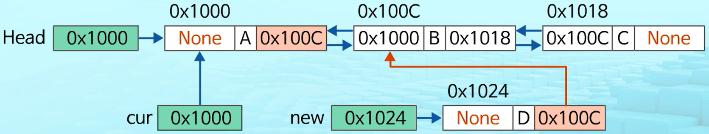

  - new 값을 cur의 next에 저장 -> 삽입 노드를 cur 다음 노드로 연결

    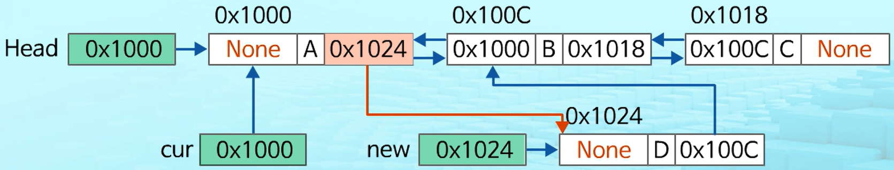

  - cur 값을 new의 prev 필드에 저장 -> cur를 new의 이전 노드로 연결

    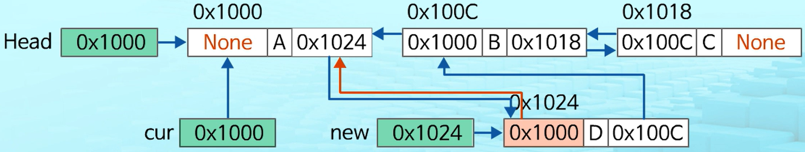

  - new 값을 new가 가리키는 노드의 다음 노드의 prev 필드에 저장 -> 삽입 노드의 다음 노드와 삽입 노드를 연결

    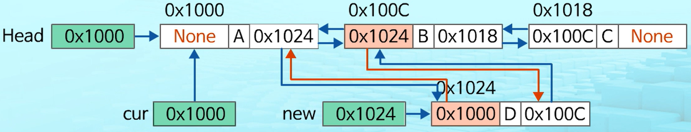

- 삭제 연산

  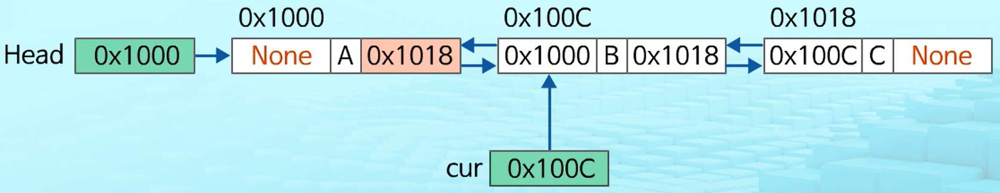

  - 삭제 노드의 다음 노드의 주소를 삭제 노드의 이전 노드의 next 필드에 저장 -> 링크 연결

    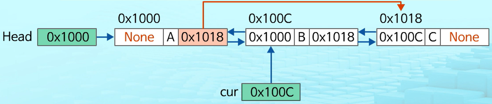

  - 삭제 노드의 다음 노드의 prev 필드에 삭제 노드의 이전 노드의 주소를 저장 -> 링크 연결

    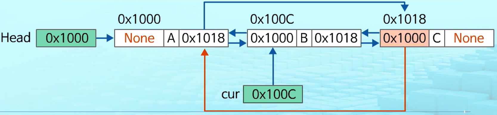

  - cur이 가리키는 노드에 할당된 메모리 반환

    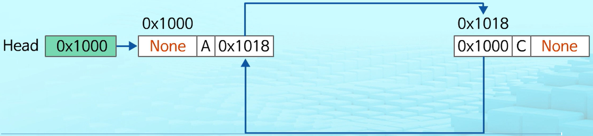

### 삽입 정렬

- 모든 원소들을 앞에서부터 차례대로 이미 정렬된 부분과 비교 -> 자신 위치 찾기
- `O(n^2)`

1. 부분집합 S, U
   - S : 정렬된 앞부분 원소
   - U : 아직 정렬되지 않은 나머지
2. U의 원소를 하나씩 꺼내서 S의 마지막 원소부터 비교

- {69, 10, 30, 2, 16, 8, 31, 22} 삽입 정렬

  - U 첫 번째 원소 10, S 마지막 원소 69

    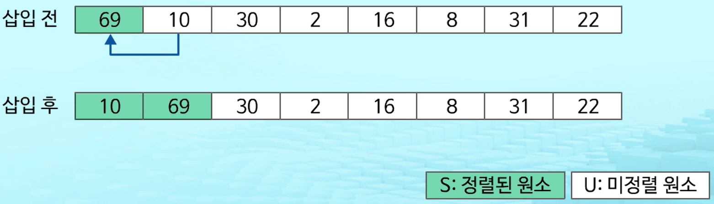

  - U 첫 번쨰 원소 30, S 마지막 원소 69

    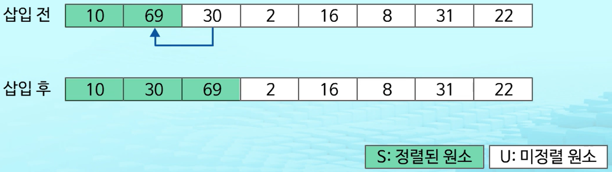

  - U 첫 번째 원소 2, S 마지막 원소 69

    

    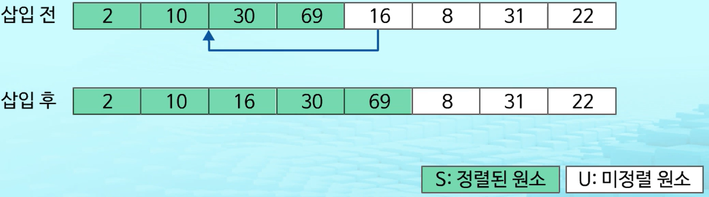

    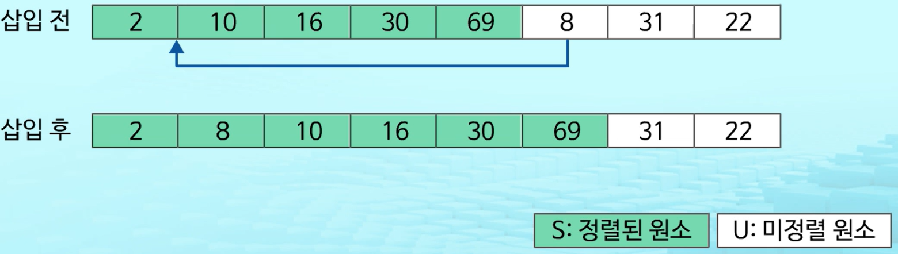

    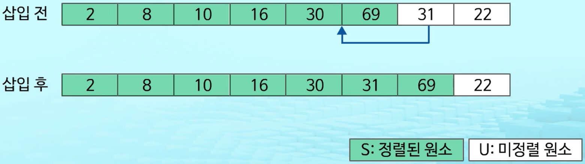

    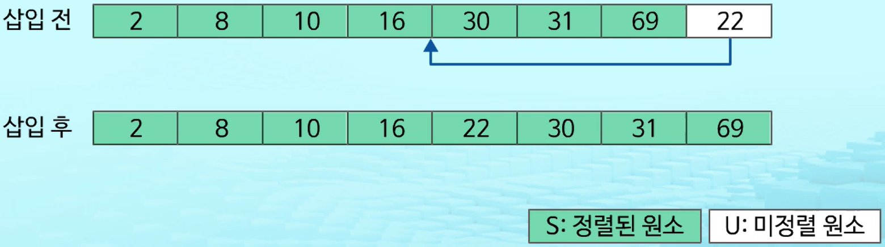

### 병합 정렬

- 여러 개 정렬된 자료 집합 병합 -> 한 개 정렬된 집합
- 분할 정복 알고리즘 : 최소 단위 문제까지 나눈 후, 차례대로 정렬, Top-Down 방식
- `O(n log n)`

- {69, 10, 30, 2, 16, 8, 31, 22} 

  - 분할 단계

    

    ```pseudocode
    def merge_sort(m):
    	if len(m) <= 1:  # 사이즈가 0이거나 1인 경우, 리턴
    		return m
    	
    	# 1. Divide 부분
    	mid = len(m) // 2
    	left = m[:mid]
    	right = m[mid:]
    	
    	# 리스트 크기 1 될 때까지 merge_sort 재귀 호출
    	left = merge_sort(left)
    	right = merge_sort(right)
    	
    	# 2. Conquer : 분할 리스트 병합
    	return merge(left, right)
    ```

    

  - 병합 단계 

    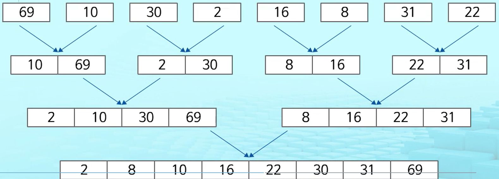

    ```pseudocode
    def merge(left, right):
    	result = []  # 두 개의 분할 리스트 -> 병합
    
    	while len(left) > 0 and len(right) > 0:  # 양쪽 리스트에 원소 남아있는 경우
    		# 두 서브 리스트 첫 원소 비교 -> 작은 것부터 result 추가
    		if left[0] <= right[0]:
    			result.append(left.pop(0))
    		else:
    			result.append(right.pop(0))
    			
    	if len(left) > 0:  # 왼쪽 리스트에 원소 남아있는 경우
    		result.extend(left)
    	if len(right) > 0:  # 오른쪽 리스트에 원소 남아있는 경우
    		result.extend(right)
    	return result
    ```

### 활용

#### Stack

- 원소 : 리스트 노드

- 스택 내 순서 : 리스트 링크를 통해 연결

- push : 리스트 마지막에 노드 삽입

- pop : 리스트 마지막 노드 반환, 삭제

  1. None 값 노드 -> 스택 초기화

     

  2. 원소 A 삽입 : `push(A)`

     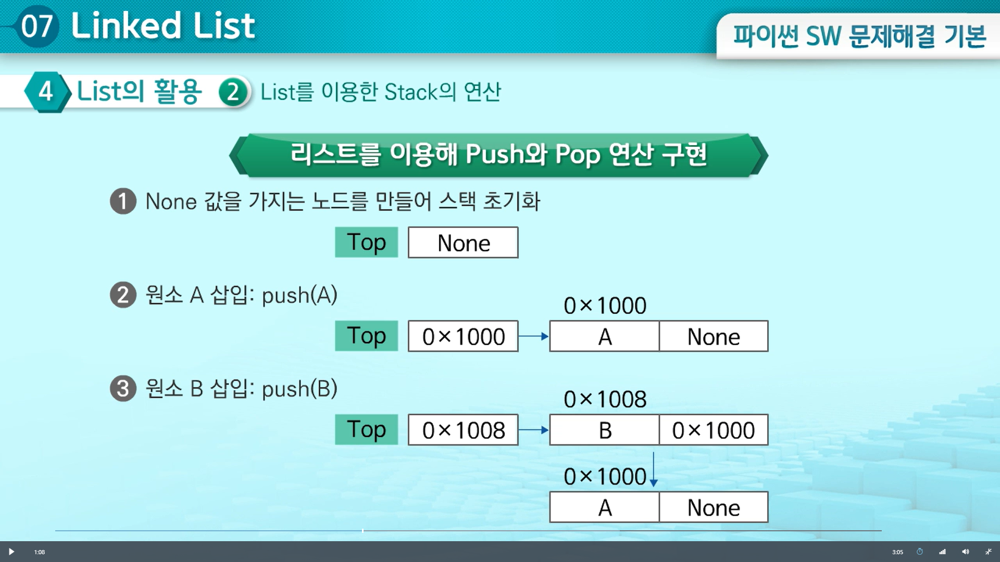

  3. 원소 B 삽입 : `push(B)`

     

  4. 원소 C 삽입 : `push(C)`

     

  5. 원소 반환 : pop

     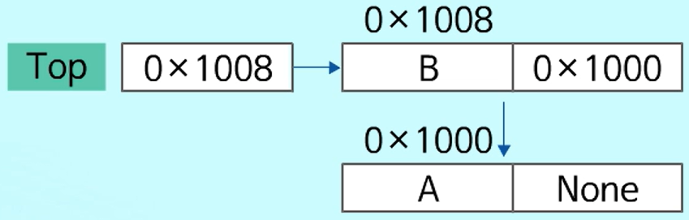

```pseudocode
def push(i):  # 원소 i를 stack top (맨 앞) 위치에 push
	global top
	top = Node(i, top)  # 새로운 노드 생성
	
def pop():  # stack top을 pop
	global top
	
	if top == None:  # 빈 리스트면
		print('error')
	else:
		data = top.data
		top = top.link  # top이 가리키는 노드 변경
		return data
```

- 변수 top : 리스트 마지막 노드, 초기 상태 (Top = None)

### 우선순위 큐

- 연결 리스트 이용
- 삽입 : `enQueue`, 삭제 : `deQueue`

#### 순차 리스트

- 우선순위 비교
- 가장 앞 : 최고 우선순위
- 삽입, 삭제 연산 시 원소 재배치 -> 시간, 메모리 낭비

#### 연결 리스트

- 리스트 내 노드 원소들과 비교
- 리스트 가장 앞쪽 : 최고 우선순위
- 삽입, 삭제 연산 후 원소 재배치 필요 X
- 메모리 효율적 사용