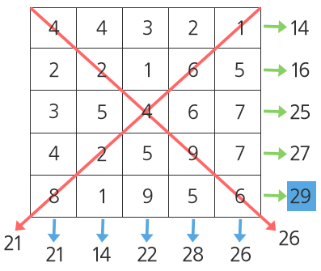

# 1209. Sum

> https://swexpertacademy.com/main/code/problem/problemDetail.do?contestProbId=AV13_BWKACUCFAYh&categoryId=AV13_BWKACUCFAYh&categoryType=CODE&problemTitle=sum&orderBy=FIRST_REG_DATETIME&selectCodeLang=ALL&select-1=&pageSize=10&pageIndex=1
>
> 다음 100X100의 2차원 배열이 주어질 때, 각 행의 합, 각 열의 합, 각 대각선의 합 중 최댓값을 구하는 프로그램을 작성하여라.
>
> 다음과 같은 5X5 배열에서 최댓값은 29이다.
>
> 
>
> **[제약 사항]**
>
> 총 10개의 테스트 케이스가 주어진다.
>
> 배열의 크기는 100X100으로 동일하다.
>
> 각 행의 합은 integer 범위를 넘어가지 않는다.
>
> 동일한 최댓값이 있을 경우, 하나의 값만 출력한다.
>  
> **[입력]**
>
> 각 테스트 케이스의 첫 줄에는 테스트 케이스 번호가 주어지고 그 다음 줄부터는 2차원 배열의 각 행 값이 주어진다.
>
> 1
> 13 24 13 24 1 7 24 11 22 18 22 16 24 8 15 28 9 24 14 14 28 18 17 9 3 29 22 12 28 2 25 6 11 26 14 19 3 26 13 6 23 3 3 29 13 25 4 27 8 25 28 8 9 17 28 13 24 27 9 25 21 20 6 16 28 5 22 11 9 29 13 26 28 2 11 10 14 14 5 11 26 9 15 3 23 9 8 11 12 6 9 18 6 14 28 21 24 24 20 12
> 20 28 29 21 27 13 29 16 6 28 5 7 13 20 7 1 11 1 23 12 4 9 27 19 26 2 21 2 1 18 4 20 6 4 18 9 20 3 28 28 1 21 1 2 11 7 20 15 7 29 14 7 15 10 29 24 2 25 29 3 11 9 17 6 2 17 17 11 7 20 26 10 8 1 15 10 2 29 7 9 17 8 25 28 29 12 28 19 3 4 17 17 28 9 2 15 14 6 20 3
> 13 19 28 23 11 1 19 5 5 28 19 18 16 14 26 20 6 12 20 18 16 22 25 21 25 29 3
> ........
>
> **[출력]**
>
> \#부호와 함께 테스트 케이스의 번호를 출력하고, 공백 문자 후 테스트 케이스의 답을 출력한다.
>
> \#1 1712
> \#2 1743
> .......

- 풀이

```python
for t in range(1, 11):
    n = int(input())
    arr = []
    for _ in range(100):
        arr += [list(map(int, input().split()))]

    arr_max = arr_sum = 0
    for i in range(100):
        for j in range(100):
            arr_sum += arr[i][j]
        if arr_max < arr_sum:
            arr_max = arr_sum
        arr_sum = 0

    for i in range(100):
        for j in range(100):
            arr_sum += arr[j][i]  # i, j 위치를 바꾼다.
        if arr_max < arr_sum:
            arr_max = arr_sum
        arr_sum = 0

    for i in range(100):
        arr_sum += arr[i][i]
    if arr_max < arr_sum:
        arr_max = arr_sum
    arr_sum = 0

    for i in range(100):
        arr_sum += arr[i][99 - i]
    if arr_max < arr_sum:
        arr_max = arr_sum

    print(f"#{t} {arr_max}")
```

- 해설

```python
TC = 10
for tc in range(1, TC+1):
    N = int(input())
    lst = []
    for i in range(100):
        sub_lst = list(map(int, input().split()))
        lst.append(sub_lst)

    # 각 행의 합
    sum_row_total = 0
    for a in range(100):
        sum_row = 0
        for b in lst[a]:
            sum_row += b
            if sum_row > sum_row_total:
                sum_row_total = sum_row

    sum_column_total = 0
    for b in range(100):
        sum_column = 0
        for a in range(100):
            sum_column += lst[a][b]
            if sum_column > sum_column_total:
                sum_column_total = sum_column

    sum_diagonal_1 = 0
    for a in range(100):
        for b in range(100):
            if a == b:
                sum_diagonal_1 += lst[a][b]
                
    sum_diagonal_2 = 0
    for a in range(100):
        for b in range(99, -1, -1):
            if a+b == 99:
                sum_diagonal_2 += lst[a][b]

    max_final = max([sum_row_total, sum_column_total, sum_diagonal_1, sum_diagonal_2])
    print("#{} {}".format(tc, max_final))
```

