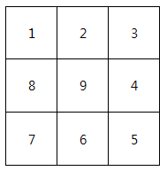
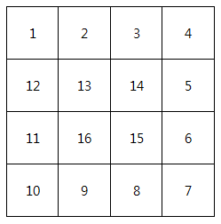

# 1954. 달팽이 숫자

> https://swexpertacademy.com/main/code/problem/problemDetail.do?contestProbId=AV5PobmqAPoDFAUq&categoryId=AV5PobmqAPoDFAUq&categoryType=CODE&problemTitle=%EB%8B%AC%ED%8C%BD%EC%9D%B4&orderBy=FIRST_REG_DATETIME&selectCodeLang=ALL&select-1=&pageSize=10&pageIndex=1
>
> 달팽이는 1부터 N*N까지의 숫자가 시계방향으로 이루어져 있다.
>
> 다음과 같이 정수 N을 입력 받아 N크기의 달팽이를 출력하시오.
>
>
> **[예제]**
>
> N이 3일 경우,
>
> 
>
> N이 4일 경우,
>
> 
>
> **[제약사항]**
>
> 달팽이의 크기 N은 1 이상 10 이하의 정수이다. (1 ≤ N ≤ 10)
>
>
> **[입력]**
>
> 가장 첫 줄에는 테스트 케이스의 개수 T가 주어지고, 그 아래로 각 테스트 케이스가 주어진다.
>
> 각 테스트 케이스에는 N이 주어진다.
>
> ```
> 2    
> 3   
> 4  
> ```
> 
> 
> **[출력]**
> 
> 각 줄은 '#t'로 시작하고, 다음 줄부터 빈칸을 사이에 두고 달팽이 숫자를 출력한다.
> 
> (t는 테스트 케이스의 번호를 의미하며 1부터 시작한다.)
> 
>```
>#1
> 1 2 3
>8 9 4
> 7 6 5
>#2
> 1 2 3 4
>12 13 14 5
> 11 16 15 6
> 10 9 8 7
> ```

- 풀이

```python
def get_snail(n):
    # 우하좌상 순으로 규칙적으로 진행됨
    # 이에 따른 델타 좌표 dx, dy
    dx = [0, 1, 0, -1]
    dy = [1, 0, -1, 0]
    # 달팽이 숫자 저장할 리스트
    snail = [[0] * n for _ in range(n)]
    num = 1
    # 델타 좌표 활용하기 위한 변수 case
    case = 0
    x, y = 0, -1
    # n이 3일 때 3 2 2 1 1 이런식으로 진행
    # 첫 번째 경우만 따로 처리
    for _ in range(n):
        x += dx[case]
        y += dy[case]
        snail[x][y] = num
        num += 1
    # 반복되는 경우 처리
    for i in range(n - 1, 0, -1):
        for _ in range(2):
            case += 1
            for _ in range(i):
                x += dx[case % 4]
                y += dy[case % 4]
                snail[x][y] = num
                num += 1
    return snail


t = int(input())
for tc in range(1, t + 1):
    n = int(input())
    print(f'#{tc}')
    result = get_snail(n)
    for nums in result:
        print(*nums)
```

