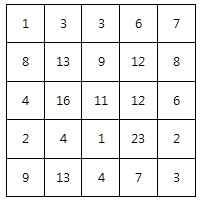
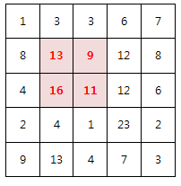

# 2001. 파리 퇴치

> https://swexpertacademy.com/main/code/problem/problemDetail.do?contestProbId=AV5PzOCKAigDFAUq&categoryId=AV5PzOCKAigDFAUq&categoryType=CODE&problemTitle=%ED%8C%8C%EB%A6%AC&orderBy=FIRST_REG_DATETIME&selectCodeLang=ALL&select-1=&pageSize=10&pageIndex=1
>
> N x N 배열 안의 숫자는 해당 영역에 존재하는 파리의 개수를 의미한다.
>
> 아래는 N=5 의 예이다.
>
> 
>
> M x M 크기의 파리채를 한 번 내리쳐 최대한 많은 파리를 죽이고자 한다.
>
> 죽은 파리의 개수를 구하라!
>
> 예를 들어 M=2 일 경우 위 예제의 정답은 49마리가 된다.
>
> 
>
> **[제약 사항]**
>
> \1. N 은 5 이상 15 이하이다.
>
> \2. M은 2 이상 N 이하이다.
>
> \3. 각 영역의 파리 갯수는 30 이하 이다.
>
> 
> **[입력]**
>
> 가장 첫 줄에는 테스트 케이스의 개수 T가 주어지고, 그 아래로 각 테스트 케이스가 주어진다.
>
> 각 테스트 케이스의 첫 번째 줄에 N 과 M 이 주어지고,
>
> 다음 N 줄에 걸쳐 N x N 배열이 주어진다.
>
> 10
> 5 2
> 1 3 3 6 7
> 8 13 9 12 8
> 4 16 11 12 6
> 2 4 1 23 2
> 9 13 4 7 3
> 6 3
> 29 21 26 9 5 8
> 21 19 8 0 21 19
> 9 24 2 11 4 24
> 19 29 1 0 21 19
> 10 29 6 18 4 3
> 29 11 15 3 3 29
> ...
>
> 
> **[출력]**
>
> 출력의 각 줄은 '#t'로 시작하고, 공백을 한 칸 둔 다음 정답을 출력한다.
>
> (t는 테스트 케이스의 번호를 의미하며 1부터 시작한다.)
>
> \#1 49
> \#2 159
> ...

- 풀이

```python
t = int(input())

for tc in range(1, t + 1):
    n, m = map(int, input().split())
    arr = [list(map(int, input().split())) for _ in range(n)]  # n X n
    
    flies = 0
    for i in range(n - m + 1):
        for j in range(n - m + 1):
            total = 0
            for k in range(i, i + m):
                for l in range(j, j + m):
                    total += arr[k][l]
            if total > flies:
                flies = total

    print(f"#{tc} {flies}")
```

- 해설 1

```python
T = int(input())
for tc in range(1,T+1):
    N,M = map(int,input().split())
    flies = [list(map(int, input().split())) for _ in range(N)]
    # print(flies)
    result = -1
    for r in range(N-M+1):
        for c in range(N-M+1):
            result_sub = 0
            for dr in range(M):
                for dc in range(M):
                    result_sub += flies[r+dr][c+dc]
            if result_sub > result:
                result = result_sub
    print("#{} {}".format(tc, result))
```

- 해설 2

```python
T = int(input())
for tc in range(1,T+1):
    N, M = map(int,input().split())
    arr = [list(map(int,input().split())) for _ in range(N)]
    # for row in arr:
    #     print(row)
    max_get = 0
    max_sub = 0
    for i in range(0,N-M+1):
        for j in range(0,N-M+1):
            for a in range(M):
                for b in range(M):
                    max_sub += arr[i+a][j+b]
            if max_get < max_sub:
                max_get = max_sub
            max_sub = 0
    print("#{} {}".format(tc, max_get))
```

