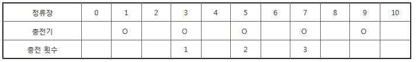

# 4831. 전기버스

> https://swexpertacademy.com/main/learn/course/subjectDetail.do?courseId=AVuPDN86AAXw5UW6&subjectId=AWOVFCzaqeUDFAWg
>
> A도시는 전기버스를 운행하려고 한다. 전기버스는 **한번 충전으로 이동할 수 있는 정류장 수**가 정해져 있어서, 중간에 충전기가 설치된 정류장을 만들기로 했다.
>
> 버스는 0번에서 출발해 종점인 N번 정류장까지 이동하고, 한번 충전으로 최대한 이동할 수 있는 정류장 수 K가 정해져 있다.
>
> 충전기가 설치된 M개의 정류장 번호가 주어질 때, **최소한 몇 번의 충전을 해야 종점에 도착할 수 있는지 출력**하는 프로그램을 만드시오.
>
> 만약 충전기 설치가 잘못되어 종점에 도착할 수 없는 경우는 0을 출력한다. 출발지에는 항상 충전기가 설치되어 있지만 충전횟수에는 포함하지 않는다.
>
> **[예시]**
>
> 
>
>
> 다음은 K = 3, N = 10, M = 5, 충전기가 설치된 정류장이 1, 3, 5, 7, 9인 경우의 예이다.
>
> 
>
> **[입력]**
>
>
> 첫 줄에 노선 수 T가 주어진다. ( 1 ≤ T ≤ 50 )
>
>
> 각 노선별로 K, N, M이 주어지고, 다음줄에 M개의 정류장 번호가 주어진다. ( 1 ≤ K, N, M ≤ 100 )
>
> 3 
>
> 3 10 5 
>
> 1 3 5 7 9 
>
> 3 10 5 
>
> 1 3 7 8 9 
>
> 5 20 5 
>
> 4 7 9 14 17 
>
> **[출력]**
>
>
> \#과 노선번호, 빈칸에 이어 최소 충전횟수 또는 0을 출력한다.
>
> #1 3 
>
> #2 0 
>
> #3 4

- 풀이

```python
T = int(input())
for t in range(1, T + 1):
    k, n, m = map(int, input().split())
    stations = list(map(int, input().split()))
    result = 0
    start = 0
    impossible = False
    while True:
        end = start + k
        # 끝에 도달하거나 불가능이면 탈출
        if end >= n or impossible:
            break
        # 뒤부터 탐색하여 K범위 내 가장 먼 충전기와 만나면 진행, 못만나면 불가능
        for i in range(end, start - 1, -1):
            # 간 곳이 start와 같으면 충전기가 없는 것이다. 불가능으로 판별
            if i == start:
                impossible = True
                break
            # 간 곳이 충전기이면 진행
            if i in stations:
                start = i
                result += 1
                break

    if impossible:
        print(f'#{t} 0')
    else:
        print(f'#{t} {result}')
```

- 해설1

```python
TC = int(input())
for tc in range(1, TC+1):
    K,N,M = map(int,input().split())
    station = list(map(int, input().split()))
    station_lst = [0] * (N+1)

    for i in range(len(station)):
        station_lst[station[i]] += 1

    start = 0
    end = K
    cnt = 0

    while True:
        zero = 0
        for i in range(start+1, end+1):
            if station_lst[i] == 1:
                start = i
            else:
                zero += 1

        if zero == K:
            cnt = 0
            break

        cnt += 1
        end = start + K

        if end >= N:
            break

    print('#%s %d'%(tc, cnt))
```

- 해설2

```python
T = int(input())
for tc in range(1,T+1):
    K, N, M = map(int,input().split())
    arr = list(map(int,input().split()))
    stations = [0]*(N+1)
    for chr in arr:
        stations[chr] = 1
 
    start_idx = 0
    cnt = 0
    bool = True
    while start_idx < N-K:
        if bool == False:
            break
        if stations[start_idx+K] == 1:
            cnt += 1
            start_idx = start_idx+K
        else:
            for i in range(1,K+1):
                if i == K: bool = False; break
                elif stations[(start_idx+K)-i] == 1:
                    start_idx = (start_idx+K)-i
                    cnt+=1
                    break
    if bool == True:
        print("#{} {}".format(tc, cnt))
    else: print("#{} 0".format(tc))
```

