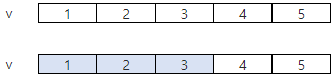

# 4835. 구간합

> https://swexpertacademy.com/main/learn/course/subjectDetail.do?courseId=AVuPDN86AAXw5UW6&subjectId=AWOVFCzaqeUDFAWg
>
> N개의 정수가 들어있는 배열에서 이웃한 M개의 합을 계산하는 것은 디지털 필터링의 기초연산이다.
>
> M개의 합이 가장 큰 경우와 가장 작은 경우의 차이를 출력하는 프로그램을 작성하시오.
>
>
> 다음은 N=5, M=3이고 5개의 숫자 1 2 3 4 5가 배열 v에 들어있는 경우이다.
>
> 
>
> 이웃한 M개의 합이 가장 작은 경우 1 + 2 + 3 = 6
>
> 
>
> 이웃한 M개의 합이 가장 큰 경우 3 + 4 + 5 = 12
>
>
> 답은 12와 6의 차인 6을 출력한다.
>
> 
>
>
> **[입력]**
>
>
> 첫 줄에 테스트 케이스 개수 T가 주어진다. ( 1 ≤ T ≤ 50 )
>
>
> 다음 줄부터 테스트케이스의 첫 줄에 정수의 개수 N과 구간의 개수 M 주어진다. ( 10 ≤ N ≤ 100, 2 ≤ M ＜ N )
>
>
> 다음 줄에 N개의 정수 ai가 주어진다. ( 1 ≤ a ≤ 10000 )
>
> 3
> 10 3
> 1 2 3 4 5 6 7 8 9 10
> 10 5
> 6262 6004 1801 7660 7919 1280 525 9798 5134 1821
> 20 19
> 3266 9419 3087 9001 9321 1341 7379 6236 5795 8910 2990 2152 2249 4059 1394 6871 4911 3648 1969 2176 
>
> **[출력]**
>
>
> 각 줄마다 "#T" (T는 테스트 케이스 번호)를 출력한 뒤, 답을 출력한다.
>
> \#1 21
> \#2 11088
> \#3 1090

- 풀이

```python
t = int(input())
for tc in range(1, t + 1):
    n, m = map(int, input().split())
    ai = list(map(int, input().split()))
    # 1
    max_num = sum(ai[0:m])
    min_num = sum(ai[0:m])
    # 2
    for i in range(0, n - m + 1):
        temp = sum(ai[i:i + m])
        if min_num >= temp:
            min_num = temp
        if max_num <= temp:
            max_num = temp
    ans = max_num - min_num
    print(f'#{tc} {ans}')
```

- 해설

```python
T = int(input())
for tc in range(1, T+1):
    N, M = map(int, input().split())
    ai = list(map(int, input().split()))
    
    lst = []
    for i in range(N-M+1):
        lst.append(sum(ai[i:i+M]))
    
    print('#{} {}'.format(tc, max(lst)-min(lst)))
```

