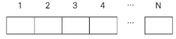

# 8702. 당근 수확

> 영준이의 당근밭은 농사가 잘 되어서 두 명의 일꾼에게 수확을 시키려고 합니다. 당근밭은 관리를 위해 다음과 같이 번호를 붙인 N개의 구역으로 이루어져 있습니다. 첫번째 일꾼은 1번 영역부터 연속으로 몇 개의 영역을 수확하고, 두번째 일꾼은 바로 다음부터 N번까지의 영역을 수확할 때, 두 일꾼이 수확한 당근의 수가 비슷하게 구역을 나누려고 합니다. 첫 번째 일꾼이 몇 번 영역까지 수확할 때 두 일꾼이 수확한 당근 개수의 차이가 최소가 되는지 알아내는 프로그램을 만들어보세요.
>
> 각 구역에서 수확할 수 있는 당근의 개수가 제공되고, 남겨놓는 당근은 없습니다.
> 만약 여러 영역이 가능한 경우 가장 빠른 번호를 선택합니다.
>
> 
>
> **입력**
>
> 첫 줄에 테스트케이스 T, 다음 줄부터 테스트케이스 별로 첫 줄에 N, 다음줄에 구역별로 10개 이하의 당근 개수가 주어집니다.
>
> 1<=T<=50, 5<=N<=20
> 3
> 5
> 10 8 7 4 9
> 10
> 9 4 1 6 9 10 0 5 8 2
> 10
> 3 1 6 8 0 9 7 9 9 7
>
> **출력**
>
> \#과 테스트케이스 번호, 첫 일꾼의 마지막 영역과 수확 개수의 차이를 출력합니다.
>
> \#1 2 2
> \#2 5 4
> \#3 6 5

- 풀이

```python
t = int(input())

for tc in range(1, t + 1):
    n = int(input())
    carrot = list(map(int, input().split()))
    ans = []

    for i in range(n):
        a = sum(carrot[:i + 1])
        b = sum(carrot[i + 1:])
        ans.append((i + 1, abs(a - b)))
    work = 0
    diff = float('inf')

    for r in ans:
        if r[1] < diff:
            work = r[0]
            diff = r[1]
    print(f'#{tc} {work} {diff}')
```

