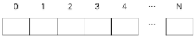

# 8706. 당근 수확 2

> 한 명의 일꾼이 외바퀴 수레를 이용해 수확한 당근을 옮기려고 합니다. 당근밭은 작은 구역으로 나뉘어 있고, 각 구역은 한줄로 늘어선 모양이어서 일정 간격으로 번호가 붙어있습니다. 수확한 당근을 모으는 통과 외바퀴 수레의 보관 장소가 0번 구역이고, 여기서부터 거리에 따라 구역번호를 붙였기 때문에 각 구역의 번호를 그 구역까지 이동한 거리로 생각합니다. 다음과 같이 번호가 붙은 밭에서 모든 당근을 0번 구역으로 옮길 때, 일꾼이 이동한 총 거리를 알아내는 프로그램을 만들어보세요.
>
> 
>
> 각 구역에서 가져올 당근의 개수가 제공됩니다.
> 수레에는 실을 수 있는 당근의 개수가 제한되어 있습니다.
> 일꾼은 0번에서 출발해 가까운 순서로 당근을 수레에 싣다가 수레가 꽉 차면 0번으로 돌아와 수레를 비우고, 다시 당근을 실으러 이동합니다.
> 모든 당근을 0번 구역으로 옮기기까지 일꾼이 이동한 총 거리를 계산합니다.
>
> **입력**
>
> 첫 줄에 테스트케이스 T, 다음 줄부터 테스트케이스 별로 첫 줄에 N과 수레에 실을 수 있는 용량 M, 다음줄에 구역별로 10개 이하의 당근 개수가 주어집니다.
>
> 1<=T<=50, 5<=N<=20
>
> 3
> 5 6
> 10 8 7 4 9
> 10 100
> 9 4 1 6 9 10 0 5 8 2
> 10 6
> 3 1 6 8 0 9 7 9 9 7
>
> **출력**
>
> 테스트케이스별로 각 줄에 #과 테스트케이스 번호, 일꾼이 이동한 거리를 출력합니다.
>
> \#1 46
> \#2 20
> \#3 138

- 풀이

```python
t = int(input())

for tc in range(1, t + 1):
    n, m = map(int, input().split())
    area = list(map(int, input().split()))

    dist = 0
    carrot = 0
    i = 0

    while i < n:
        if area[i] >= m - carrot:
            area[i] -= m - carrot
            carrot = 0
            dist += (i + 1) * 2
        else:
            carrot += area[i]
            i += 1
            dist += 1
    dist += n
    print(f'#{tc} {dist}')
```

