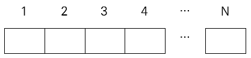

# 8810. 당근밭 옆 고구마밭

> 영준이는 당근 밭 옆에 다음과 같은 모양의 구역으로 나눠진 고구마 밭을 새로 만들었고, 수확철이 되자 학생들이 고구마를 캐러 방문하게 되었습니다. 마침 학생들이 알고리즘 공부를 하고 있다는 것을 알게 된 영준이는 고구마 밭의 규칙을 찾아보라 했고, 어떤 구역에 이웃한 오른쪽 구역의 고구마 개수가 더 많으면, 두 구역의 모든 고구마가 하나의 줄기에 매달려 있음을 알게 되었습니다. 학생들은 두개 이상의 구역에 걸쳐 있는 줄기를 ‘긴 줄기’라 이름 붙이고, 고구마 밭에는 총 몇 개의 긴 줄기가 있는지, 그리고 가장 긴 줄기에 달린 고구마는 모두 몇개인지 알아내는 프로그램을 만들기로 했습니다. 각 구역의 고구마 개수가 주어질 때, 학생들이 만든 프로그램의 결과를 확인하기 위한 출력을 만들어보세요. 가장 긴 줄기가 여럿일 때는 고구마의 개수가 많은 쪽을 가장 긴 줄기로 선택합니다.
>
> 
>
> **입력**
>
> 첫 줄에 테스트케이스 T, 다음 줄부터 테스트케이스 별로 첫 줄에 구역의 개수 N, 다음 줄에 각 구역의 고구마 개수 C가 주어집니다.
>
> 1<=T<=50, 5<=N<=1000, 0<=C<=100
>
>  4
> 8
> 1 2 3 4 5 1 2 3
> 7
> 1 2 3 4 3 2 1
> 9
> 1 2 3 2 3 4 1 2 3
> 5
> 1 9 1 2 3
>
> **출력**
>
> 테스트케이스별로 각 줄에 #과 테스트케이스 번호, 긴 줄기의 개수, 가장 긴 줄기에 달린 고구마의 개수를 출력합니다.
>
> \#1 2 15
> \#2 1 10
> \#3 3 9
> \#4 2 6

- 풀이

```python
t = int(input())

for tc in range(1, t + 1):
    n = int(input())
    c = list(map(int, input().split()))

    ans = list()
    temp = [c[0]]
    max_len, max_sum, cnt = 0, 0, 0

    for i in range(n - 1):
        if c[i] < c[i + 1]:
            temp.append(c[i + 1])
        else:
            ans.append(temp)
            temp = [c[i + 1]]
        if i == n - 2:
            ans.append(temp)

    for stem in ans:
        if len(stem) > 1:
            if max_len < len(stem):
                max_len = len(stem)
                max_sum = sum(stem)
            if len(stem) == max_len:
                if sum(stem) > max_sum:
                    max_sum = sum(stem)
            cnt += 1
    print(f'#{tc} {cnt} {max_sum}')
```

