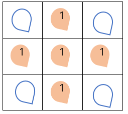

# 9490. 풍선팡

> 종이 꽃가루가 들어있는 풍선이 M개씩 N개의 줄에 붙어있고, 어떤 풍선을 터뜨리면 안에 든 종이 꽃가루 개수만큼 상하 좌우의 풍선이 추가로 터지게 되는 게임이 있다.
>
> 예를 들어 풍선에 든 꽃가루가 1개씩일 때, 가운데 풍선을 터뜨리면 상하좌우의 풍선이 추가로 1개씩 터지면서 총 5개의 꽃가루가 날리게 된다.
>
> 
>
> NxM개의 풍선에 들어있는 종이 꽃가루 개수A가 주어지면, 한 개의 풍선을 선택했을 때 날릴 수 있는 꽃가루의 합 중 최대값을 출력하는 프로그램을 만드시오.
>
> (3<=N, M<=100)
>
> 
>
> **입력**
>
> 첫 줄에 테스트케이스 수 T, 다음 줄부터 테스트케이스 별로 첫 줄에 N과 M, 이후 N줄에 걸쳐 M개씩 풍선에 든 종이 꽃가루 개수가 주어진다.
>
> ```
> 3
> 3 5
> 2 1 1 2 2 
> 2 2 1 2 2 
> 2 2 1 1 2 
> 5 5
> 3 4 1 2 3 
> 3 4 1 3 2 
> 2 3 2 4 1 
> 1 4 4 1 3 
> 2 2 3 4 4 
> 5 8
> 1 3 4 4 4 4 3 3 
> 4 1 2 4 3 1 4 4 
> 4 1 4 4 1 4 2 1 
> 3 2 4 2 1 1 2 1 
> 4 4 1 4 4 2 2 2 
> ```
>
> **출력**
>
> \#과 테스트케이스 번호, 빈칸에 이어 종이 꽃가루의 최대 개수를 출력한다.
>
> ```
> #1 10
> #2 26
> #3 40
> ```

- 풀이

```python
t = int(input())
dr = [-1, 0, 1, 0]
dc = [0, -1, 0, 1]

for tc in range(1, t + 1):
    m, n = map(int, input().split())

    ball = [[0] + list(map(int, input().split())) + [0] for _ in range(m)]
    ball.insert(0, [0] * (n + 2))
    ball.append([0] * (n + 2))

    pollen = 0

    for i in range(1, m + 1):
        for j in range(1, n + 1):
            point = ball[i][j]
            s = point
            for k in range(4):
                p = 0
                temp_m = i + dr[k]
                temp_n = j + dc[k]
                position = ball[temp_m][temp_n]

                while position != 0:
                    if p >= point:
                        break
                    s += position
                    p += 1
                    temp_m += dr[k]
                    temp_n += dc[k]
                    position = ball[temp_m][temp_n]

                if pollen < s:
                    pollen = s

    print(f'#{tc} {pollen}')
```

- 다른 풀이 1

```python
T = int(input())
for tc in range(T):
    n,m=map(int,input().split())
    arr = []
    res=0
    for i in range(n):
        tmp=list(map(int,input().split()))
        arr.append(tmp)
 
    for i in range(n):
        for j in range(m):
            value=-arr[i][j]
            for a in range(max(0,i-arr[i][j]),min(n,i+arr[i][j]+1)):
                value+=arr[a][j]
            for a in range(max(0,j-arr[i][j]),min(m,j+arr[i][j]+1)):
                value+=arr[i][a]
            res=max(res,value)
 
    print(f'#{tc+1} {res}')
```

- 다른 풀이 2

```python
T = int(input())

for tc in range(T):
    N, M = map(int, input().split())
    arr = [list(map(int, input().split())) for _ in range(N)]
 
    sum_list = []
    i = 0
    while i <= N-1:
 
        j = 0
        while j <= M-1:
            tmp_sum = 0
            f = arr[i][j]   
            tmp_sum += f    
            k=i-f 
            while k<= i+f:  
                if 0 <= k <= N-1 and k!=i: 
                    tmp_sum += arr[k][j]    
                k+=1    
            p = j-f
            while p <= j+f:
 
                if 0 <= p <= M-1 and p!=j:  
                    tmp_sum += arr[i][p]   
            sum_list.append(tmp_sum)
            j+=1 
        i+=1
 
    maxidx = 0
    for idx in range(len(sum_list)):
        if sum_list[maxidx] < sum_list[idx]:
            maxidx = idx
 
    print(f'#{tc+1} {sum_list[maxidx]}')
```

