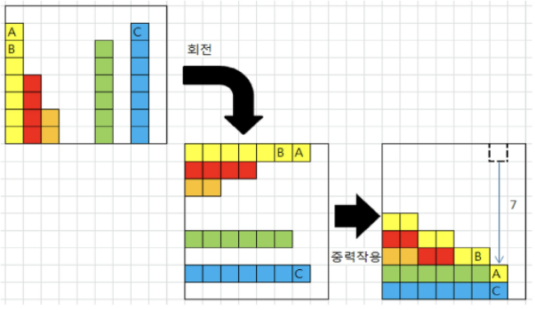

# 10548. Gravity

> 상자들이 쌓여있는 방이 있다. 방이 오른쪽으로 90도 회전하여 상자들이 중력의 영향을 받아 낙하한다고 할 때, 낙차가 가장 큰 상자를 구하여 그 낙차를 리턴 하는 프로그램을 작성하시오.
>
> - 중력은 회전이 완료된 후 적용된다.
> - 상자들은 모두 한쪽 벽면에 붙여진 상태로 쌓여 2차원의 형태를 이루며 벽에서 떨어져서 쌓인 상자는 없다.
> - 방의 가로길이는 항상 100이며, 세로 길이도 항상 100이다.
> - 즉, 상자는 최소 0, 최대 100 높이로 쌓을 수 있다.
> - 아래 예) 총 26개의 상자가 회전 후, 오른쪽 방 그림의 상태가 된다. A 상자의 낙차가 7로 가장 크므로 7을 리턴하면 된다.
> - 회전 결과, B 상자의 낙차는 6, C 상자의 낙차는 1이다.
>
> 
>
> 단, 방의 가로 길이는 N이다. 
>
> 입력으로 테스트케이스 개수, 다음 줄부터 케이스별로 첫 줄에 N, 다음 줄에 N개의 상자 높이가 주어진다.
>
> - **입력**
>
> 3
> 9
> 7 4 2 0 0 6 0 7 0
> 20
> 52 56 38 77 43 31 11 87 68 64 88 76 56 59 46 57 75 85 65 53
> 100
> 1 83 27 3 96 23 9 48 54 94 32 4 26 79 35 0 69 52 15 13 72 34 86 52 97 61 44 57 71 81 15 86 8 31 46 80 95 95 21 83 55 90 97 90 30 61 45 35 95 86 3 39 53 26 69 0 92 17 15 72 79 63 41 11 94 55 14 89 65 15 45 13 15 17 23 100 55 68 60 46 77 29 4 13 53 3 79 58 9 88 20 84 93 71 28 67 22 7 12 43 
>
> - **출력**
>
> \#1 7
> \#2 13
> \#3 92

- 풀이

```python
T = int(input())

for t in range(1, T + 1):
    N = int(input())
    boxes = list(map(int, input().split()))
    max_fall = 0

    for i in range(0, len(boxes) - 1):
        bigger = 0
        for j in range(i + 1, len(boxes)):
            if boxes[j] >= boxes[i]:
                bigger += 1

        i_max_fall = len(boxes) - i - 1 - bigger
        if i_max_fall > max_fall:
            max_fall = i_max_fall

    print(f'#{t} {max_fall}')
```

- 다른 풀이

```python
T=int(input())
for i in range(T):
        res=0
        tmp=[]
        N=int(input())
        numbers=list(map(int,input().split()))
        for j in range(len(numbers)):
            final=N-j-1
            for k in range(j+1,len(numbers)):
                if numbers[k]>=numbers[j]:
                    final-=1
            tmp.append(final)
        res=tmp[0]
        for j in tmp:
            if j>res:
                res=j
        print(f"#{i+1} {res}")
```

