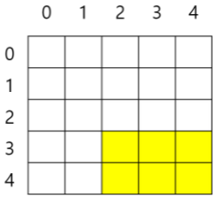

# 11042. 부분 배열의 합

> 크기가 NxN인 배열의 부분 배열인 nxm 배열 원소의 합 중 가장 큰 값을 출력하시오.
>
> 
>
> 다음은 N=5, n=2, m=3일 때 오른쪽 아래의 부분 배열 영역을 나타낸다. 
>
> 
>
> 부분 배열은 주어진 NxN 배열을 벗어나지 않는 모든 경우에 대해 고려해야한다.
>
> **입력**
> 첫 줄에 테스트케이스개수 T가 주어지고, 다음 줄 부터 각 테스트 케이스 별로 N, n, m이 주어진다. 이후 N개의 줄 각각 N개의 1 또는 0이 주어진다.
>
> 10<=N<=100, 1<=n, m
>
> ```
> 3
> 5 3 3
> 0 1 1 0 1 
> 1 1 0 1 1 
> 0 1 1 0 0 
> 0 0 1 0 0 
> 1 0 1 0 0 
> 10 8 6
> 0 1 1 1 1 0 0 0 1 1 
> 1 1 1 1 1 0 1 0 1 1 
> 1 1 0 1 0 1 0 1 1 0 
> 1 0 0 1 1 1 0 1 0 1 
> 0 1 1 0 0 1 0 0 0 0 
> 1 1 1 0 1 1 0 1 0 1 
> 0 0 1 1 1 1 1 0 0 0 
> 1 1 0 0 1 0 1 0 1 1 
> 1 1 0 0 1 0 1 0 1 1 
> 1 1 0 1 0 0 1 1 0 0 
> 20 12 16
> 1 0 0 0 0 1 1 0 1 0 0 0 0 1 1 1 0 1 1 1 
> 0 0 0 0 1 1 0 1 1 1 0 1 1 0 1 1 0 0 0 0 
> 1 1 1 1 0 1 1 1 0 0 0 0 0 0 0 1 1 0 0 1 
> 0 0 1 1 1 1 0 0 0 0 1 0 0 1 1 0 1 1 1 1 
> 1 1 0 0 1 0 0 0 1 0 1 1 0 0 1 1 0 1 1 1 
> 0 1 0 0 0 1 1 0 1 0 1 1 1 1 0 0 1 0 0 0 
> 0 0 0 1 0 0 1 1 1 0 1 0 0 1 1 1 0 1 1 1 
> 0 0 1 1 1 1 0 0 0 1 0 1 1 0 1 1 1 0 1 0 
> 1 1 0 1 0 1 0 0 0 0 0 1 1 1 0 0 1 1 1 0 
> 1 0 0 1 1 1 1 1 0 0 0 0 1 1 0 0 1 0 1 1 
> 0 0 0 0 0 0 0 1 0 0 0 1 0 1 0 1 1 0 1 1 
> 0 0 0 1 0 1 1 0 1 1 0 0 1 0 1 1 0 0 1 1 
> 1 1 1 1 1 1 0 1 1 1 1 1 0 0 1 0 1 1 1 0 
> 1 0 0 1 0 1 1 0 0 1 1 0 1 0 0 0 0 0 0 0 
> 0 1 1 1 0 0 1 1 1 1 0 1 0 0 1 0 1 1 0 1 
> 1 0 0 0 1 0 0 1 0 1 1 0 0 1 0 0 1 0 0 1 
> 0 0 0 1 0 0 0 0 0 1 0 1 0 0 0 1 0 0 0 0 
> 1 1 1 1 1 1 1 1 1 0 0 0 1 1 1 0 1 0 0 0 
> 0 1 0 1 0 1 1 1 1 0 0 1 0 0 0 0 0 0 0 1 
> 1 0 1 0 1 0 0 1 1 1 1 0 1 0 0 1 0 1 0 1
> ```
>
> **출력**
> \#에 이어 1번부터인 테스트케이스 번호, 빈칸에 이어 답을 출력한다.
>
> ```
> #1 6
> #2 32
> #3 104
> ```

- 풀이

```python
T = int(input())

for tc in range(1, T + 1):
    N, n, m = map(int, input().split())
    arr = [list(map(int, input().split())) for _ in range(N)]

    max_sum = 0
    for i in range(N - n + 1):
        for j in range(N - m + 1):
            temp_sum = 0
            for k in range(i, i + n):
                for l in range(j, j + m):
                    temp_sum += arr[k][l]

            if max_sum < temp_sum:
                max_sum = temp_sum

    print(f'#{tc} {max_sum}')
```

