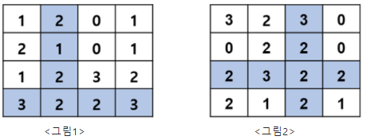

# 11094. 가로 세로 최대합

> N x N 배열에서 한 칸을 선택했을 때 그 칸을 포함하는 가로 행과 세로 열에 포함된 값들의 총합이 최대가 되는 경우를 찾고 싶다.
>
> 그림1과 2는 N = 4인 배열의 예이다.  그림 1은 (3행, 1열)의 위치를 포함하는 행과 열의 합 **15** 가 최대가 되고, 그림 2는 (2행, 2열)을 포함하는 **16** 이 최대가 된다.
>
> 
>
> [입력]
>
> 첫 줄에 테스트케이스 수가 주어진다.
>
> 다음으로 배열의 크기 N(1<= N <= 30)이 주어진다.
>
> 다음 N개의 줄에 공백으로 구분된 N개의 정수 aij값이 주어진다. (0<= aij <=100)
>
> 3
> 4
> 1 2 0 1
> 2 1 0 1
> 1 2 3 2
> 3 2 2 3
> 4
> 3 2 3 0
> 0 2 2 0
> 2 3 2 2
> 2 1 2 1
> 5
> 2 4 3 1 3
> 4 0 2 3 2
> 2 0 3 4 3
> 1 3 4 3 1
> 3 0 3 3 4
>
>  
>
> [출력]
>
> '#'과 케이스 번호를 출력하고 총합이 최대가 되는 값을 출력한다.
>
> \#1 15
> \#2 16
> \#3 26

- 풀이

```python
T = int(input())

for tc in range(1, T + 1):
    N = int(input())
    aij = [list(map(int, input().split())) for _ in range(N)]

    max_sum = 0
    for i in range(N):
        for j in range(N):
            tmp_sum = 0
            for k in range(N):
                tmp_sum += (aij[i][k] + aij[k][j])
            tmp_sum -= aij[i][j]

            if tmp_sum > max_sum:
                max_sum = tmp_sum

    print(f'#{tc} {max_sum}')
```

