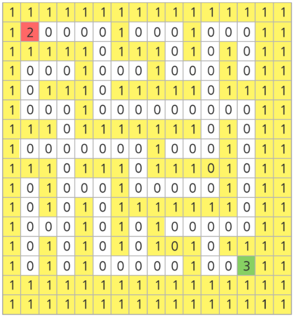
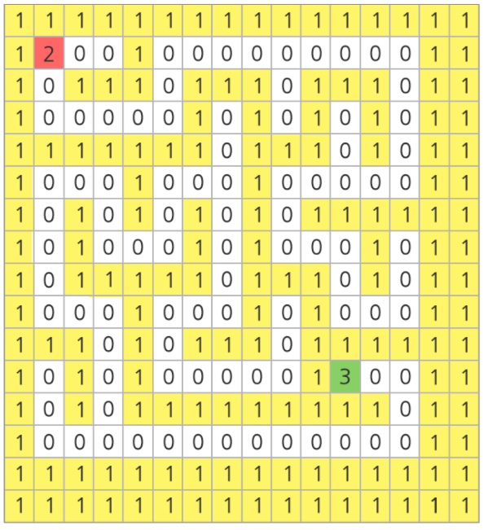

# 1226. 미로1

> https://swexpertacademy.com/main/code/problem/problemDetail.do?contestProbId=AV14vXUqAGMCFAYD&categoryId=AV14vXUqAGMCFAYD&categoryType=CODE&problemTitle=%EB%AF%B8%EB%A1%9C1&orderBy=FIRST_REG_DATETIME&selectCodeLang=ALL&select-1=&pageSize=10&pageIndex=1
>
> 아래 그림과 같은 미로가 있다. 16*16 행렬의 형태로 만들어진 미로에서 흰색 바탕은 길, 노란색 바탕은 벽을 나타낸다.
>
> 가장 좌상단에 있는 칸을 (0, 0)의 기준으로 하여, 가로방향을 x 방향, 세로방향을 y 방향이라고 할 때, 미로의 시작점은 (1, 1)이고 도착점은 (13, 13)이다.
>
> 주어진 미로의 출발점으로부터 도착지점까지 갈 수 있는 길이 있는지 판단하는 프로그램을 작성하라.
>
> 아래의 예시에서는 도달 가능하다.
>
> 
>
> 아래의 예시에서는 출발점이 (1, 1)이고, 도착점이 (11, 11)이며 도달이 불가능하다.
>
> 
>
> **[입력]**
>
> 각 테스트 케이스의 첫 번째 줄에는 테스트 케이스의 번호가 주어지며, 바로 다음 줄에 테스트 케이스가 주어진다.
>
> 총 10개의 테스트케이스가 주어진다.
>
> 테스트 케이스에서 1은 벽을 나타내며 0은 길, 2는 출발점, 3은 도착점을 나타낸다.
>
> 1
> 1111111111111111
> 1210000000100011
> 1010101110101111
> 1000100010100011
> 1111111010101011
> 1000000010101011
> 1011111110111011
> 1010000010001011
> 1010101111101011
> 1010100010001011
> 1010111010111011
> 1010001000100011
> 1011101111101011
> 1000100000001311
> 1111111111111111
> 1111111111111111
> 2
> 1111111111111111
> 1200000010000011
> 1011111011111011
> 1000001010000011
> 1110101010111011
> 1010101010100011
> 1011111010111111
> 1000001010000011
> 1011101011111011
> 1010101010000011
> 1010101010111111
> 1010100000130011
> 1010111111111011
> 1000000000000011
> 1111111111111111
> 1111111111111111
> ...
>
> **[출력]**
>
> \#부호와 함께 테스트 케이스의 번호를 출력하고, 공백 문자 후 도달 가능 여부를 1 또는 0으로 표시한다 (1 - 가능함, 0 - 가능하지 않음).
>
> \#1 1
> \#2 1
> ...

- 풀이

```python
def maze(x, y):
    global ans
    # 상, 우, 하, 좌
    dx = [-1, 0, 1, 0]
    dy = [0, 1, 0, -1]

    for k in range(4):
        nx = x + dx[k]  # 다음 x
        ny = y + dy[k]  # 다음 y
        if nx in range(N) and ny in range(N):  # 미로 안에서는
            if arr[nx][ny] == 3:  # 도착
                ans = 1
                return ans
            elif arr[nx][ny] == 0:  # 처음 가는 루트
                arr[nx][ny] = 1
                maze(nx, ny)


T = 10
for _ in range(1, T + 1):
    tc = int(input())
    N = 16
    arr = [list(map(int, input())) for _ in range(16)]

    ans = 0
    maze(1, 1)
    print(f"#{tc} {ans}")
```

- 해설

```python
dr = [-1,0,1,0]
dc = [0,-1,0,1]
def dfs(r, c):
    global ans
    maze[r][c] = 1
    for k in range(4):
        nr = r + dr[k]
        nc = c + dc[k]
        if 0 <= nr < 16 and 0 <= nc < 16 and maze[nr][nc] == 0:
            dfs(nr, nc)
        elif 0 <= nr < 16 and 0 <= nc < 16 and maze[nr][nc] == 3:
            ans = 1
            return

for tc in range(1, 11):
    TC = int(input())
    maze = [list(map(int, input())) for _ in range(16)]
    ans = 0
    dfs(1, 1)
    print("#%d" % tc, ans)
```

