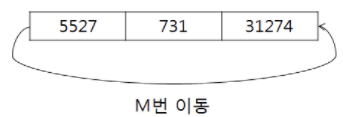

# 5097. 회전

> https://swexpertacademy.com/main/learn/course/subjectDetail.do?courseId=AVuPDN86AAXw5UW6&subjectId=AWOVIoJqqfYDFAWg
>
> N개의 숫자로 이루어진 수열이 주어진다. 맨 앞의 숫자를 맨 뒤로 보내는 작업을 M번 했을 때, 수열의 맨 앞에 있는 숫자를 출력하는 프로그램을 만드시오.
>
> 
>
> **[입력]**
>
> 첫 줄에 테스트 케이스 개수 T가 주어진다. 1<=T<=50
>
> 다음 줄부터 테스트 케이스의 첫 줄에 N과 M이 주어지고, 다음 줄에 10억 이하의 자연수 N개가 주어진다. 3<=N<=20, N<=M<=1000,
>
> 3 
>
> 3 10 
>
> 5527 731 31274 
>
> 5 12 
>
> 18140 14618 18641 22536 23097 
>
> 10 23 
>
> 17236 31594 29094 2412 4316 5044 28515 24737 11578 7907
>
> **[출력]**
>
> 각 줄마다 "#T" (T는 테스트 케이스 번호)를 출력한 뒤, 번호를 출력한다.
>
> #1 731 
>
> #2 18641 
>
> #3 2412

- 풀이

```python
T = int(input())
for tc in range(1, T + 1):
    N, M = map(int, input().split())
    arr = list(map(int, input().split()))
    queue = []
    for n in range(N):
        queue.append(arr[n])
        # queue 에 arr 값 삽입
    for m in range(M):
        first = queue.pop(0)
        queue.append(first)

    print("#{} {}".format(tc, queue[0]))
```

- 해설 1

```python
def enQueue(item):
    global rear
    rear = (rear+1)%Size
    Q[rear] = item

def deQueue():
    global front
    front = (front+1)%Size
    return Q[front]

for tc in range(1,int(input())+1):
    rear, front = 0, 0
    N, M = map(int,input().split())
    Size = N
    lst = list(map(int,input().split()))
    Q = [0]*N
    for _ in range(M):
        enQueue(lst.pop(0))
        lst.append(deQueue())

    ans = lst[0]
    print("#{} {}".format(tc, ans))
```

- 해설 2

```python
for tc in range(1, int(input())+1):
    N, M = map(int,input().split())
    Q = list(map(int,input().split())) + ([0]*M)
    f, r = -1, N-1

    for _ in range(M):
        f += 1
        r += 1
        Q[r] = Q[f]
        print(Q)
    print(Q[M%N])
```

- 해설 3

```python
for tc in range(1, int(input())+1):
    N, M = map(int,input().split())
    Q = [0] + list(map(int,input().split()))
    f, r = 0, N
    SIZE = N+1

    for _ in range(M):
        f  = (f+1)%SIZE
        r  = (r+1)%SIZE
        Q[r] = Q[f]
    print(Q[(f+1)%SIZE])
```