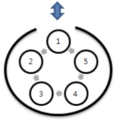

# 5099. 피자 굽기

> https://swexpertacademy.com/main/learn/course/subjectDetail.do?courseId=AVuPDN86AAXw5UW6&subjectId=AWOVIoJqqfYDFAWg#
>
> N개의 피자를 동시에 구울 수 있는 화덕이 있다. 피자는 치즈가 모두 녹으면 화덕에서 꺼내며, 치즈의 양은 피자마다 다르다.
>
> 1번부터 M번까지 M개의 피자를 순서대로 화덕에 넣을 때, 치즈의 양에 따라 녹는 시간이 다르기 때문에 꺼내지는 순서는 바뀔 수 있다.
>
> 주어진 조건에 따라 피자를 구울 때, 화덕에 가장 마지막까지 남아있는 피자 번호를 알아내는 프로그램을 작성하시오.
>
> 
>
> \- 피자는 1번위치에서 넣거나 뺄 수 있다.
> \- 화덕 내부의 피자받침은 천천히 회전해서 1번에서 잠시 꺼내 치즈를 확인하고 다시 같은 자리에 넣을 수 있다.
> \- M개의 피자에 처음 뿌려진 치즈의 양이 주어지고, 화덕을 한 바퀴 돌 때 녹지않은 치즈의 양은 반으로 줄어든다. 이전 치즈의 양을 C라고 하면 다시 꺼냈을 때 C//2로 줄어든다.
> \- 치즈가 모두 녹아 0이 되면 화덕에서 꺼내고, 바로 그 자리에 남은 피자를 순서대로 넣는다.
>
> 
>
> **[입력]**
>
> 첫 줄에 테스트 케이스 개수 T가 주어진다. 1<=T<=50
>
> 다음 줄부터 테스트 케이스의 첫 줄에 화덕의 크기 N과 피자 개수 M이 주어지고, 다음 줄에 M개의 피자에 뿌려진 치즈의 양을 나타내는 Ci가 주어진다.
>
> 3<=N<=20, N<=M<=100, 1<=Ci<=20
>
> 3 
>
> 3 5 
>
> 7 2 6 5 3 
>
> 5 10 
>
> 5 9 3 9 9 2 5 8 7 1 
>
> 5 10 
>
> 20 4 5 7 3 15 2 1 2 2
>
> **[출력]**
>
> 각 줄마다 "#T" (T는 테스트 케이스 번호)를 출력한 뒤, 번호를 출력한다.
>
> #1 4 
>
> #2 8 
>
> #3 6

- 풀이

```python
T = int(input())
for tc in range(1, T + 1):
    N, M = map(int, input().split())
    ci = list(map(int, input().split()))
    pizza = [i for i in range(M)]

    q = pizza[0:N]

    while len(q) > 1:  # 마지막 피자까지
        if ci[q[0]] >= 1:  # 치즈 안녹았을 떄
            ci[q[0]] //= 2
            q.append(q.pop(0))  # rotate
        else:  # 다 녹았을 때
            q.pop(0)
            if N != M:  # 피자 다 안채워졌을 때
                q.append(pizza[N])
                N += 1

    last = q.pop() + 1

    print("#{} {}".format(tc, last))
```

- 해설 1

```python
T = int(input())
for tc in range(1,T+1):
    N, M = map(int,input().split())
    pizza = [0] + list(map(int,input().split())) # 각 피자에 번호 부여
    # print(pizza)
    oven = [i for i in range(1,N+1)] # 1번 부터 N번(한번에 넣을 수있는 최대 피자개수)까지의 피자를 오븐에 넣기
    pos = N+1 # 오븐에 공간이 남으면 N+1번 피자부터 다시 넣어줄거임.
    while len(oven) > 1:
        num = oven.pop(0)
        pizza[num] = pizza[num]//2
        if pizza[num]:
            oven.append(num)
        else:
            if pos <= M:
                oven.append(pos)
                pos += 1
    print("#{} {}".format(tc, oven[0]))
```

- 해설 2

```python
for tc in range(1,int(input())+1):
    N, M = map(int,input().split()) # N: 화덕의크기, M: 피자수
    pizza = [0]+list(map(int,input().split()))

    oven = [i for i in range(1,N+1)] # 오븐에 피자번호 저장할거임.
    pos = N+1
    while len(oven) > 1:
        num = oven.pop(0)
        pizza[num] = pizza[num]//2
        if pizza[num]:
            oven.append(num)
        else:
            if pos <= M:
                oven.append(pos)
                pos += 1
    print(oven[0])
```

