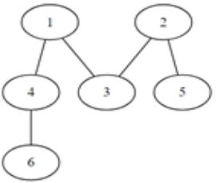

# 5102. 노드의 거리

> https://swexpertacademy.com/main/learn/course/subjectDetail.do?courseId=AVuPDN86AAXw5UW6&subjectId=AWOVIoJqqfYDFAWg#
>
> V개의 노드 개수와 방향성이 없는 E개의 간선 정보가 주어진다.
>
> 주어진 출발 노드에서 최소 몇 개의 간선을 지나면 도착 노드에 갈 수 있는지 알아내는 프로그램을 만드시오.
>
> 예를 들어 다음과 같은 그래프에서 1에서 6으로 가는 경우, 두 개의 간선을 지나면 되므로 2를 출력한다.
>
> 
>
> 노드 번호는 1번부터 존재하며, 노드 중에는 간선으로 연결되지 않은 경우도 있을 수 있다.
>
> **[입력]**
>
> 첫 줄에 테스트 케이스 개수 T가 주어진다. 1<=T<=50
>
> 다음 줄부터 테스트 케이스의 첫 줄에 V와 E가 주어진다. 5<=V=50, 4<=E<=1000
>
> 테스트케이스의 둘째 줄부터 E개의 줄에 걸쳐, 간선의 양쪽 노드 번호가 주어진다.
>
> E개의 줄 이후에는 출발 노드 S와 도착 노드 G가 주어진다.
>
> 3 
>
> 6 5 
>
> 1 4 
>
> 1 3 
>
> 2 3 
>
> 2 5 
>
> 4 6 
>
> 1 6 
>
> 7 4 
>
> 1 6 
>
> 2 3 
>
> 2 6 
>
> 3 5 
>
> 1 5 
>
> 9 9 
>
> 2 6 
>
> 4 7 
>
> 5 7 
>
> 1 5 
>
> 2 9 
>
> 3 9 
>
> 4 8 
>
> 5 3 
>
> 7 8 
>
> 1 9
>
> **[출력]**
>
> 각 줄마다 "#T" (T는 테스트 케이스 번호)를 출력한 뒤, 답을 출력한다.
>
> 두 노드 S와 G가 서로 연결되어 있지 않다면, 0을 출력한다.
>
> #1 2 
>
> #2 4 
>
> #3 3

- 풀이

```python
def bfs(arr, start, end, visited):
    q = []
    q.append((start, end))
    while q:
        cv, cd = q.pop(0)
        visited[cv] = 1
        for i in range(V + 1):
            if arr[cv][i] and not visited[i]:
                if i == G:
                    return cd + 1
                q.append((i, cd + 1))
    return 0


T = int(input())
for tc in range(1, T + 1):

    V, E = map(int, input().split())
    arr = [[0] * (V + 1) for _ in range(V + 1)]
    visited = [0] * (V + 1)

    for n in range(E):
        l, r = map(int, input().split())
        arr[l][r] = 1
        arr[r][l] = 1

    S, G = map(int, input().split())

    print(f'#{tc} {bfs(arr, S, 0, visited)}')
```

- 해설 1

```python
def BFS(S,G):
    stack = []
    stack.append(S)
    visited[S] = 1
    while len(stack):
        r = stack.pop(0)
        for w in range(1,V+1):
            if Graph[r][w] and visited[w] == 0:
                stack.append(w)
                visited[w] = visited[r] + 1
                if w == G:
                    return visited[G]-visited[S]
    return 0


T = int(input())
for tc in range(1,T+1):
    V, E = map(int,input().split())
    Graph = [[0 for _ in range(V+1)] for _ in range(V+1)]
    for _ in range(E):
        s, g = map(int,input().split())
        Graph[s][g] = 1
        Graph[g][s] = 1
    # for row in G:
    #     print(row)
    # print()
    S, G = map(int,input().split())
    visited = [0]*(V+1)
    ans = BFS(S,G)
    print("#{} {}".format(tc, ans))
    # ans = visited[G]-visited[S]
    # if visited[G] == 0:
    #     print("#{} 0".format(tc))
    # if visited[G]:
    #     print("#{} {}".format(tc, ans))
```

- 해설 2

```python
for tc in range(1,int(input())+1):
    V, E = map(int,input().split())

    G = [[0]*(V+1) for _ in range(V+1)]
    for _ in range(E):
        u,v = map(int,input().split())
        G[u][v] = G[v][u] = 1

    s,e = map(int,input().split()) # 출발, 도착
    visit = [0] * (V+1)
    Q = [s]
    visit[s] = 1 # 출발점 방문하고 큐에 삽입
    while Q: # 빈큐가 아닐 동안
        v = Q.pop(0) # 큐에 뺀다.

        for w in range(1,V+1):
            if G[v][w] and not visit[w]:
                visit[w] = visit[v] + 1
                if w == e: Q.clear(); break
                Q.append(w)

    print(visit[e]-1)
```

