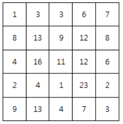
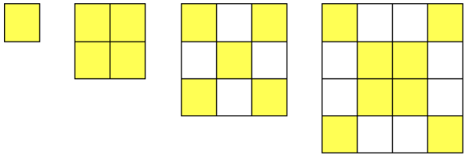

# 12685. 파리퇴치 2

> N x N 배열 안의 숫자는 해당 영역에 존재하는 파리의 개수를 의미한다.
>
> 아래는 N=5 의 예이다.
>
> 
>
> M x M 크기의 파리채를 한 번 내리쳐 최대한 많은 파리를 죽이고자 한다.
>
> 그런데 파리채는 다음과 같이 일부분이 떨어져 나가 X자 모양이라고 한다.
>
> X 모양 파리채는 다음과 같이 파리가 있는 칸을 내리칠 수 있다.
>
> M=1, 2, 3, 4인 경우의 예
>
> 
>
> 한 번에 잡을 수 있는 최대 파리수를 출력하라.
>
> **[제약 사항]**
>
> \1. N 은 5 이상 15 이하이다.
>
> \2. M은 2 이상 N 이하이다.
>
> \3. 각 영역의 파리 갯수는 30 이하 이다.
>
> 
> **[입력]**
>
> 가장 첫 줄에는 테스트 케이스의 개수 T가 주어지고, 그 아래로 각 테스트 케이스가 주어진다.
>
> 각 테스트 케이스의 첫 번째 줄에 N 과 M 이 주어지고,
>
> 다음 N 줄에 걸쳐 N x N 배열이 주어진다.
>
> 2
> 5 2
> 1 3 3 6 7
> 8 13 9 12 8
> 4 16 11 12 6
> 2 4 1 23 2
> 9 13 4 7 3
> 6 3
> 29 21 26 9 5 8
> 21 19 8 0 21 19
> 9 24 2 11 4 24
> 19 29 1 0 21 19
> 10 29 6 18 4 3
> 29 11 15 3 3 29
>
> 
> **[출력]**
>
> 출력의 각 줄은 '#t'로 시작하고, 공백을 한 칸 둔 다음 정답을 출력한다.
>
> (t는 테스트 케이스의 번호를 의미하며 1부터 시작한다.)
>
> \#1 49
> \#2 93

- 풀이

```python
t = int(input())

for tc in range(1, t + 1):
    n, m = map(int, input().split())
    arr = [list(map(int, input().split())) for _ in range(n)]

    flies = 0
    for i in range(n - m + 1):
        for j in range(n - m + 1):
            total = 0
            for k in range(m):
                for l in range(m):
                    if k == l or k + l == m - 1:
                        total += arr[i + k][j + l]

                if total > flies:
                    total = flies
    print(f'#{tc} {flies}')
```

