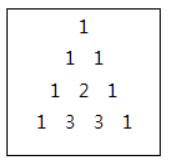

# 2005. 파스칼의 삼각형

> https://swexpertacademy.com/main/code/problem/problemDetail.do?contestProbId=AV5P0-h6Ak4DFAUq&categoryId=AV5P0-h6Ak4DFAUq&categoryType=CODE&problemTitle=%ED%8C%8C%EC%8A%A4%EC%B9%BC&orderBy=FIRST_REG_DATETIME&selectCodeLang=ALL&select-1=&pageSize=10&pageIndex=1
>
> 크기가 N인 파스칼의 삼각형을 만들어야 한다.
>
> 파스칼의 삼각형이란 아래와 같은 규칙을 따른다.
>
> \1. 첫 번째 줄은 항상 숫자 1이다.
>
> \2. 두 번째 줄부터 각 숫자들은 자신의 왼쪽과 오른쪽 위의 숫자의 합으로 구성된다.
>
> N이 4일 경우,
>
> 
>
> N을 입력 받아 크기 N인 파스칼의 삼각형을 출력하는 프로그램을 작성하시오.
>
> 
> **[제약 사항]**
>
> 파스칼의 삼각형의 크기 N은 1 이상 10 이하의 정수이다. (1 ≤ N ≤ 10)
>
> 
> **[입력]**
>
> 가장 첫 줄에는 테스트 케이스의 개수 T가 주어지고, 그 아래로 각 테스트 케이스가 주어진다.
>
> 각 테스트 케이스에는 N이 주어진다.
>
> 1
> 4
>
>
> **[출력]**
>
> 각 줄은 '#t'로 시작하고, 다음 줄부터 파스칼의 삼각형을 출력한다.
>
> 삼각형 각 줄의 처음 숫자가 나오기 전까지의 빈 칸은 생략하고 숫자들 사이에는 한 칸의 빈칸을 출력한다.
>
> (t는 테스트 케이스의 번호를 의미하며 1부터 시작한다.)
>
> \#1
> 1
> 1 1
> 1 2 1
> 1 3 3 1

- 풀이

```python
T = int(input())
for tc in range(1, T + 1):
    N = int(input())

    pascal = list([0] * x for x in range(1, N + 1))  # 이차원 리스트 생성
    for i in range(N):
        for j in range(len(pascal[i])):  # i번째 리스트의 갯수만큼
            if j == 0:  # 첫번째 idx 1
                pascal[i][j] = 1
            if j == len(pascal[i]) - 1:  # 마지막 idx 1
                pascal[i][j] = 1
            elif j > 0:
                pascal[i][j] = pascal[i - 1][j - 1] + pascal[i - 1][j]
    print(f'#{tc}')
    for a in pascal:  # 이차원 리스트 프린트
        for b in a:
            print(b, end=' ')
        print()
```

- 다른 풀이 1

```python
T = int(input())
 
for case in range(T):
    n = int(input())
    print(f"#{case+1}")
    print(1)
    if n>=2:
        res = [1,1]
        print(*res)
        for i in range(2,n):
            tmp = [1]*(i+1)
            for j in range(1,i):
                tmp[j] = res[j-1] + res[j]
            res = tmp
            print(*tmp)
```

- 다른 풀이 2

```python
T=int(input())
for t in range(1,T+1):
    a=int(input())
    lst=[[1] * x for x in range(1,a+1)]
    for i in range(1,a-1):
        for j in range(len(lst[i])-1):
            lst[i+1][j+1]=lst[i][j] + lst[i][j+1]
 
    print(f'#{t}')
    for k in lst:
        print(*k)
```

