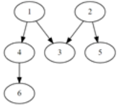

# 4871. 그래프 경로

> https://swexpertacademy.com/main/learn/course/subjectDetail.do?courseId=AVuPDN86AAXw5UW6&subjectId=AWOVHzyqqe8DFAWg#
>
> V개 이내의 노드를 E개의 간선으로 연결한 방향성 그래프에 대한 정보가 주어질 때, 특정한 두 개의 노드에 경로가 존재하는지 확인하는 프로그램을 만드시오.
>
> 두 개의 노드에 대해 경로가 있으면 1, 없으면 0을 출력한다.
>  
>
> 예를 들어 다음과 같은 그래프에서 1에서 6으로 가는 경로를 찾는 경우, 경로가 존재하므로 1을 출력한다.
>  
>
> 노드번호는 1번부터 존재하며, V개의 노드 중에는 간선으로 연결되지 않은 경우도 있을 수 있다.
>
>  
>  
>
> **[입력]**
>  
>
> 첫 줄에 테스트 케이스 개수 T가 주어진다. 1≤T≤50
>  
>
> 다음 줄부터 테스트 케이스의 첫 줄에 V와 E가 주어진다. 5≤V≤50, 4≤E≤1000
>  
>
> 테스트케이스의 둘째 줄부터 E개의 줄에 걸쳐, 출발 도착 노드로 간선 정보가 주어진다.
>  
>
> E개의 줄 이후에는 경로의 존재를 확인할 출발 노드 S와 도착노드 G가 주어진다.
>
> 3
> 6 5
> 1 4
> 1 3
> 2 3
> 2 5
> 4 6
> 1 6 
> 7 4
> 1 6
> 2 3
> 2 6
> 3 5
> 2 5 
> 9 9
> 2 6
> 4 7
> 5 7
> 1 5
> 2 9
> 3 9
> 4 8
> 5 3
> 7 8
> 1 9
>
>  
>
> **[출력]**
>  
>
> 각 줄마다 "#T" (T는 테스트 케이스 번호)를 출력한 뒤, 답을 출력한다.
>
> \#1 1
> \#2 1
> \#3 1

- 풀이

```python
def dfs(start):
    edge[start] = True
    ans = 0
    if start in node:  # 시작하는 노드가 있으면
        for next in node[start]:
            if not edge[next]:
                if next == G:
                    return 1  # 연결되어 있으면 1
                elif not ans:  # 아니면 계속 탐색
                    ans += dfs(next)  # S에서 G까지 계속
    return ans


T = int(input())
for tc in range(1, T + 1):
    V, E = map(int, input().split())

    node = {}
    edge = [False for _ in range(V + 1)]  # 노드에서 연결된 도착 노드의 리스트

    for _ in range(E):
        start, end = map(int, input().split())
        if start not in node:  # 시작노드에서 도착하는 노드의 리스트
            node[start] = [end]
        else:
            node[start].append(end)

    S, G = map(int, input().split())
    print(f'#{tc} {dfs(S)}')
```

- 해설 1

```python
for tc in range(1,int(input())+1):

    def check(s, g):
        cnt = 0
        visited = [0]*(V+1)
        stack = [0]*(V+1)
        top = -1

        top += 1
        stack[top] = s
        while top >= 0:
            s = stack[top]
            top -= 1
            for w in range(1,V+1):
                if graph[s][w] != 0 and w == g:
                    cnt = 1
                    break
                if graph[s][w] != 0 and visited[w] == 0:
                    top += 1
                    stack[top] = w
                    visited[w] = 1
        return cnt


    V, E = map(int, input().split())
    gansun_info = []
    for _ in range(E):
        g_info = list(map(int,input().split()))
        gansun_info.extend(g_info)
    # print(gansun_info)
    S, G = map(int,input().split())

    graph = [[0] * (V+1) for _ in range(V+1)]
    for i in range(E):
        s = gansun_info[i*2]
        e = gansun_info[(i*2)+1]
        graph[s][e] = 1
    # for row in graph:
    #     print(row)
    # print(S,G)
    ans = check(S,G)
    print ("#{} {}".format(tc, ans))
```

- 해설 2

```python
def DFS(v):
    visit[v] = 1
    if v == e:
        return 1
    for w in range(1,V+1):
        if G[v][w] == 1 and visit[w] == 0:
            DFS(w)
        if DFS(w):
            return 1
    return 0

for tc in range(1,int(input())+1):
    V, E = map(int,input().split())
    G = [[0] * (V+1) for _ in range(V+1)]
    for _ in range(E): # 간선 정보 읽기
        s, a = map(int,input().split())
        G[s][a] = 1
    s, e = map(int,input().split())
    # print(G)
    # print(s, e)
    visit = [0] * (V+1)
    DFS(s)
    print("#{} {}".format(tc, visit[e]))
```

