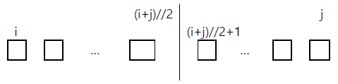
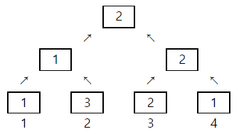

# 4880. 토너먼트 카드게임

> https://swexpertacademy.com/main/learn/course/subjectDetail.do?courseId=AVuPDN86AAXw5UW6&subjectId=AWOVIc7KqfQDFAWg#
>
> 사다리 게임이 지겨워진 알고리즘 반 학생들이 새로운 게임을 만들었다. 가위바위보가 그려진 카드를 이용해 토너먼트로 한 명을 뽑는 것이다. 게임 룰은 다음과 같다.
>  
>
> 1번부터 N번까지 N명의 학생이 N장의 카드를 나눠 갖는다. 전체를 두 개의 그룹으로 나누고, 그룹의 승자끼리 카드를 비교해서 이긴 사람이 최종 승자가 된다.
>
> 그룹의 승자는 그룹 내부를 다시 두 그룹으로 나눠 뽑는데, i번부터 j번까지 속한 그룹은 파이썬 연산으로 다음처럼 두개로 나눈다.
>
> 
>
> 두 그룹이 각각 1명이 되면 양 쪽의 카드를 비교해 승자를 가리고, 다시 더 큰 그룹의 승자를 뽑는 방식이다.
>
> 다음은 4명이 카드를 비교하는 경우로, 숫자 1은 가위, 2는 바위, 3은 보를 나타낸다. 만약 같은 카드인 경우 편의상 번호가 작은 쪽을 승자로 하고, 처음 선택한 카드는 바꾸지 않는다.
>
> 
>
> N명이 학생들이 카드를 골랐을 때 1등을 찾는 프로그램을 만드시오.
>
> 
>  
>
> **[입력]**
>  
>
> 첫 줄에 테스트 케이스 개수 T가 주어진다. 1≤T≤50
>  
>
> 다음 줄부터 테스트 케이스의 별로 인원수 N과 다음 줄에 N명이 고른 카드가 번호순으로 주어진다. 4≤N≤100
>
> 카드의 숫자는 각각 1은 가위, 2는 바위, 3은 보를 나타낸다.
>
> 3 
>
> 4 
>
> 1 3 2 1 
>
> 6 
>
> 2 1 1 2 3 3 
>
> 7 
>
> 1 3 3 3 1 1 3
>
>  
>
> **[출력]**
>  
>
> 각 줄마다 "#T" (T는 테스트 케이스 번호)를 출력한 뒤, 1등의 번호를 출력한다.
>
> #1 3 
>
> #2 5 
>
> #3 1

- 풀이

```python
# 분할 정복
def DCA(tournament):
    # 올라올 때마다 2명씩
    if len(tournament) == 2:

        # 가위 바위 보
        if tournament[0][0] == "1":
            if tournament[1][0] == "1" or tournament[1][0] == "3":
                return "1", tournament[0][1]
            else:
                return "2", tournament[1][1]

        elif tournament[0][0] == "2":
            if tournament[1][0] == "2" or tournament[1][0] == "1":
                return "2", tournament[0][1]
            else:
                return "3", tournament[1][1]

        else:
            if tournament[1][0] == "3" or tournament[1][0] == "2":
                return "3", tournament[0][1]
            else:
                return "1", tournament[1][1]

    # 한 명일 때
    elif len(tournament) == 1:
        return tournament[0][0], tournament[0][1]

    # 2명 이상일 떄
    else:
        num = len(tournament)
        # Divide and Conquer
        return DCA([DCA(tournament[:num // 2 + num % 2]), DCA(tournament[num // 2 + num % 2:])])


if __name__ == "__main__":
    T = int(input())
    for tc in range(1, T + 1):
        N = int(input())
        cards = input().split()

        students = [i + 1 for i in range(N)]

        ans = DCA(list(zip(cards, students)))

        print("#{} {}".format(tc, ans[1]))
```

