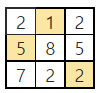

# 4881. 배열 최소 합

> https://swexpertacademy.com/main/learn/course/subjectDetail.do?courseId=AVuPDN86AAXw5UW6&subjectId=AWOVIc7KqfQDFAWg#
>
> NxN 배열에 숫자가 들어있다. 한 줄에서 하나씩 N개의 숫자를 골라 합이 최소가 되도록 하려고 한다. 단, 세로로 같은 줄에서 두 개 이상의 숫자를 고를 수 없다.
>
> 조건에 맞게 숫자를 골랐을 때의 최소 합을 출력하는 프로그램을 만드시오.
>  
>
> 예를 들어 다음과 같이 배열이 주어진다.
>
> 
>
> 이경우 1, 5, 2를 고르면 합이 8로 최소가 된다.
>
>  
>
> **[입력]**
>  
>
> 첫 줄에 테스트 케이스 개수 T가 주어진다. 1≤T≤50
>  
>
> 다음 줄부터 테스트 케이스의 첫 줄에 숫자 N이 주어지고, 이후 N개씩 N줄에 걸쳐 10보다 작은 자연수가 주어진다. 3≤N≤10
>
> 3 
>
> 3 
>
> 2 1 2 
>
> 5 8 5 
>
> 7 2 2 
>
> 3 
>
> 9 4 7 
>
> 8 6 5 
>
> 5 3 7 
>
> 5 
>
> 5 2 1 1 9 
>
> 3 3 8 3 1 
>
> 9 2 8 8 6 
>
> 1 5 7 8 3 
>
> 5 5 4 6 8
>
>  
>
> **[출력]**
>  
>
> 각 줄마다 "#T" (T는 테스트 케이스 번호)를 출력한 뒤, 합계를 출력한다.
>
> #1 8 
>
> #2 14 
>
> #3 9

- 풀이

```python
def min_sum(curr, total):  # curr: 현재 행, total: 총합
    global minV
    if curr == N:
        # 최소값인지
        if total < minV:
            minV = total
        return
    elif minV <= total:  # 최소가 아니면
        return
    else:
        for i in range(N):
            if visited[i] == 0:
                visited[i] = 1
                min_sum(curr + 1, total + arr[curr][i])
                visited[i] = 0


for tc in range(1, int(input()) + 1):
    N = int(input())
    arr = [list(map(int, input().split())) for _ in range(N)]

    visited = [0 for _ in range(N)]
    minV = 10000
    min_sum(0, 0)  # 0행에서 시작, 총합: 0
    print("#{} {}".format(tc, minV))
```

- 해설 1

```python
def MyCalc(y):
    global sub_result, result

    if result < sub_result:
        return

    if y == N:
        if sub_result < result:
            result = sub_result
        return

    for x in range(N):
        if not visited[x]:
            visited[x] = True
            sub_result += lst[y][x]
            MyCalc(y+1)
            visited[x] = False
            sub_result -= lst[y][x]


TC = int(input())
for tc in range(1, TC+1):
    N = int(input())
    lst = [list(map(int, input().split())) for _ in range(N)]
    visited = [0] * N
    sub_result, result = 0, 987654321
    MyCalc(0)

    print(f'#{tc} {result}')
```

- 해설 2

```python
def subset(y):
    global min_sub, min_final

    if min_final < min_sub: return

    if y==N:
        if min_sub < min_final:
            min_final = min_sub
        return

    for x in range(N):
        if not bit[x]:
            bit[x] = 1
            min_sub += arr[y][x]
            subset(y+1)
            bit[x] = 0
            min_sub -= arr[y][x]

for tc in range(1,int(input())+1):
    N = int(input())
    arr = [list(map(int,input().split())) for _ in range(N)]
    # for row in arr:
    #     print(row)
    # print()
    bit = [0]*N
    min_sub, min_final = 0, 987654321
    subset(0)

    print("#{} {}".format(tc, min_final))
```

- 해설 3

```python
for tc in range(1,int(input())+1):
    N = int(input())
    arr = [list(map(int,input().split())) for _ in range(N)]
    # for row in arr:
    #     print(row)
    # print()
    bit = [0]*N
    min_sub, min_final = 0, 987654321

    while True:
        bit = [0] * N
        stack = []
        max_sub = 0
        k = 0
        for i in range(N):
            for j in range(N):
                if bit[i] == 0 and bit_second[j][i]==0:
                    stack.append(arr[j][i])
                    bit[i] = 1
                elif bit[i] == 1 or bit_second[j][i]: continue
        for num in stack:
            max_sub += num
        if max_sub > max_num: max_num = max_sub
            
            
    print("#{} {}".format(tc, min_final))
```

- 해설 4

```python
def find(n,s): #n: 현재 행, s: 총합
    global minV
    if n == N: # 순열을 완성하면
        #최소값인지 판단
        if s < minV:
            minV = s
        return
    elif minV <= s: # 백트레킹
        return  #순열완성이 완성되지 않았지만 이미 최소가 아니면 종료
    else:
        for i in range(N):
            if u[i] == 0:
                u[i] = 1
                find(n+1,s+arr[n][i])
                u[i] = 0

for tc in range(1,int(input())+1):
    N = int(input())
    arr = [list(map(int,input().split())) for _ in range(N)]
    # for row in arr:
    #     print(row)
    # print()
    u = [0 for _ in range(N)] #방문배열
    minV = 10000
    find(0,0) # 0행에서 시작, 총합: 0
    print("#{} {}".format(tc, minV))
```

- 해설 5

```python
def perm(k, cur_sum): # cur_sum 0~k~1행에 선택한 값들의 합
    global ans;
    if ans <= cur_sum: return
    if k == N:
        ans = min(ans,cur_sum)
        # print(S)
    else:
        for i in range(k, N):
            cols[k], cols[i] = cols[i], cols[k]
            perm(k + 1, cur_sum + arr[k][cols[k]])
            cols[k], cols[i] = cols[i], cols[k]


for tc in range(1,int(input())+1):
    N = int(input())
    arr = [list(map(int,input().split())) for _ in range(N)]
    cols = [i for i in range(N)]
    ans = 0xfffff

    perm(0,0)
    print(ans)
```

