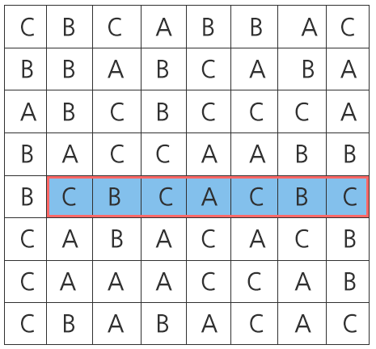
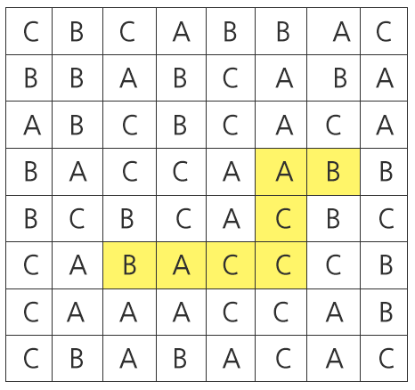

# 1216. 회문2

> https://swexpertacademy.com/main/code/problem/problemDetail.do?contestProbId=AV14Rq5aABUCFAYi&categoryId=AV14Rq5aABUCFAYi&categoryType=CODE&problemTitle=%ED%9A%8C%EB%AC%B8&orderBy=FIRST_REG_DATETIME&selectCodeLang=ALL&select-1=&pageSize=10&pageIndex=1
>
> "기러기" 또는 "level" 과 같이 거꾸로 읽어도 제대로 읽은 것과 같은 문장이나 낱말을 회문(回文, palindrome)이라 한다.
>
> 주어진 100x100 평면 글자판에서 가로, 세로를 모두 보아 가장 긴 회문의 길이를 구하는 문제이다.
>
> 
>
> 위와 같은 글자 판이 주어졌을 때, 길이가 가장 긴 회문은 붉은색 테두리로 표시된 7칸짜리 회문이다.
>
> 예시의 경우 설명을 위해 글자판의 크기가 100 x 100이 아닌 8 x 8으로 주어졌음에 주의한다.
>
> **[제약사항]**
>
> 각 칸의 들어가는 글자는 c언어 char type으로 주어지며 'A', 'B', 'C' 중 하나이다.
>
> 글자 판은 무조건 정사각형으로 주어진다.
>
> ABA도 회문이며, ABBA도 회문이다. A또한 길이 1짜리 회문이다.
>
> 가로, 세로 각각에 대해서 직선으로만 판단한다. 즉, 아래 예에서 노란색 경로를 따라가면 길이 7짜리 회문이 되지만 직선이 아니기 때문에 인정되지 않는다. 
>
> 
>
> **[입력]**
>
> 각 테스트 케이스의 첫 번째 줄에는 테스트 케이스의 번호가 주어지며, 바로 다음 줄에 테스트 케이스가 주어진다.
>
> 총 10개의 테스트케이스가 주어진다.
>
> 1
> CCBBCBAABCCCBABCBCAAAACABBACCCCACAABCBBACACAACABCBCCB...
> ACBAAAACCACCCBAACAAABACACCABCBCBABBBACBABCAACCBCCACBC...
> CCCACCBCBACBACBCABAABABCCAAAACCCCCBBAABBCCBCCCABBACAC...
> CABACBCBBCBABACABBBBBBABBCABCBCBCAABCBCCCBABACCCCABBA...
> BCCBCCACCBCBCABBBCCABAACACCBCCCBCCACCBBCBCCCBBCCBACBC...
> BBBBCBBAACABACCBCBCCABBBBCCAABCBBCACCBBCAAAABABABBABB...
> ABBAACCCACBBABBABCCCABABCACABABACCCBACACABCBCCCBABCCC...
> ABBBBAABCAACCBACBBAACACABCABACBAABCAABBCCCCCCACBCCCCA...
> ACCACABABBACBBAACCBBACBBCCACCACCABCCBABABBBACBACBAABC...
> BABACACCABCAACBAABCCACCACBCCAABBCBAABABAACAAAAAACCCBC...
> ...
> 2
> CBBABBACCAACCCAABABAACCABCBBCCABABBBBBCCACBCCCCBBBAAC...
> BBBCBACAAABAACACBCAABBAAABCABBBCAAACBAABCAAAAACBABBAB...
> CAAAABCAABAACCBBABCCCACABABACBCCBCCBABABBCCCBCBACAAAC...
> BBBACBBBBBAACBBCBABBCBAABACCCBBBBCCCBBBCABCABCAABCBCA...
> ABBBBAABCBACCACBBCBBAABABCBCCAAABBCAAABBAABBCACABAABA...
> ABCBACAAACCCAAABCACABBAABBCAACCBABCCACBABBBABAABAACBB...
> ACACABCBAAACCACABABBCABCBABAAABCBCCABABCCAACACBCBABCA...
> ACCBACACCAAAABABACABABBBBABBAABABBBBACBACABABACACACAA...
> AAACCCCCBCAACCCCCAAAACBCACBBABBBBBABABBCCCCBBAACCBBCB...
> CCABCCBBCAAAACACBBBBAAAACABACABCCCBACBABBACCAABAAACAB...
>
> **[출력]**
>
> \#부호와 함께 테스트 케이스의 번호를 출력하고, 공백 문자 후 찾은 회문의 길이를 출력한다.
>
> \#1 18
> \#2 17
> ...

- 풀이

```python
def palindrome(length, words):
    for word in words:
        for i in range(100 - length + 1):  # 단어 인덱스 길이까지
            for j in range(length // 2):
                k = i + j  # 왼쪽에서부터
                l = i + length - 1 - j  # 오른쪽으로 한 칸 씩
                left = word[k]
                right = word[l]
                if left != right:  # 인덱스 다르면 다음 인덱스
                    break
            else:
                return length  # 길이 리턴
    return 0


for _ in range(1, 11):
    tc = int(input())
    # 가로
    row = [input() for _ in range(100)]
    # 세로
    col = [''.join(pal) for pal in zip(*row)]

    # 가로
    ans = 1
    for length in range(2, 101):
        if length > ans + 2:
            break
        if ans < palindrome(length, row):
            ans = length

    # 세로
    for length in range(ans + 1, 101):
        if length > ans + 2:
            break
        if ans < palindrome(length, col):
            ans = length

    print(f'#{tc} {ans}')
```

- 해설 1

```python
for _ in range(1, 11):
    tc = int(input())
    result = []

    Garo_lst = []
    for _ in range(100):
        Data = input()
        Garo_lst.append(Data)
        for M in range(2,len(Data)+1):
            for i in range(len(Data)-M+1):
                if Data[i:i+M] == Data[i:i+M][::-1]:
                    result.append(Data[i:i+M])
    # print(result)

    # 세로
    Sero_lst = []
    Sero_lst_sub = ''
    for x in range(100):
        for y in range(100):
            Sero_lst_sub += Garo_lst[y][x]
        Sero_lst.append(Sero_lst_sub)
        Sero_lst_sub = ''
    # print(Sero_lst)
    for Sero_data in Sero_lst:
        for M in range(2, len(Sero_data)+1):
            for i in range(len(Sero_data)-M+1):
                if Sero_data[i:i+M] == Sero_data[i:i+M][::-1]:
                    result.append(Sero_data[i:i+M])
    max_len = 0
    for i in result:
        if len(i) > max_len:
            max_len = len(i)
    print('#%s %s'%(tc, max_len))
```

- 해설 2

```python
def find(row, start, end):
    global cnt
    len = end - start + 1
    half = len//2 if len % 2 == 0 else len//2+1

    s = []
    for i in range(start, start+half):
        s.append(map[row][i])
    if len % 2 == 1:
        s.pop()
    if len != 1:
        for i in range(start+half, end+1):
            if s.pop() != map[row][i]:
                return
    # 회문발견함
    if cnt < len:
        cnt = len


T = 10
N = 100
for tc in range(1,T+1):
    int(input())
    map = [list(input()) for _ in range(N)]
    # print(map)
    # 세로방향으로 배열 추가하기
    for i in range(N):
        temp = []
        for j in range(N):
            temp.append(map[j][i])
        map.append(temp)
    # for row in map:
    #     print(row)

    cnt = 0
    for i in range(2*N):
        for j in range(N):
            for k in range(j,N):
                if k-j+1 > cnt :
                    find(i,j,k)
    print('#{} {}'.format(tc, cnt))
```

