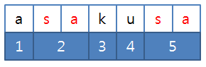

# 3143. 가장 빠른 문자열 타이핑

> https://swexpertacademy.com/main/code/problem/problemDetail.do?contestProbId=AV_65wkqsb4DFAWS&categoryId=AV_65wkqsb4DFAWS&categoryType=CODE&problemTitle=%EA%B0%80%EC%9E%A5&orderBy=FIRST_REG_DATETIME&selectCodeLang=ALL&select-1=&pageSize=10&pageIndex=1
>
> 어떤 문자열 A를 타이핑하려고 한다.
>
> 그냥 한 글자씩 타이핑 한다면 A의 길이만큼 키를 눌러야 할 것이다.
>
> 여기에 속도를 조금 더 높이기 위해 어떤 문자열 B가 저장되어 있어서 키를 한번 누른 것으로 B전체를 타이핑 할 수 있다.
>
> 이미 타이핑 한 문자를 지우는 것은 불가능하다.
>
> 예를 들어 A=”asakusa”, B=”sa”일 때, 다음 그림과 같이 B를 두 번 사용하면 5번 만에 A를 타이핑 할 수 있다.
>
> 
>
> A와 B가 주어질 때 A 전체를 타이핑 하기 위해 키를 눌러야 하는 횟수의 최솟값을 구하여라.
>
>
> **[입력]**
>
> 첫 번째 줄에 테스트 케이스의 수 T가 주어진다.
>
> 각 테스트 케이스마다 첫 번째 줄에 두 문자열 A, B가 주어진다. A의 길이는 1이상 10,000이하, B의 길이는 1이상 100이하이다.
>
> 2 
>
> banana bana 
>
> asakusa sa
>
>
> **[출력]**
>
> 각 테스트 케이스마다 A 전체를 타이핑 하기 위해 키를 눌러야 하는 횟수의 최솟값을 출력한다.
>
> #1 3 
>
> #2 5

- 풀이

```python
T = int(input())

for tc in range(1, T + 1):
    A, B = input().split()
    A = A.replace(B, '-')
    print(f'#{tc} {len(A)}')
```

