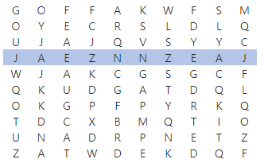

# 4861. 회문

> https://swexpertacademy.com/main/learn/course/subjectDetail.do?courseId=AVuPDN86AAXw5UW6&subjectId=AWOVGOEKqeoDFAWg
>
> ABBA처럼 어느 방향에서 읽어도 같은 문자열을 회문이라 한다. NxN 크기의 글자판에서 길이가 M인 회문을 찾아 출력하는 프로그램을 만드시오.
>
> 회문은 1개가 존재하는데, 가로 뿐만 아니라 세로로 찾아질 수도 있다.
>
>
> 예를 들어 N=10, M=10 일 때, 다음과 같이 회문을 찾을 수 있다.
>
> 
>
> **[입력]**
>
>
> 첫 줄에 테스트 케이스 개수 T가 주어진다. 1≤T≤50
>
> 다음 줄부터 테스트케이스의 첫 줄에 N과 M이 주어진다. 10≤N≤100, 5≤M≤N
>
> 다음 줄부터 N개의 글자를 가진 N개의 줄이 주어진다.
>
> 3 
>
> 10 10
>
> GOFFAKWFSM 
>
> OYECRSLDLQ 
>
> UJAJQVSYYC 
>
> JAEZNNZEAJ 
>
> WJAKCGSGCF 
>
> QKUDGATDQL 
>
> OKGPFPYRKQ 
>
> TDCXBMQTIO 
>
> UNADRPNETZ
>
> ZATWDEKDQF 
>
> 10 10 
>
> WPMACSIBIK 
>
> STWASDCOBQ 
>
> AMOUENCSOG 
>
> XTIIGBLRCZ 
>
> WXVSWXYYVU 
>
> CJVAHRZZEM 
>
> NDIEBIIMTX
>
> UOOGPQCBIW 
>
> OWWATKUEUY 
>
> FTMERSSANL 
>
> 20 13 
>
> ECFQBKSYBBOSZQSFBXKI 
>
> VBOAIDLYEXYMNGLLIOPP 
>
> AIZMTVJBZAWSJEIGAKWB 
>
> CABLQKMRFNBINNZSOGNT 
>
> NQLMHYUMBOCSZWIOBINM 
>
> QJZQPSOMNQELBPLVXNRN 
>
> RHMDWPBHDAMWROUFTPYH 
>
> FNERUGIFZNLJSSATGFHF 
>
> TUIAXPMHFKDLQLNYQBPW 
>
> OPIRADJURRDLTDKZGOGA 
>
> JHYXHBQTLMMHOOOHMMLT 
>
> XXCNJGTXXKUCVOUYNXZR 
>
> RMWTQQFHZUIGCJBASNOX 
>
> CVODFKWMJSGMFTCSLLWO 
>
> EJISQCXLNQHEIXXZSGKG 
>
> KGVFJLNNBTVXJLFXPOZA 
>
> YUNDJDSSOPRVSLLHGKGZ 
>
> OZVTWRYWRFIAIPEYRFFG 
>
> ERAPUWPSHHKSWCTBAPXR 
>
> FIKQJTQDYLGMMWMEGRUZ
>
> 
>
> **[출력]**
>
>
> 각 줄마다 "#T" (T는 테스트 케이스 번호)를 출력한 뒤, 답을 출력한다.
>
> #1 JAEZNNZEAJ 
>
> #2 MWOIVVIOWM 
>
> #3 TLMMHOOOHMMLT

- 풀이

```python
T = int(input())
for tc in range(1, T + 1):
    N, M = map(int, input().split())
    arr = [list(input()) for _ in range(N)]
    ans = ''
 
    # row
    pal = 0
    for i in range(N):
        for j in range(N - M + 1):
            for k in range(M // 2):
                if arr[i][j + k] == arr[i][j + M - 1 - k]:
                    pal += 1
            if pal == M // 2:
                for l in range(j, j + M):
                    ans += arr[i][l]
            pal = 0
 
    # col
    pal = 0
    for j in range(N):
        for i in range(N - M + 1):
            for k in range(M // 2):
                if arr[i + k][j] == arr[i + M - 1 - k][j]:
                    pal += 1
            if pal == M // 2:
                for l in range(i, i + M):
                    ans += arr[l][j]
            pal = 0
 
    print(f"#{tc} {ans}")
```

- 해설 1

```python
TC = int(input())

for tc in range(1,TC+1):
    N, M = map(int, input().split())
    result = []

    # 가로줄
    Garo_lst = []
    for i in range(N):
        Data = input()
        Garo_lst.append(Data)
        for i in range(len(Data)-M+1):
            if Data[i:i+M] == Data[i:i+M][::-1]:
                result.append(Data[i:i+M])
    # 세로줄
    Sero_lst = []
    Sero_sub_lst = ''
    for x in range(N):
        for y in Garo_lst:
            Sero_sub_lst += y[x]
        Sero_lst.append(Sero_sub_lst)
        Sero_sub_lst = ''
    for sero_data in Sero_lst:
        for j in range(len(sero_data)-M+1):
            if sero_data[j:M+j] == sero_data[j:M+j][::-1]:
                result.append(sero_data[j:M+j])
    print("#%s %s"%(tc, result[0]))
```

- 해설 2

```python
def find(s):
    for i in range(N):
        for j in range(N-M+1):
            k = 0
            h = M//2
            while k < h:
                if s[i][j+k] != s[i][j+M-1-k]:
                    break
                k += 1
            if k == h:
                print(s[i][j:j+M])
                return
            k = 0
            while k < h:
                if s[j+k][i] != s[j+M-k-1][i]:
                    break
                k += 1
            if k == h:
                for sero in range(j,j+M):
                    print(s[sero][i], end='')
                print()
                return


T = int(input())
for tc in range(1,T+1):
    N,M = map(int,input().split())
    s = [input() for _ in range(N)]
    find(s)
```

