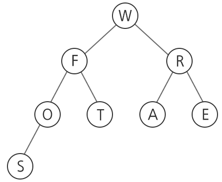
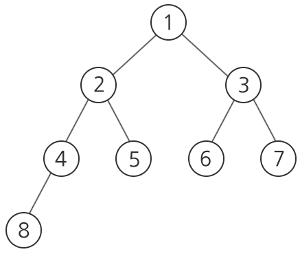

# 1231. 중위순회

> https://swexpertacademy.com/main/code/problem/problemDetail.do?contestProbId=AV140YnqAIECFAYD&categoryId=AV140YnqAIECFAYD&categoryType=CODE&problemTitle=%EC%A4%91%EC%9C%84&orderBy=FIRST_REG_DATETIME&selectCodeLang=ALL&select-1=&pageSize=10&pageIndex=1
>
> 다음은 특정 단어(또는 문장)를 트리 형태로 구성한 것으로, in-order 형식으로 순회하여 각 노드를 읽으면 원래 단어를 알 수 있다고 한다.
>
> 
>
> 위 트리를 in-order 형식으로 순회할 경우 SOFTWARE 라는 단어를 읽을 수 있다.
>
> **[제약 사항]**
>
> 총 10개의 테스트 케이스가 주어진다.
>
> 총 노드의 개수는 100개를 넘어가지 않는다.
>
> 트리는 완전 이진 트리 형식으로 주어지며, 노드당 하나의 알파벳만 저장할 수 있다.
>
> 노드가 주어지는 순서는 아래 그림과 같은 숫자 번호대로 주어진다.
>
> 
>
> **[입력]**
>
> 각 테스트 케이스의 첫 줄에는 각 케이스의 트리가 갖는 정점의 총 수 N(1≤N≤100)이 주어진다. 그 다음 N줄에 걸쳐 각각의 정점 정보가 주어진다.
>
> 해당 정점에 대한 정보는 해당 정점의 알파벳, 해당 정점의 왼쪽 자식, 오른쪽 자식의 정점번호가 차례대로 주어진다.
>
> 정점번호는 1부터 N까지의 정수로 구분된다. 입력에서 정점 번호를 매기는 규칙은 위와 같으며, 루트 정점의 번호는 반드시 1이다.
>
> 입력에서 이웃한 알파벳이나 자식 정점의 번호는 모두 공백으로 구분된다.
>
> 위의 예시에서, 알파벳 S가 7번 정점에 해당하면 “7 S”으로 주어지고, 알파벳 ‘F’가 2번 정점에 해당하면 두 자식이 각각 알파벳 ‘O’인 4번 정점과 알파벳 ‘T’인 5번 정점이므로 “2 F 4 5”로 주어진다.
>
> 총 10개의 테스트 케이스가 주어진다,
>
> 8
> 1 W 2 3
> 2 F 4 5
> 3 R 6 7
> 4 O 8
> 5 T
> 6 A
> 7 E
> 8 S
> ........
>
> **[출력]**
>
> \#부호와 함께 테스트 케이스의 번호를 출력하고, 공백 문자 후 테스트 케이스의 답을 출력한다.
>
> \#1 SOFTWARE
> \#2 COMPUTER_SCIENCE_AND_ENGINEERING
> .......

- 풀이

```python
def in_order(node):
    # 왼쪽
    if len(arr[node]) >= 3:
        in_order(int(arr[node][2]))
    # root
    print(arr[node][1], end="")
    # 오른쪽
    if len(arr[node]) == 4:
        in_order(int(arr[node][3]))


T = 10
for tc in range(1, T + 1):
    N = int(input())  # 정점의 총 수
    arr = [[]] + [input().split() for _ in range(N)]

    print("#{}".format(tc), end=" ")
    in_order(1)
    print()
```

