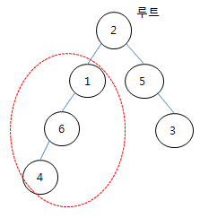

# 5174. subtree

> https://swexpertacademy.com/main/learn/course/subjectDetail.do?courseId=AVuPDN86AAXw5UW6&subjectId=AWOVJ-_6qfsDFAWg#
>
> 트리의 일부를 서브 트리라고 한다. 주어진 이진 트리에서 노드 N을 루트로 하는 서브 트리에 속한 노드의 개수를 알아내는 프로그램을 만드시오.
>
> 
>
> 주어지는 트리는 부모와 자식 노드 번호 사이에 특별한 규칙이 없고, 부모가 없는 노드가 전체의 루트 노드가 된다.
>
> 이런 경우의 트리는 부모 노드를 인덱스로 다음과 같은 방법으로 나타낼 수 있다. 자식 노드가 0인 경우는 노드가 자식이 없는 경우이다.
>
> | 부모  | 1    | 2    | 3    | 4    | 5    | 6    |
> | ----- | ---- | ---- | ---- | ---- | ---- | ---- |
> | 자식1 | 6    | 1    | 0    | 0    | 3    | 4    |
> | 자식2 | 0    | 5    | 0    | 0    | 0    | 0    |
>
> **[입력]**
>
> 첫 줄에 테스트케이스의 수 T가 주어진다. 1<=T<=50
>
> 다음 줄부터 테스트 케이스의 별로 첫 줄에 간선의 개수 E와 N이 주어지고, 다음 줄에 E개의 부모 자식 노드 번호 쌍이 주어진다.
>
> 노드 번호는 1번부터 E+1번까지 존재한다. 1<=E<=1000, 1<=N<=E+1
>
> ```
> 3
> 5 1
> 2 1 2 5 1 6 5 3 6 4 
> 5 1
> 2 6 6 4 6 5 4 1 5 3 
> 10 5
> 7 6 7 4 6 9 4 11 9 5 11 8 5 3 5 2 8 1 8 10
> ```
>
> **[출력]**
>
> 각 줄마다 "#T" (T는 테스트 케이스 번호)를 출력한 뒤, 답을 출력한다.
>
> ```
> #1 3
> #2 1
> #3 3
> ```

- 풀이

```python
def subtree(node):
    global ans
    if node != 0:
        ans += 1
        subtree(left[node])
        subtree(right[node])


T = int(input())

for tc in range(1, T + 1):
    E, N = map(int, input().split())  
    arr = list(map(int, input().split()))

    left = [0] * (E + 2)  # 첫 번째 자식
    right = [0] * (E + 2)  # 두 번째 자식

    for i in range(E):
        paren, child = arr[i * 2], arr[2 * i + 1]
        if left[paren] == 0:
            left[paren] = child
        else:
            right[paren] = child

    ans = 0
    subtree(N)

    print(f'#{tc} {ans}')
```

- 해설 1

```python
def search(row):
    global cnt
    cnt +=1
    if Tree[row][0]: search(Tree[row][0])
    if Tree[row][1]: search(Tree[row][1])
    else: return

T = int(input())
for tc in range(1,T+1):
    E, N = map(int,input().split())
    pairs = list(map(int,input().split()))
    Tree = [[0]*3 for _ in range(E+2)]
    for i in range(E):
        p = pairs[i*2]
        c = pairs[i*2+1]
        if Tree[p][0] == 0: Tree[p][0]=c
        else: Tree[p][1]=c
        Tree[c][2] = p
    # for t in Tree:
    #     print(*t)
    for i in range(1, E+2):
        if Tree[i][2] == 0: root = i
    cnt = 0
    search(N)
    print("#{} {}".format(tc,cnt))
```

- 해설 2

```python
for tc in range(1,int(input())+1):
    E, N = map(int,input().split())
    # 정점 번호 1~E+1
    L = [0]*(E+2)
    R = [0]*(E+2)
    P = [0]*(E+2)
    arr = list(map(int,input().split()))
    for i in range(0,E*2,2):
        p,c = arr[i],arr[i+1]
        if L[p]: R[p] = c
        else: L[p] = c
        P[c] = p
    ans = 0
    def traverse(v):
        global ans
        if v == 0: return
        ans += 1
        traverse(L[v])
        # ans += 1
        traverse(R[v])
        # ans += 1
    traverse(N)
    print(ans)
```

- 해설 3

```python
for tc in range(1,int(input())+1):
    E, N = map(int,input().split())
    # 정점 번호 1~E+1
    L = [0]*(E+2)
    R = [0]*(E+2)
    P = [0]*(E+2)
    arr = list(map(int,input().split()))
    for i in range(0,E*2,2):
        p,c = arr[i],arr[i+1]
        if L[p]: R[p] = c
        else: L[p] = c
        P[c] = p

    def traverse(v):
        if v == 0: return 0
        l = traverse(L[v])
        r= traverse(R[v])
        return l+r+1
    print(traverse(N))
```

- 해설 4

```python
for tc in range(1,int(input())+1):
    E, N = map(int,input().split())
    # 정점 번호 1~E+1
    L = [0]*(E+2)
    R = [0]*(E+2)
    P = [0]*(E+2)
    arr = list(map(int,input().split()))
    for i in range(0,E*2,2):
        p,c = arr[i],arr[i+1]
        if L[p]: R[p] = c
        else: L[p] = c
        P[c] = p

    ans = 0
    Q = [N]
    while Q:
        v = Q.pop(0)
        if v == 0: continue
        ans += 1
        Q.append(L[v])
        Q.append(R[v])
    print(ans)
```

- 해설 5

  ```python
  T = int(input())
  
  def size(root):
      global cnt
      if tree[root][0]:
          cnt += 1
          size(tree[root][0])
      if tree[root][1]:
          cnt += 1
          size(tree[root][1])
  
  for tc in range(1, T+1):
      E, N = map(int, input().split())  # 간선개수, root
      tmp = list(map(int, input().split()))  # 부모-자식
      tree = [[0] * 3 for _ in range(E+2)]  # [왼쪽자식, 오른쪽자식, 부모]
      for i in range(E):
          # [왼쪽자식, 오른쪽자식, 부모노드]
          parent, child = tmp[i * 2], tmp[i * 2 + 1]
          tree[child][2] = parent
          if not tree[parent][0]:
              tree[parent][0] = child
          else:
              tree[parent][1] = child
  
      cnt = 1
      size(N)
      print("#{} {}".format(tc, cnt)
  ```

  
