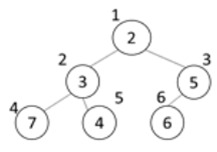

# 5177. 이진 힙

> https://swexpertacademy.com/main/learn/course/subjectDetail.do?courseId=AVuPDN86AAXw5UW6&subjectId=AWOVJ-_6qfsDFAWg#
>
> 이진 최소힙은 다음과 같은 특징을 가진다.
>
>   \- 항상 완전 이진 트리를 유지하기 위해 마지막 노드 뒤에 새 노드를 추가한다.
>
>   \- 부모 노드의 값<자식 노드의 값을 유지한다. 새로 추가된 노드의 값이 조건에 맞지 않는 경우, 조건을 만족할 때까지 부모 노드와 값을 바꾼다.
>
>   \- 노드 번호는 루트가 1번, 왼쪽에서 오른쪽으로, 더 이상 오른쪽이 없는 경우 다음 줄로 1씩 증가한다.
>
> 예를 들어 7, 2, 5, 3, 4, 6이 차례로 입력되면 다음과 같은 트리가 구성된다.
>
> 
>
> 이때 마지막 노드인 6번의 조상은 3번과 1번 노드이다.
>
> 1000000이하인 N개의 서로 다른 자연수가 주어지면 입력 순서대로 이진 최소힙에 저장하고, 마지막 노드의 조상 노드에 저장된 정수의 합을 알아내는 프로그램을 작성하시오.
>
> 
> **[입력]**
>
> 첫 줄에 테스트케이스의 수 T가 주어진다. 1<=T<=50
> 다음 줄부터 테스트 케이스의 별로 N이 주어지고, 다음 줄에 1000000이하인 서로 다른 N개의 자연수가 주어진다. 5<=N<=500
>
> 3 
>
> 6 
>
> 7 2 5 3 4 6 
>
> 6 
>
> 3 1 4 16 23 12 
>
> 8 
>
> 18 57 11 52 14 45 63 40
>
> **[출력]**
>
> 각 줄마다 "#T" (T는 테스트 케이스 번호)를 출력한 뒤, 답을 출력한다.
>
> #1 7 
>
> #2 5 
>
> #3 65

- 풀이

```python
T = int(input())
for tc in range(1, T + 1):
    N = int(input())
    nums = list(map(int, input().split()))

    q = [0 for i in range(N + 1)]

    for i in range(1, N + 1):
        # q 삽입
        q[i] = nums[i - 1]
        heap = i
        while True:
            if q[heap] <= q[heap // 2] and heap != 1:
                q[heap], q[heap // 2] = q[heap // 2], q[heap]
            else:
                break
            heap //= 2

    ans = 0
    while N > 1:
        ans += q[N // 2]
        N //= 2

    print(f"#{tc} {ans}")
```

- 해설 1

```python
def heappush(value):
    global heapcount
    heapcount += 1
    c = heapcount
    p = heapcount//2
    Tree[c] = value
    if p > 0 and Tree[p] > Tree[c]:
        while p > 0 and Tree[p] > Tree[c]:
            Tree[p], Tree[c] = Tree[c], Tree[p]
            c = p
            p = c//2

T = int(input())
for tc in range(1,T+1):
    N = int(input())
    Tree = [0]*(N+1)
    temp = list(map(int,input().split()))
    heapcount = 0
    for i in range(len(temp)):
        heappush(temp[i])
    lastnode= heapcount
    anc = lastnode // 2
    ans = 0
    while anc > 0:
        ans += Tree[anc]
        anc = anc // 2

    print("#{} {}".format(tc, ans))
```

- 해설 2

```python
import heapq
T = int(input())
for tc in range(1,T+1):
    N = int(input())
    # print(N)
    info = list(map(int,input().split()))
    # print(info)
    heap = []
    for i in info:
        heapq.heappush(heap,i)
    heap = [0]+heap
    target = N//2
    ans = 0
    while target > 0:
        ans += heap[target]
        # print(target)
        target = target//2
    print(ans)
```

- 해설 3

```python
def push(item):
    global hsize
    hsize += 1
    H[hsize] = item
    c=hsize; p=hsize//2
    while p and H[p] > H[c]:
        H[p], H[c] = H[c], H[p]
        c = p; p = c//2
for tc in range(1,int(input())+1):
    N = int(input())
    arr = list(map(int,input().split()))
    H = [0]* (N+1)
    hsize = 0
    for i in range(N):
        push(arr[i])
```

- 해설 4

```python
for tc in range(1,int(input())+1):
    N = int(input())
    arr = list(map(int,input().split()))
    H = [0]* (N+1)
    hsize = 0
    for val in arr:
        hsize += 1
        H[hsize] = val

        c=hsize; p=hsize//2
        while p and H[p] > H[c]:
            H[p], H[c] = H[c], H[p]
            c = p; p = c//2

    ans = 0
    v = N//2
    while v:
        ans += H[v]
        v = v//2
    print(ans)
```

- 해설 5

```python
from heapq import heappush
for tc in range(1,int(input())+1):
    N = int(input())
    arr = list(map(int,input().split()))
    H = []
    for val in arr:
        heappush(H, val)
    H = [0]+H
    target = N//2
    ans = 0
    while target:
        ans += H[target]
        target //= 2
    print("#{} {}".format(tc, ans))
```

