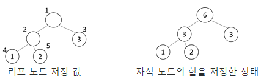

# 5178. 노드의 합

> https://swexpertacademy.com/main/learn/course/subjectDetail.do?courseId=AVuPDN86AAXw5UW6&subjectId=AWOVJ-_6qfsDFAWg#
>
> 완전 이진 트리의 리프 노드에 1000이하의 자연수가 저장되어 있고, 리프 노드를 제외한 노드에는 자식 노드에 저장된 값의 합이 들어있다고 한다.
>
> 다음은 리프 노드에 저장된 1, 2, 3이 주어졌을 때, 나머지 노드에 자식 노드의 합을 저장한 예이다.
>
> 
>
> N개의 노드를 갖는 완전 이진 트리의 노드 번호는 루트가 1번이 되며, 같은 단계에서는 왼쪽에서 오른쪽으로 증가, 단계가 꽉 차면 다음단계의 왼쪽부터 시작된다.
>
> 완전 이진 트리의 특성상 1번부터 N번까지 빠지는 노드 번호는 없다.
>
> 리프 노드의 번호와 저장된 값이 주어지면 나머지 노드에 자식 노드 값의 합을 저장한 다음, 지정한 노드 번호에 저장된 값을 출력하는 프로그램을 작성 하시오.
>
>
> **[입력]**
>
> 첫 줄에 테스트케이스의 수 T가 주어진다. 1<=T<=50
>
> 다음 줄부터 테스트 케이스의 별로 노드의 개수 N과 리프 노드의 개수 M, 값을 출력할 노드 번호 L이 주어지고, 다음 줄부터 M개의 줄에 걸쳐 리프 노드 번호와 1000이하의 자연수가 주어진다.
>
> ```
> 3
> 5 3 2
> 4 1
> 5 2
> 3 3
> 10 5 2
> 8 42
> 9 468
> 10 335
> 6 501
> 7 170
> 17 9 4
> 16 479
> 17 359
> 9 963
> 10 465
> 11 706
> 12 146
> 13 282
> 14 828
> 15 962
> ```
>
> **[출력]**
>
> 각 줄마다 "#T" (T는 테스트 케이스 번호)를 출력한 뒤, 답을 출력한다.
>
> ```
> #1 3
> #2 845
> #3 1801
> ```

- 풀이

```python
T = int(input())
for tc in range(1, T + 1):
    N, M, L = map(int, input().split())
    tree = [0] * (N + 1)
    for _ in range(M):
        leaf, num = map(int, input().split())
        tree[leaf] = num

    for i in range(N - M, 0, -1):
        if i * 2 <= N:
            tree[i] = tree[i * 2]
            if i * 2 + 1 <= N:
                tree[i] += tree[i * 2 + 1]

    print(f'#{tc} {tree[L]}')
```

- 해설 1

```python
def postorder(n):
    if n <= N:
        postorder(2*n)
        postorder(2*n+1)
        if not Tree[n] and 2*n+1<=N:
            Tree[n] = Tree[2*n]+Tree[2*n+1]
        elif not Tree[n] and 2*n<=N and 2*n+1 > N:
            Tree[n] = Tree[2*n]

T = int(input())
for tc in range(1,T+1):
    N, M, L = map(int,input().split())
    Tree = [0]*(N+1)
    for _ in range(M):
        idx, num = map(int,input().split())
        Tree[idx] = num
    postorder(1)
    ans = Tree[L]
    print("#{} {}".format(tc, ans))
```

- 해설 2

```python
for tc in range(1,int(input())+1):
    N,M,L = map(int,input().split())
    T = [0]*(N+1)
    for _ in range(M):
        num, val = map(int,input().split())
        T[num] = val
    def dfs(v):
        if v>N: return 0
        l= dfs(v*2)
        r= dfs(v*2+1)
        T[v] += l+r
        return T[v]
    dfs(1)
    print(T[L])
```

- 해설 3

```python
for tc in range(1,int(input())+1):
    N,M,L = map(int,input().split())
    T = [0]*(N+1)
    for _ in range(M):
        num, val = map(int,input().split())
        T[num] = val
    for i in range(N-M,0,-1): # 배열의 인덱스이자, 노드번호
        T[i] = T[i*2]
        if i*2+1<=N:
            T[i] += T[i*2+1]
    print(T[L])
```

- 해설 4

  ```python
  T = int(input())
  
  for tc in range(1, T+1):
      N, M, L = map(int, input().split())  # N:노드개수, M:리드노프개수, L:출력할 노드번호
      tree = [0 for _ in range(N + 1)]
      for i in range(M):
          n, v = map(int, input().split())
          tree[n] = v
  
      # 방법1
      if N % 2 == 0:  # 노드의 개수가 짝수인경우
          tree.append(0)
  
      for i in range((N//2)*2, 1, -2):
          tree[i // 2] = tree[i] + tree[i + 1]
  
      print("#{} {}".format(tc, tree[L]))
  ```

- 해설 5

  ```python
  T = int(input())
  
  for tc in range(1, T+1):
      N, M, L = map(int, input().split())  # N:노드개수, M:리드노프개수, L:출력할 노드번호
      tree = [0 for _ in range(N + 1)]
      for i in range(M):
          n, v = map(int, input().split())
          tree[n] = v
  
      # 방법2
      for i in range(N, 0, -1):
          if i // 2 > 0:
              tree[i // 2] += tree[i]
  
      print("#{} {}".format(tc, tree[L]))
  ```

  
