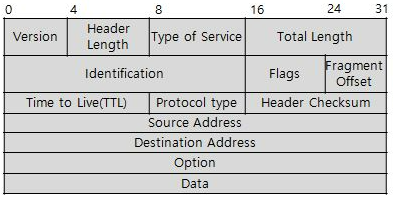
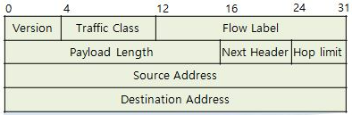
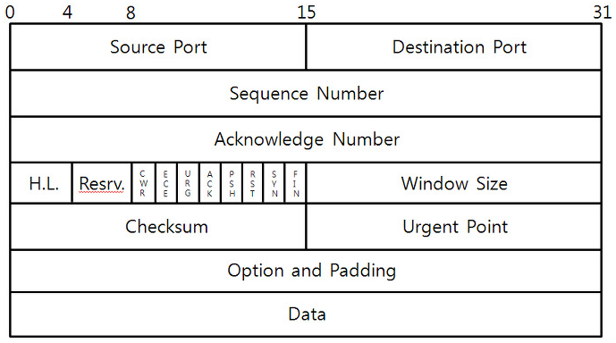
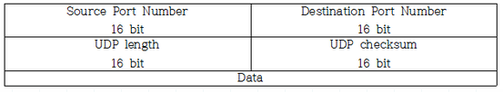

[TOC]

## 11. 응용 SW 기초 기술 활용

### 1. 운영체제 특징

#### 1. 운영체제 종류

- OS 개념 : 하드웨어 쉽게 사용할 수 있도록 인터페이스 제공 SW

- 운영체제 종류

  - Windows

    - 특징 : **지선자 오**

      |                  특징                   |                             설명                             |
      | :-------------------------------------: | :----------------------------------------------------------: |
      |     그래픽 사용자 인터페이스 (GUI)      |        키보드 없이 마우스 그래픽 기반 인터페이스        |
      |         선점형 멀티태스킹 방식          | 동시 여러 프로그램 실행 OS -> 각 작업 CPU 이용 시간 제어 |
      |   자동감지 기능 (Plug and Play)    |        하드웨어 설치 시 필요한 시스템 환경 자동 구성         |
      | OLE (Object Linking and Embedding) |            현재 작성 문서에 개체 연결, 삽입 편집             |

  - Unix : 교육, 연구 기관 -> 범용 다중 사용자 방식 시분할 OS

    - 특징 : **대다 사이계**

      |             특징             |                             설명                             |
      | :--------------------------: | :----------------------------------------------------------: |
      |          대화식 OS           |        프롬프트 : 명령 -> 수행 사용자 명령 기반         |
      |        다중 작업 기능        | 다수 작업 -> 공용자원 (CPU) 나누어서 사용 한 번에 하나 이상 작업 |
      |       다중 사용자 기능       | 여러 대 단말 -> 하나의 컴퓨터 여러 사람 동시 시스템 사용 -> 각각 작업 수행 |
      |            이식성            |    C 언어, 시스템 모듈화 -> 다른 하드웨어 기종 이식 가능     |
      | 계층적 트리 구조 파일 시스템 |                       통합적 파일 관리                       |

    - 안드로이드 : 휴대용 장치 OS, 미들웨어, 사용자 인터페이스, 표준 응용 플그램 포함 OS

#### 2. 운영체제 기본 명령어 활용

#### 3. 운영체제 핵심 기능 파악

- OS 핵심 기능

  |     기능      |                             설명                             |
  | :-----------: | :----------------------------------------------------------: |
  |  메모리 관리  |       메모리 가용 상태로 유지, 관리 MMU 주소 매핑       |
  | 프로세스 관리 | 일시중지 및 재실행, 동기화, 통신 교착상태 처리, 프로세스 생성 삭제 |

  - 메모리 관리 기법 : **반배할교**

    |   기법    |                             설명                             |                          세부 기법                           |
    | :-------: | :----------------------------------------------------------: | :----------------------------------------------------------: |
    | 반입 기법 | 주기억장치 적재 다음 프로세스 반입 시기 메모리로 시기 결정 : When |                     요구/예상 반입 기법                      |
    | 배치 기법 | 디스크 프로세스 -> 주기억장치 어디에 저장  메모리 적재 위치 : Where | 최초 적합 (First-fit) 최적 적합 (Best-fit) 최악 적합 (Worst-fit) |
    | 할당 기법 | 실행 프로세스 -> 주기억장치 어떻게 할당 메모리 적재 방법 : How |                     연속/분산 할당 기법                      |
    | 교체 기법 | 재배치 -> 주기억장치 프로세스 중 어떤 것 제거 메모리 교체 대상 : Who | 프로세스 Swap in / Out FIFO, Optimal, LRU, LFU 시계 알고리즘, MFU |

    - 메모리 배치 기법 : **초적악**
      - 최초 : 첫 번째 분할
      - 최적 : 가장 크기 비슷
      - 최악 : 가장 큰 공간

  - 프로세스 관리

    - 상태

      |      상태       |                             설명                             |
      | :-------------: | :----------------------------------------------------------: |
      |  생성 (Create)  |                                                              |
      |  준비 (Ready)   | CPU 할당 가능 준비 리스트 : 우선순위 부여 -> 높은 우선순위 => 다음 순서 |
      | 실행 (Running)  |                           동작 중                            |
      | 대기 (Waiting)  | CPU 양도, 입출력 완료까지 대기 리스트에서 대기 대기 리스트 : 우선순위 X |
      | 완료 (Complete) |                          수행 종료                           |

    - 상태 전이 : **디타 블웨**

      |                전이                |                             설명                             |
      | :--------------------------------: | :----------------------------------------------------------: |
      |      디스패치 (Dispatch)      | 준비 상태 프로세스 -> 실행 선정 => CPU 할당 준비 -> 실행 상태 : 문맥교환 |
      | 타이머 런 아웃 할당 시간 초과 | 지정 시간 초과 시 PCB 저장, CPU 반납 -> 준비 상태 전이 실행 -> 준비 상태 타임 슬라이스 만료, 선점 시 타임아웃 |
      |       블록 입출력 발생        | 이벤트 발생 (block) -> CPU 반납, 입출력 완료 시까지 대기 상태 전이 실행 -> 대기 상태 즉시 실행 불가능한 시스템 콜, I/O 작업 시작, 프로세스 간 통신 시 block |
      |        웨이크 업 깨움         | 입출력 종료 시 대기 프로세스에 종료 wait, signal 통보 -> 준비 상태 전이 대기 -> 준비 상태 |

  - 프로세스 스케줄링

    - 유형 : **SMMR, 우기 HFS**

      |   구분   |         선점형 스케줄링 (Preemptive Scheduling)         |      비선점형 스케줄링 (Non Preemptive Scheduling)      |
      | :------: | :----------------------------------------------------------: | :----------------------------------------------------------: |
      |   개념   |             우선순위 높은 게 현재 중단, CPU 점유             |   CPU 할당 => 작업 종료 후  CPU 반환까지 점유 불가능    |
      |   장점   |               빠른 응답, 대화식 시분할 시스템                |                  응답시간 예상, 공정한 처리                  |
      |   단점   |           높은 우선순위 프로세스가 많으면 오버헤드           |       짧은 작업 프로세스가  긴 작업 종료까지 대기       |
      | 알고리즘 | SRT (Shortest Remaining Time First) 다단계 큐 (Multi-Level Queue) 다단계 피드백 큐 라운드 로빈 (Round Robin) | 우선순위 (Priority) 기한부 (Deadline) HRN (High Response Ratio Next) FCFS (First Come First Service) SJF (Shortest Job First) |
      |   활용   |                 실시간 / Deadline 응답 환경                  |            처리시간 편차 적은 특정 프로세스 환경             |

    - 알고리즘

      - 선점형

        |       유형       |                          동작 방식                           |                         특징                         |
        | :--------------: | :----------------------------------------------------------: | :--------------------------------------------------: |
        |       SRT        | 가장 짧은 시간 소요 프로세스 먼저 수행 준비 큐에 더 짧은 게 생기면 선점 |           짧은 수행시간 프로세스 우선 수행           |
        |    다단계 큐     | 여러 종류 그룹 분할 상위 단계 작업 -> 하위 단계 작업 선점 독자적 스케줄링 |                  독립된 스케줄링 큐                  |
        | 다단계 피드백 큐 | 입출력, CPU 위주 프로세스 특성 -> 서로 다른 CPU 시간 할당량 FCFS (FIFO) + 라운드 로빈 | 큐마다 다른 시간 할당 마지막 단계 : 라운드 로빈 |
        |   라운드 로빈    | 같은 크기 CPU 시간 할당 처리 못하면 준비 큐 리스트 가장 뒤로, 다음 프로세스 |        균등 CPU 점유 시간 시분할 시스템         |

      - 비선점형

        |       유형       |                          동작 방식                           |                            특징                             |
        | :--------------: | :----------------------------------------------------------: | :---------------------------------------------------------: |
        |     우선순위     |                       동일 순위는 FCFS                       | 주요/긴급 프로세스 우선 처리 설정, 자원 상황 우선 순위 |
        |      기한부      |                      명시 시간, 기한 내                      |                      시간 내 처리 보장                      |
        |       HRN        | 현재 응답률 가장 높은 것 기아 현상 보완 -> 불평등 완화 우선순위 = (대기 + 서비스 시간) / 서비스 시간 |                기아 현상 (starvation) 최소화                |
        | FCFS (FIFO) |                      대기 큐 도착 순서                       |                        도착 순서대로                        |
        |       SJF        | 도착 시점 -> 가장 작은 서비스 시간 가장 짧은 작업부터, 평균 대기 시간 최소 불평등 -> CPU 요구 시간 길면 기아 현상 |                       기아 현상 발생                        |

      - 계산방법

        - FIFO :**반종도 대반서**
          - 반환 시간 = 종료 시간 - 도착 시간
          - 대기 시간 = 반환 시간 - 서비스 시간

- 가상화, 클라우드

  - 가상화

    - 개념 : 물리적 리소스 -> 하나로 or 하나 물리 리소스 -> 여러 개로 보이게

      - 기술요소

        |                    요소                    |                             설명                             |
        | :----------------------------------------: | :----------------------------------------------------------: |
        |               컴퓨팅 가상화                | 물리적 컴퓨터 리소스 가상화 -> 논리적 단위 리소스 활용 하나 시스템 -> 1개 이상 OS 동시 가동 => 서버 이용률 향상 |
        |              스토리지 가상화               | 스토리지 ~ 서버 : 소프트/하드웨어 계층 추가 -> 스토리지 논리적 제어, 활용 이기종 스토리지 시스템 통합 |
        |                 I/O 가상화                 | 서버 ~ I/O 디바이스 사이 위치 미들웨어 계층 -> 서버 I/O 자원 물리적 분리 / 케이블, 스위치 구성 단순화 -> 효율적 연결 |
        |                  컨테이너                  | 단일 OS에서 실행 가능하도록 하이퍼바이저 없이 격리된 프로세스로 동작 -> 오버헤드 낮음 |
        | 분산처리 기술 (Distributed Computing) | 여러 대 계산, 저장능력 -> 커다란 계산 문제, 대용량 데이터 처리, 저장 |
        |              네트워크 가상화               |            중계장치 가상화 -> 가상 네트워크 지원             |

  - 클라우드 컴퓨팅 : 인터넷 -> 가상화된 컴퓨터 시스템 리소스 (IT 리소스) 제공, 인터넷 연결 다른 컴퓨터로 처리

    - 분류 : **사공하**

      |             분류             |                          주요 내용                           |
      | :--------------------------: | :----------------------------------------------------------: |
      | 사설 클라우드 (Private) | 내부 보유 컴퓨팅 자원 -> 내부 구축 운영 직접 통제, 보안성 |
      | 공용 클라우드 (Public)  | 클라우드 서비스 제공 업체 -> 다중 사용자 컴퓨팅 자원 서비스 확장성, 유연성 |
      |     하이브리드 클라우드      |        사설 + 공용 구축 비용 + 보안성 문제 해결         |

    - 유형 : **인플소**

      |                             유형                             |                             설명                             |
      | :----------------------------------------------------------: | :----------------------------------------------------------: |
      | 인프라형 서비스 (IaaS : Infrastructure as a Service) | 시스템 자원 -> 클라우드 컴퓨팅 자원 + SW 탑재, 실행 하위 클라우드 인프라 제어, 관리 X 스토리지, 어플리케이션 제어 |
      |   플랫폼형 서비스 (PaaS : Platform as a Service)   | Saas 개념 개발 플랫폼에 확장 -> 플랫폼 구축 X, 필요 개발 요소 웹에서 확장 OS, 애플리케이션, 호스팅 환경 구성 제어 |
      | 소프트웨어형 서비스 (SaaS : Software as a Service) | SW, 관련 데이터 -> 중앙 호스팅 사용자 -> 클라이언트 통해서 접속 SW 서비스 형태로 이용, 주문형 SW |

### 2. 네트워크 기초 활용

#### 1. 네트워크 계층 구조 파악

- 네트워크 : 원하는 정보 -> 원하는 수신자, 기기 => 정확 전송 기반 인프라

- OSI (Open System Interconnection) 7계층 : **아파서 티내다, 피나다**

  |                  계층                  |                             설명                             |   프로토콜   |        전송단위         |      장비      |
  | :------------------------------------: | :----------------------------------------------------------: | :----------: | :---------------------: | :------------: |
  |   응용 계층 (Application Layer)   |     사용자 ~ 네트워크 응용서비스 연결, 데이터 생성      |  HTTP, FTP   |         데이터          |     호스트     |
  |  표현 계층 (Presentation Layer)   |          데이터 형식 설정, 부호교환 암/복호화           |  JPEG, MPEG  |         데이터          |     호스트     |
  |     세션 계층 (Session Layer)     |        송수신 간 논리적 연결 연결 접속, 동기제어        | RPC, NetBIOS |         데이터          |     호스트     |
  |    전송 계층 (Transport Layer)    | 송수신 프로세스 간 연결 신뢰성 통신 보장 데이터 분할, 재조립, 흐름/오류/혼잡 제어 |   TCP, UDP   | 세그먼트 (Segment) |   L4, 스위치   |
  |   네트워크 계층 (Network Layer)   |          단말기 간 데이터 전송 -> 최적화 경로 제공           |   IP, CMP    |   패킷 (Packet)    |     라우터     |
  | 데이터링크 계층 (Data Link Layer) | 인접 시스템 간 데이터 전송, 전송 오류 제어 동기화, 오류/흐름/회선 제어 |  HDLC, PPP   |   프레임 (Frame)   | 브리지, 스위치 |
  |    물리 계층 (Physical Layer)     |        비트 정보 회선에 보내기 위한 전기적 신호 변환         |   RS-232C    |       비트 (Bit)        |  허브, 리피터  |

- 네트워크 장비

  - 1계층

    |  장비  |                             설명                             |
    | :----: | :----------------------------------------------------------: |
    |  허브  | 여러 대 컴퓨터 연결 하나 네트워크 수신 정보 -> 여러 대 컴퓨터 송신 |
    | 리피터 |                       디지털 신호 증폭                       |

  - 2계층

    |  장비  |             설명              |
    | :----: | :---------------------------: |
    | 브리지 | 두 개 근거리통신망 (LAN) 연결 |

  - 3계층

    |    장비    |                             설명                             |
    | :--------: | :----------------------------------------------------------: |
    |   라우터   | LAN ~ LAN, WAN 패킷 위치 추출 -> 최적 경로 지정 => 데이터 패킷 전송 |
    | 게이트웨이 | 서로 다른 통신망에 접속 LAN : 다른 네트워크 데이터 송수신 출입구 |

#### 2. 네트워크 프로토콜 파악

- 프로토콜

  - 개념

    - 다른 시스템 두 개체 간 데이터 교환 원활 통신규약
    - 메시지 전달, 도착 확인, 재전송 -> '기술적 은어'

  - 기본 3요소 : **구의타**

    |      요소       |               설명                |
    | :-------------: | :-------------------------------: |
    |  구문 (Syntax)  | 데이터 형식, 코딩, 신호 레벨 규정 |
    | 의미 (Semantic) |   제어 정보 -> 조정, 에러 처리    |
    | 타이밍 (Timing) |     속도 조절, 순서 관리 규정     |

- 네트워크 프로토콜 : 컴퓨터, 원거리 통신 장비 사이 메시지 송수신 양식, 규칙 체계

  |   특징    |                   설명                    |
  | :-------: | :---------------------------------------: |
  |  단편화   |                 작은 블록                 |
  |  재조립   |              단편화 -> 복원               |
  |  캡슐화   | 상위 계층 데이터 + 정보 추가 -> 하위 계층 |
  | 연결 제어 |             전송량, 속도 제어             |
  | 오류 제어 |                   검증                    |
  |  동기화   |             송수신 시점 맞춤              |
  |  다중화   |     하나 통신 회선 -> 여러 기기 접속      |
  | 주소 지정 |   송수신지 주소 부여 -> 정확 전송 보장    |

- 네트워크 계층 (3계층)

  - 프로토콜

    - ICMP (Internet Control Message Protocol) : TCP/IP에서 오류 발생 시 ICMP 메시지

  - IPv4 (Internet Protocol version 4)

    - 헤더 : **버헤타토 아플프 타플해 소데옵페**

      

      - Options : 선택 옵션 / Data Padding : 필요시민

  - IPv6 : IPv4 주소 고갈, 보안성, 이동성 지원 문제점 해결 => 128비트

    |       특징       |                             설명                             |
    | :--------------: | :----------------------------------------------------------: |
    |   IP 주소 확장   |                           128비트                            |
    |      이동성      |     물리적 위치 제한 X 같은 주소 유지 -> 자유 이동      |
    | 인증, 보안 기능  | 패킷 출처 인증, 데이터 무결성, 비밀 보장 -> IP 프로토콜 체계 반영 IPSec 기능 적용, 보안성 강화 |
    |    개선된 QoS    |                   흐름 레이블 (Flow Label)                   |
    |    Plug&Play     |      자동적 네트워크 주소 부여, 멀티미디어 실시간 처리       |
    | Ad-hoc 네트워크  |                  자동 네트워킹, 인터넷 연결                  |
    |    단순 헤더     | IP 패킷 처리 신속 : 고정 크기 단순 헤더 확장 헤더 -> 기능 확장, 옵션 기능 사용 |
    | 실시간 패킷 추적 |                   흐름 레이블 (Flow Label)                   |

    - 헤더 : **버트플 페넥홉 소데**

      

  - IPv4 IPv6 특징 : **유멀브, 유멀애**

    |   구분   |                 IPv4                  |                IPv6                |
    | :------: | :-----------------------------------: | :--------------------------------: |
    | 전송방식 | 유니캐스트, 멀티캐스트, 브로드 캐스트 | 유니캐스트, 멀티캐스트, 애니캐스트 |

  - 라우팅 프로토콜

    |                  기술                   |                             설명                             |
    | :-------------------------------------: | :----------------------------------------------------------: |
    | RIP (Routing Information Protocol) | 인접 라우터 정보 공유 -> 목적지 거리 방향  벨만-포드 알고리즘 (Bellman-Ford) 최초 라우팅 프로토콜, 거리 벡터 알고리즘 30초 주기 갱신 -> 업데이트 시 많은 시간 소요 라우팅 루프 |
    |  OSPF (Open Shortest Path First)   | 링크 상태 정보 모든 라우터 전달 -> 최단 경로 트리 구성 링크 상태 알고리즘, 빠른 업데이트 다익스트라 알고리즘 -> 대규모 네트워크 토폴로지 정보 전체 라우터 동일 유지 |

- 전송 계층 (4계층)

  - TCP (Transmission Control Protocol) : 근거리 통신망, 인트라넷, 인터넷 -> 안정, 순서, 에러 없이 교환

    - 특징 : **신연호혼**

      |                특징                 |                             설명                             |
      | :---------------------------------: | :----------------------------------------------------------: |
      |             신뢰성 보장             | 패킷 손실, 중복, 순서 바뀜 X 보장 TCP 하위 계층 IP 계층 : 신뢰성 없는 서비스 보완 |
      |             연결 지향적             | UDP : 비연결성 양단간 애플리케이션/프로세스 : TCP 제공 연결성 회선으로 통신 |
      |    흐름 제어 (Flow Control)    |                     송신, 수신 속도 일치                     |
      | 혼잡 제어 (Congestion Control) |                         송신율 감속                          |

    - 헤더 구조 : **소데씨엑 헤리플윈 체어옵패**

      

  - UDP (User Datagram Protocol)

    |            특징            |                             설명                             |
    | :------------------------: | :----------------------------------------------------------: |
    |          비신뢰성          | 논리적 가상회선 연결 필요 X 확인응답 X 오류 제어 거의 X |
    | 순서화 X 데이터그램 서비스 |          수신 메시지 순서 X 흐름 제어 피드백 X          |
    |  실시간 응용, 멀티태스킹   |        빠른 요청, 응답 여러 다수 지점 전송 가능         |
    |         단순 헤더          |  고정 크기 8바이트 (TCP : 20바이트) 헤더 처리에 노력 X  |

    - 헤더 구조 : **소데 랭체다**

      

#### 3. 네트워크 전달 방식

- 패킷 스위칭 : 블록 단위 데이터 전송 -> 전송 중만 네트워크 자원 사용

  | 기술 |                             설명                             |
  | :--: | :----------------------------------------------------------: |
  | X.25 | 패킷 교환망 -> 통신 프로토콜 고정 대역폭, 신뢰성 통신, 복잡 기능 -> 고속망 대체 |
  | ATM  |           비동기 전송모드 -> 광대역 전송 : 스위칭            |
  - ATM

    |            계층            |                             설명                             |
    | :------------------------: | :----------------------------------------------------------: |
    | AAL (ATM Adaptation Layer) |               패킷 셀로 전송 -> 재조립 후 복원               |
    |          ATM 계층          | 셀 전송, 레이아웃 정의, 헤더 필드 의미 가상 회선 연결, 해제, 혼잡 제어 처리 |
    | 물리 계층 (Physical Layer) |                    물리적 전송 매체 처리                     |

- 서킷 스위칭 : 네트워크 특정 사용층 독점

### 3. 기본 개발환경 구축

#### 3. 응용 시스템 개발 인프라 구축

- 개발환경 인프라 구축 개요

  - 구성 방식

    |               방식                |                             설명                             |
    | :-------------------------------: | :----------------------------------------------------------: |
    | 온프레미스 방식 (On-Premise) | 외부 인터넷 차단 -> 인트라넷망만 활용 장비 자체 구매, 특정 공간에 개발환경 구축 |
    |           클라우드 방식           |  클라우드 공급 서비스 임대 투자비용 적, 구축 시간 빠름  |
    |          하이브리드 방식          |                    온프레미스 + 클라우드                     |

    