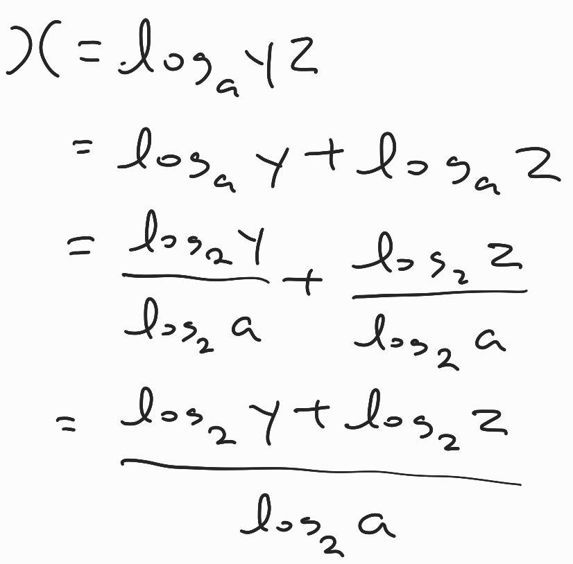
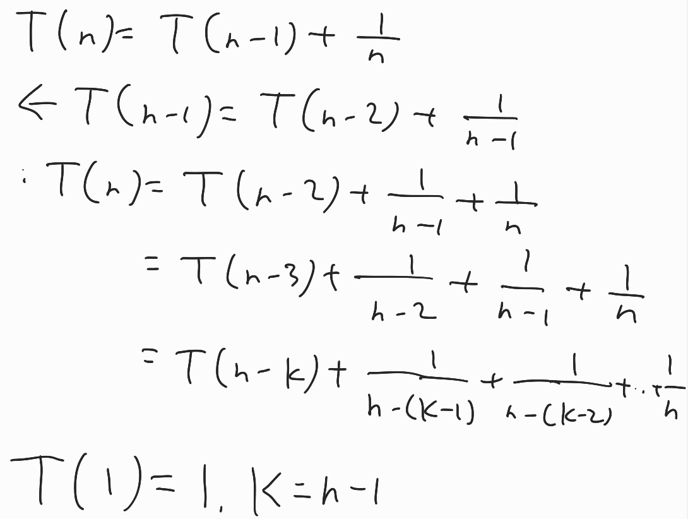
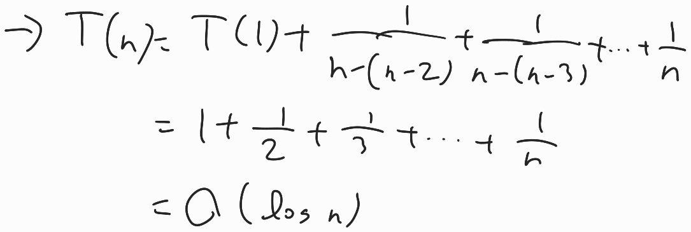

## 수와 표현

> x = loga(yz)일때 x를 2를 밑으로 하는 로그들로 표현하시오. 단 로그 함수 인자는 모두 문자 하나여야 한다.

- 

## 집합과 조합론

> 52개 카드에서 5개 카드 조합을 만들 때, 숫자가 같은 카드가 한쌍도 없는 경우는 몇가지인가?

- `C(52, 5)` = 52! / (5! * 47!) = 2,598,960

## 기초 수식

> T(n) = T(n - 1) + 1 / n

- 

  

