# Computational Thinking

## 1. 논리와 증명

> 문제 1. 다음 명제들이 항진명제라는 것을 진리표를 이용해서 보이시오.
>
> 1. ~(~p∧q)∨q
> 2. (~p∨q)∨(p∧~q)

|  p   |  q   |  ~p  | ~p∧q | ~(~p∧q) | ~(~p∧q)∨q |
| :--: | :--: | :--: | :--: | :-----: | :-------: |
|  T   |  T   |  F   |  F   |    T    |     T     |
|  T   |  F   |  F   |  F   |    T    |     T     |
|  F   |  T   |  T   |  T   |    F    |     T     |
|  F   |  F   |  T   |  F   |    T    |     T     |

|  p   |  q   |  ~p  | ~p∨q |  ~q  | p∧~q | (~p∨q)∨(p∧~q) |
| :--: | :--: | :--: | :--: | :--: | :--: | :-----------: |
|  T   |  T   |  F   |  T   |  F   |  F   |       T       |
|  T   |  F   |  F   |  F   |  T   |  T   |       T       |
|  F   |  T   |  T   |  T   |  F   |  F   |       T       |
|  F   |  F   |  T   |  T   |  T   |  F   |       T       |

> 문제 2. 다음 명제들이 모순명제라는 것을 진리표를 이용해서 보이시오.
>
> 1. (~p∨q)∧(p∧~q)
> 2. (p∧q)∧(p∧~q)

|  p   |  q   |  ~p  | ~p∨q |  ~q  | p∧~q | (~p∨q)∧(p∧~q) |
| :--: | :--: | :--: | :--: | :--: | :--: | :-----------: |
|  T   |  T   |  F   |  T   |  F   |  F   |       F       |
|  T   |  F   |  F   |  F   |  T   |  T   |       F       |
|  F   |  T   |  T   |  T   |  F   |  F   |       F       |
|  F   |  F   |  T   |  T   |  T   |  F   |       F       |

|  p   |  q   |  ~q  | p∧q  | p∧~q | (p∧q)∧(p∧~q) |
| :--: | :--: | :--: | :--: | :--: | :----------: |
|  T   |  T   |  F   |  T   |  F   |      F       |
|  T   |  F   |  T   |  F   |  T   |      F       |
|  F   |  T   |  F   |  F   |  F   |      F       |
|  F   |  F   |  T   |  F   |  F   |      F       |

> 문제 3. 다음 명제의 쌍 들에 대해서 두 명제가 동등한지를 진리표를 이용해 확인하시오.
>
> 1. p∧(p∨q) 와 p : 동등
> 2. ~p∨~q 와 ~(p∨q) : 동등 X

|  p   |  q   | p∨q  | p∧(p∨q) |
| :--: | :--: | :--: | :-----: |
|  T   |  T   |  T   |    T    |
|  T   |  F   |  T   |    T    |
|  F   |  T   |  T   |    F    |
|  F   |  F   |  F   |    F    |

|  p   |  q   |  ~p  |  ~q  | ~p∨~q | ~(p∨q) |
| :--: | :--: | :--: | :--: | :---: | :----: |
|  T   |  T   |  F   |  F   |   F   |   F    |
|  T   |  F   |  F   |  T   |   T   |   F    |
|  F   |  T   |  T   |  F   |   T   |   F    |
|  F   |  F   |  T   |  T   |   T   |   T    |

> 문제 4. 명제식의 변형을 통하여 다음 명제를 간소화하시오.
>
> 1.  (p∧~q)∨(p∧q)
> 2. (p∨~q)∧(~p∨~q)

- p ∧ (~q ∨ q) = p ∧ T = p
- (p ∧ ~p) ∨ ~q = F ∨ ~q = ~q

> 문제 5. 다음 명제들이 참인지 확인하시오. 단 R은 실수의 집합을 의미하고, Z는 정수의 집합을 의미한다.
>
> 1. ∀x ∈ R, x^2 ≥ x
> 2. ∀x ∈ Z, x^2 ≥ x
> 3. ∃x ∈ R, x^2 < x
> 4. ∃x ∈ Z, x^2 < x

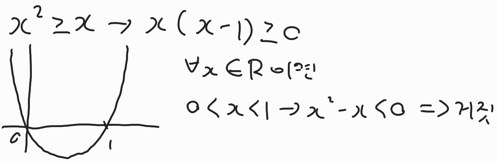

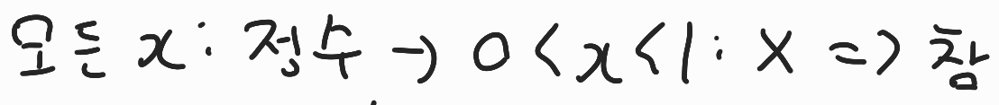

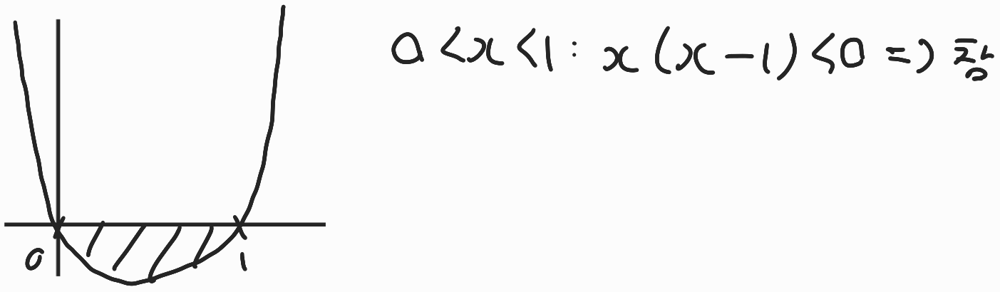

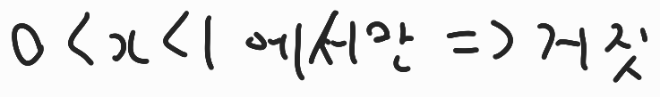

> 문제 6. n이 짝수이면, 3n+5는 홀수임을 증명하라.

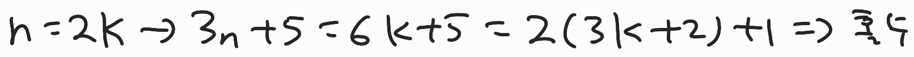

> 문제 7. n이 홀수이면, n^2+n은 짝수임을 증명하라.

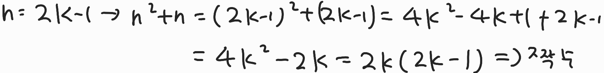

> 문제 8. m이 짝수이고, n이 홀수이면, 2m+3n은 홀수임을 증명하라.

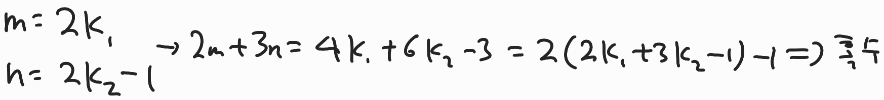

> 문제 9. 자연수 n에 대해, n^2+5가 홀수이면, n은 짝수임을 증명하라.

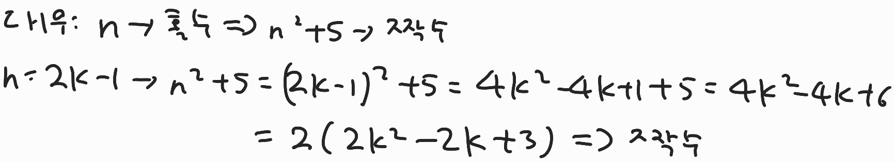

> 문제 10. n^2이 짝수이면, n은 짝수임을 증명하라.


> 문제 11. 자연수 n에 대해, n^2+5n+3은 항상 홀수임을 증명하라.


> 문제 12. n^2이 3의 배수이면, n은 3의 배수임을 증명하라.

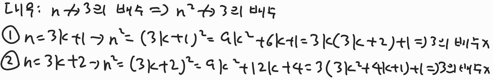


## 2. 수와 표현

> 문제 1. 2진수 표현에서 log n 비트로 표현할 수 있는 숫자 범위는?

0 ~ 2 * log(N) - 1

> 문제 2. 스무고개가 이상적으로 진행된다고 할 때, 맞출 수 있는 답의 종류는 몇 가지 인가?

2^20

> 문제 3. n이 충분히 큰 값일 때, 다음 중 어느 값이 더 큰가? 각 쌍에 대해 비교하고 그 이유를 작성하시오.
>
> 1. 2n n^2
> 2. 2^(n/2) (3n)^(1/2)
> 3. 2^(n * log(n)) n!
> 4. log(2^(2n)) n * n^(1/2)

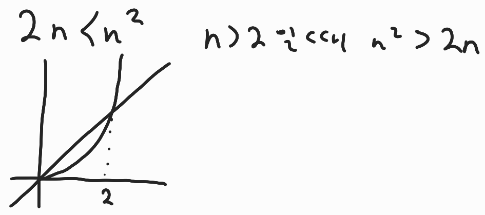

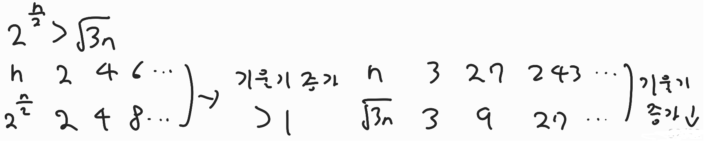

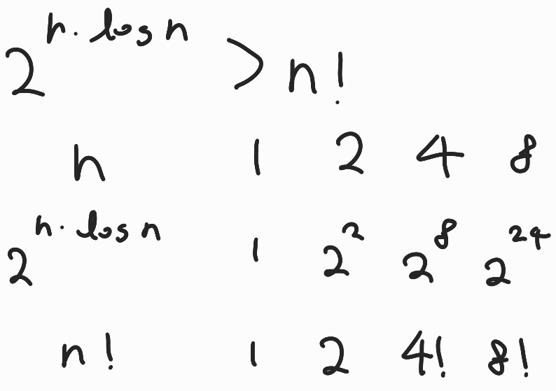

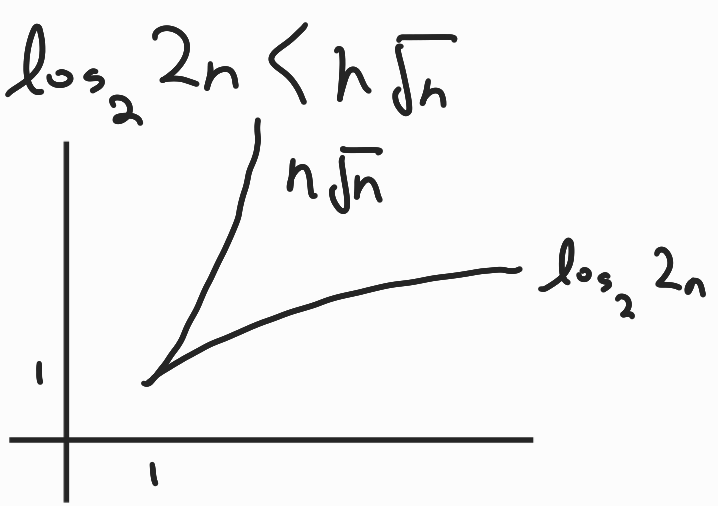

> 문제 4. x = loga(yz)일때 x를 2를 밑으로 하는 로그들로 표현하시오. 단 로그 함수 인자는 모두 문자 하나여야 한다.

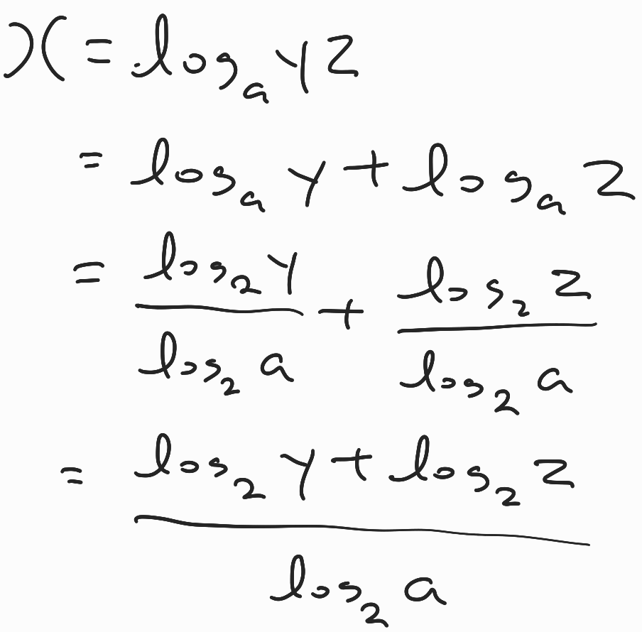

> 문제 5. 다음 함수들의 역함수를 구하시오.
>
> 1. f(x) = log(x - 3) - 5
> 2. f(x) = 3 * log(x + 3) + 1
> 3. f(x) = 2 * 3^x - 1

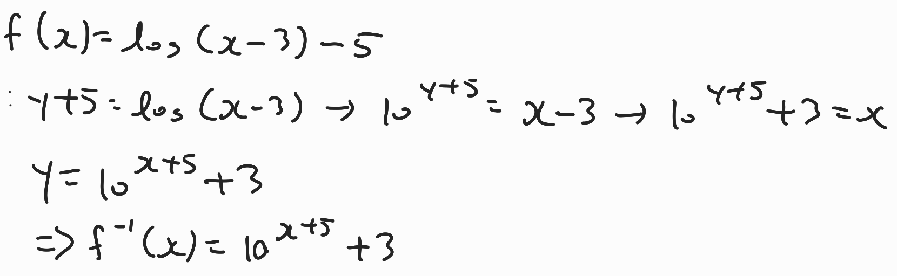

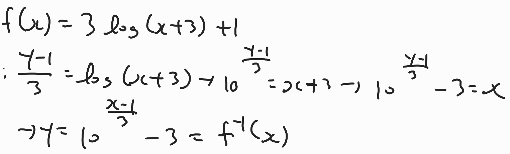

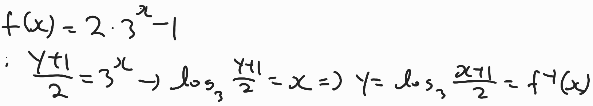

## 3. 집합과 조합론

> 문제 1 : nCk + nC(k-1) = (n+1)Ck

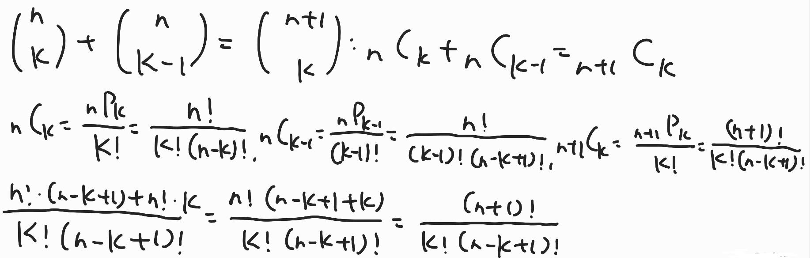

> 문제 2 : 수학적 귀납법으로 (x+y)^n = ∑ k=0부터 n까지 nCk * ((x^(n-k))*y^k)임을 증명하라.

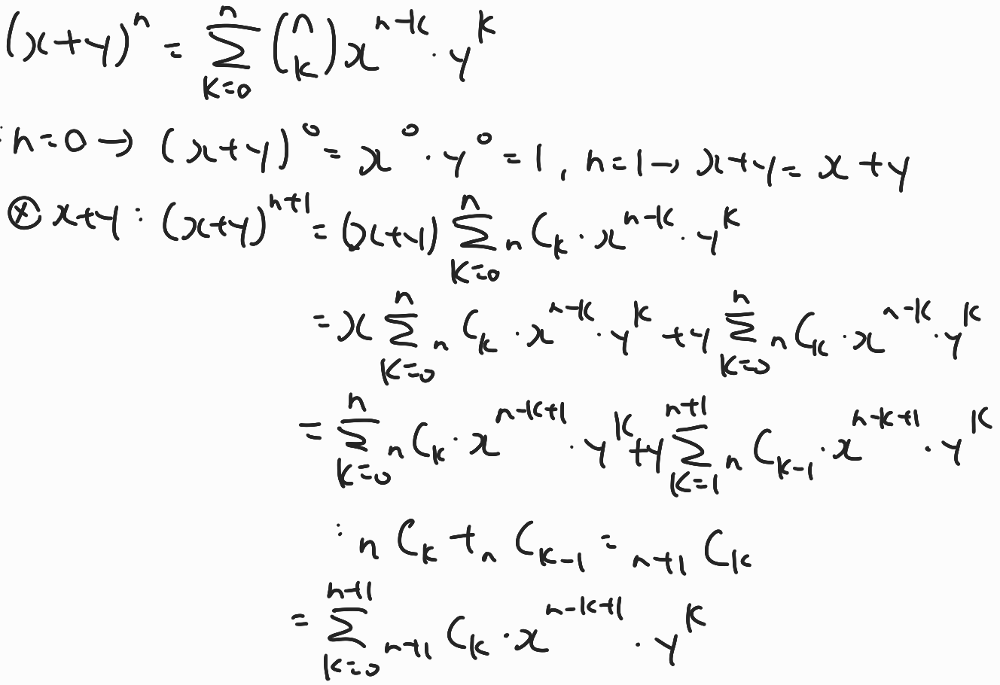

> 문제 3 : 위의 결과를 이용해서 n개의 원소를 가진 집합의 가능한 부분집합의 종류는 2^n개임을 증명하라.

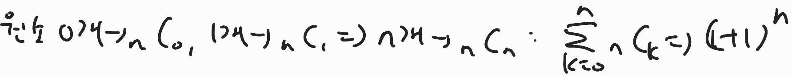

> 문제 4 : 귀류법을 이용하여 (A-B)∩(B-A) = ø 임을 증명하라

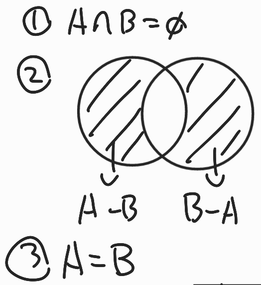

> 문제 6 : 다음이 사실임을 증명하라 ( A ∪ B ) ∩ ( A ∩ B )^c = (A - B) ∪ ( B - A )

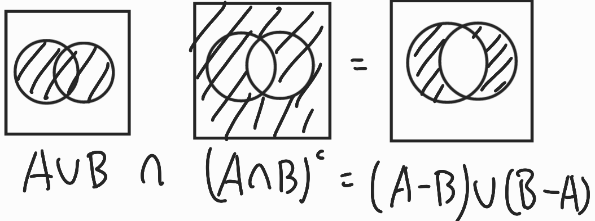

> 문제 8 : 8 X 8 체스 판에서 똑 같은 말 두개를 놓으려고 한다. 아무 곳에나 놓아도 되지만 한 칸에 두개가 들어가지는 못한다. 가능한 방법은 모두 몇가지 인가?

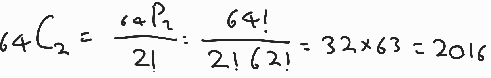

> 문제 10 : 비밀번호를 0부터 9까지의 숫자만 가지고 만든다고 하자. 4개이상 6개 이하의 숫자를 쓸 수 있다고 할 때 가능한 비밀번호의 가지수는 얼마인가?

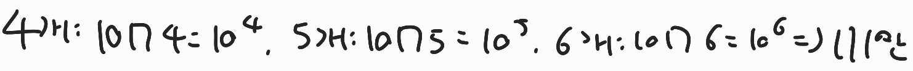

> 문제 12 : 52 개의 트럼프 카드 한 세트를 이용해서 만들 수 있는 5개의 카드의 조합은 몇가지인가?

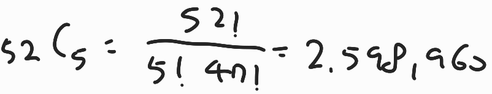

> 문제 13 : 52개의 카드를 이용해서 만들 수 있는 5개 카드 조합 중 같은 무늬의 카드가 정확히 3개인 경우는 몇가지인가?

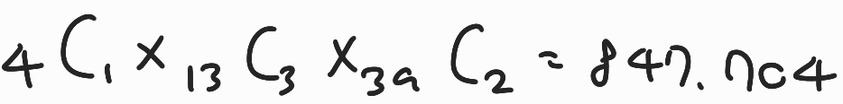

> 문제 14 : x + y + z = 100의 자연수 해는 몇가지인가?

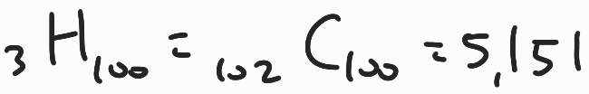

> 문제 16 : 52개 카드에서 5개 카드 조합을 만들 때, 숫자가 같은 카드가 한쌍도 없는 경우는 몇가지인가?

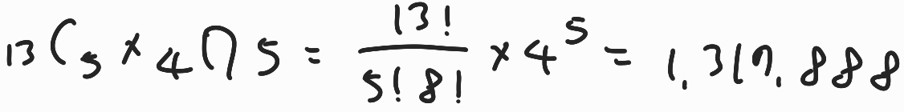

## 4. 기초 수식

> 문제 1 : T(n) = T(n - 1) + 1

```
T(n) = T(n - 1) + 1

= T(n-2) + 1 +1

= .....

=T(1) + 1 + 1 + 1 + ... + 1

1이 n개 있으므로

O(n)
```

> 문제 2 : T(n) = T(n - 1) + n

```
T(n) = T(n - 1) + n

= T(n-2) + n + (n - 1)

= T(n-3) + n + (n - 1) + (n - 2)

= .....

= T(1) + n + (n - 1) + (n - 2) + ... + 1

<=T(1) + n + n + + n + ... + n

n이 n개 있으므로

O(n^2)
```

> 문제 3 : T(n) = T(n - 1) + log(n)

```
T(n) = T(n - 1) + log(n)

= T(n-2) + log(n) + log(n-1)

= T(n-3) + log(n) + log(n -1) + log(n - 2)

= .....

=T(1) + log(n) + log(n -1) + log(n - 2) + ... + log(2)

<=T(1) +  log(n) + log(n) + log(n) + ... + log(n)

log(n)이 n개 있으므로

O(nlog(n))
```

> 문제 4 : T(n) = T(n/2) + 1

```
T(n) = T(n/2) + 1

T(n) = T(n/2^k) + k

n/2^k = 1 이어야 하므로

n = 2^k

k = log(n)

T(n) = T(1) + log(n)

따라서 O(log(n))
```

> 문제 5 : T(n) = T(n/2) + n

```
T(n) = T(n/2) + n

T(n) = T(n/2^k) + n∑ i= 0부터 k까지 1/2^k

∑ i= 0부터 k까지 1/2^i 는 1로 생각할 수 있다.

따라서 O(n)
```

> 문제 6 : T(n) = 2T(n/2) + n

```
1) T(n) = 2(T(n/2) +n

2) T(n/2) = 2T(n/2^2) + n/2

2식을 1번에 대입

 

T(n) = 2[2T(n/2^2) + n/2] + n

3) T(n)=(2^2)T(n/2^2) + n + n

 

4) t(n/2^2) = 2T(n/2^3) + n/2^2

4식을 3식에 대입

T(n) = (2^3)T(n/2^3) +3n

 

과정을 반복...

 

T(n) = (2^k)T(n/2^k) + kn

T(n/2^3) = T(1)이 되어야하므로

n/2^3 = 1

n = 2^k

k = log(n)

 

T(n) = (2^k)T(n/2^k) + kn = nT(1) + nlog(n)

따라서 O( nlog(n) )
```

> 문제 7 : T(n) = 3T(n/2) + n

```
 T(n) = 3T(n/2) + n

T(n) = (3^k)T(n/2^k) + n∑ i=0부터 n까지  (3^i)/(2^i)

n/2^k = 1 이여야 하므로 n = 2^k

k = log(n)

 

=> O(n^log3)
```

> 문제 8 : T(n) = T(n- 1) + 1/n

```
T(n) = T(n-1) + 1/n

T(n) = T(0) + ∑ k=1 부터 n까지 1/n

∑ k=1 부터 n까지 1/n <= 1+∫1부터 k까지 1/k dk

= 1 + log(n) - log1

= 1 + log(n)

따라서 O(log(n))
```


## 5. 재귀

> 문제 1 : 피보나치 수열 : F(n) = F(n - 1) + F(n-2), F(1) = F(2) = 1

> 문제 2 : Merge Sort, 크기 n인 배열을 입력으로 받아, 배열을 절반으로 두개로 나눈 후, 각 작은 배열을 재귀적으로 정렬하고, 그 결과를 Merge한다.

> 문제 3 : 다음 소팅 알고리즘이 실제로 소팅에 항상 성공한다는 것을 증명하라.
>
> ```pseudocode
> Stupid (A[0...n-1])
> {
> 	if n=2 and A[0] > A[1]
> 		then swap A[0] and A[1]
> 	else
> 		m = ceiling(2n/3)
> 		Stupid(A[0...m-1])
> 		Stupid(A[n-m...n-1])
> 		Stupid(A[0...m-1])
> }
> ```

> 문제 4 : 위의 소팅 알고리즘에서 수행하는 Swap의 횟수는 최대 몇번인가?


## 6. 동적 프로그래밍

> 문제 1. Memoization 피보나치 수열 : F(n) = F(n - 1) + F(n - 2), F(1) = F(2) = 1

> 문제 2. Dynamic Programming 피보나치 수열 : F(n) = F(n - 1) + F(n - 2)