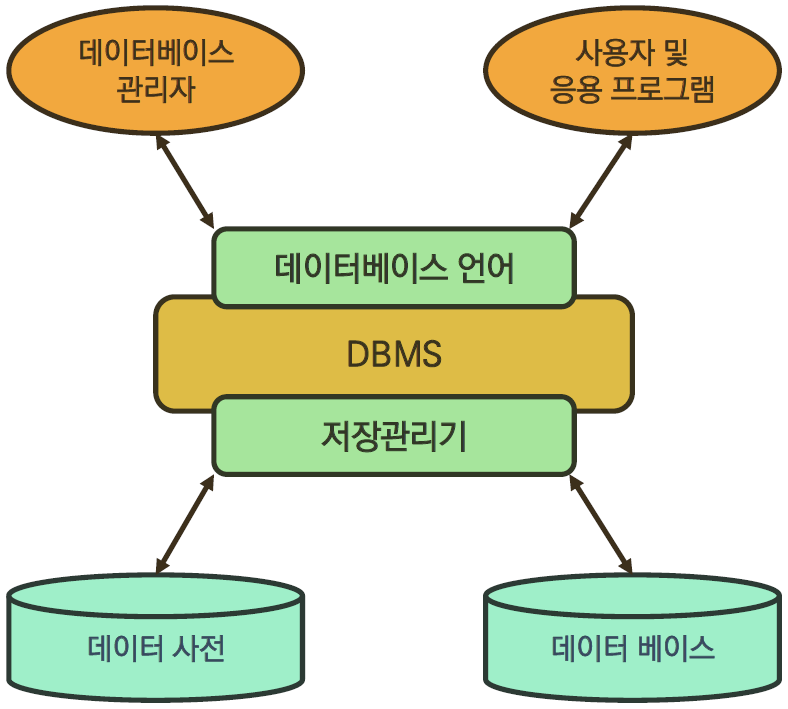

[TOC]


# DB

## Database

- 체계화된 데이터 모임
- 자료 파일 조직적 통합 -> 중복 X, 자료 구조화

### 장점

- 중복 최소화
- 무결성
- 일관성
- 독립성 (물리, 논리적)
- 표준화
- 보안 유지




## 관계형 데이터베이스 (Relational DB)

- 키(key)와 값(value) 간 관계(relation)를 표(table)로 정리 DB
- 관계형 모델

### 용어

- 스키마 (schema) : 명세 기술

  | column  | datatype |
  | :-----: | :------: |
  |   id    |   INT    |
  |  name   |   TEXT   |
  | address |   TEXT   |
  |   age   |   INT    |

- 테이블 (table) : 열 (column / field)과 행 (record / value) 모델 사용

  |  id  |  name  | address | age  |
  | :--: | :----: | :-----: | :--: |
  |  1   | 홍길동 |  제주   |  20  |
  |  2   | 김길동 |  서울   |  30  |
  |  3   | 박길동 |  독도   |  40  |

- 기본 키 (Primary Key) : 각 행 (record) 고유 값, 반드시 설정

  - 여기선 id


## 관계형 데이터베이스 관리 시스템 (Relational DB Management System)

- `MySQL`, `SQLite`, `PostgreSQL`, `ORACLE`, `MS SQL`


## SQL (Structured Query Language)

- RDBMS 데이터 관리 목적
- DB schema 생성 및 수정
- 자료 검색 및 관리
- DB 객체 접근 조정 관리

### 분류

|                           분류                           |             개념              |                            예시                            |
| :------------------------------------------------------: | :---------------------------: | :--------------------------------------------------------: |
|  DDL - 데이터 정의 언어<br />(Data Definition Language)  | RDB 구조 (table, schema) 정의 |                CREATE<br />DROP<br />ALTER                 |
| DML - 데이터 조작 언어<br />(Data Manipulation Language) |             CRUD              | INSERT (Create)<br />SELECT (Read)<br />UPDATE<br />DELETE |
|   DCL - 데이터 제어 언어<br />(Data Control Language)    |      DB 사용자 권한 제어      |        GRANT<br />REVOKE<br />COMMIT<br />ROLLBACK         |


## Table

- DB 생성

```sqlite
$ sqlite3 tutorial.splite3
sqlite> .database
```

- csv -> table

```sqlite
sqlite> .mode csv
sqlite> .import hellodb.csv examples
sqlite> .tables
examples
```

- SELECT : 특정 테이블 레코드 정보

```sqlite
SELECT * FROM examples;
1,"길동","홍",600,"충청도",010-2424-1232
```

- 터미널 view 변경

```sqlite
sqlite> .headers on
SELECT * FROM examples;
id,first_name,last_name,age,country,phone
1,"길동","홍",600,"충청도",010-2424-1232

sqlite> .mode column
id  first_name  last_name  age  country  phone
--  ----------  ---------  ---  -------  -------------
1   길동          홍          600  충청도      010-2424-1232
```

### 테이블 생성 및 삭제

- `CREATE TABLE`

  ```sqlite
  -- 테이블 생성 및 확인 --
  CREATE TABLE classmates (
  	id INTEGER PRIMARY KEY,
  	name TEXT
  );
  sqlite> .tables
  classmates examples
  ```

  - 특정 테이블 schema 조회

    ```sqlite
    .schema classmates
    ```

- `DROP TABLE`

  ```sqlite
  DROP TABLE classmates;
  ```

| column  | datatype |
| :-----: | :------: |
|  name   |   TEXT   |
|   age   |   INT    |
| address |   TEXT   |

```sqlite
CREATE TABLE classmates (
	name TEXT,
    age INT,
    address TEXT
);
```


## CRUD

### CREATE

- INSERT : 테이블에 단일 행 삽입

  ```sqlite
  -- classmates 테이블에 이름이 홍길동, 나이가 23 --
  INSERT INTO classmates (name, age) VALUES ('홍길동', 23);
  SELECT * FROM examples;
  name        age        address
  ----------  ---------  -------------
  홍길동       23                 
  ```

  ```sqlite
  -- classmates 테이블에 이름이 홍길동, 나이가 30, 주소가 서울 : 모든 열에 데이터 있을 때 column 없어도 됨--
  INSERT INTO classmates VALUES ('홍길동', 30, '서울');
  name        age        address
  ----------  ---------  -------------
  홍길동       23
  홍길동       30         서울
  
  -- id? : primary key column 정의 안하면 rowid column : 값 자동으로 증가 PK --
  -- 비어있지 않기 위해서는 NOT NULL 필요 --
  SELECT rowid, * FROM examples;
  rowid       name        age        address
  ----------  ----------  ---------  -------------
  1           홍길동       23
  2           홍길동       30         서울
  ```

  

  ```sqlite
  CREATE TABLE classmates (
  	id INTEGER PRIMARY KEY,
      name TEXT NOT NULL,
      age INT NOT NULL,
      address TEXT NOT NULL
  );
  ```

  ```sqlite
  -- classmates 테이블에 이름이 홍길동, 나이가 30, 주소가 서울 --
  INSERT INTO classmates VALUES ('홍길동', 30, '서울');
  Error: table classmates has 4 columns but 3 values were supplied
  
  INSERT INTO classmates VALUES (1, '홍길동', 30, '서울');
  INSERT INTO classmates (name, age, address) VALUES ('홍길동', 30, '서울');
  ```

  

  ```sqlite
  INSERT INTO classmates VALUES 
  ('홍길동', 30, '서울')
  ('김철수', 30, '대전')
  ('이싸피', 26, '광주')
  ('박삼성', 29, '구미')
  ('최전자', 30, '부산');
  ```

### READ

- `SELECT`

  - `LIMIT` 행 수 제한 + `OFFSET` 시작 지점
  - `WHERE` 검색 조건
  - `DISTINCT` 중복 행 제거

  ```sqlite
  -- classmates 테이블에서 id, name 컬럼 값만 조회 --
  SELECT rowid, name FROM classmates;
  
  rowid       name
  ----------  ----------
  1           홍길동
  2           김철수
  3           이싸피
  4           박삼성
  5           최전자
  ```

  ```sqlite
  -- classmates 테이블에서 id, name 컬럼 값 하나만 조회 --
  SELECT rowid, name FROM classmates LIMIT 1;
  rowid       name
  ----------  ----------
  1           홍길동
  ```

  ```sqlite
  -- classmates 테이블에서 id, name 컬럼 값 세번째 하나만 조회 --
  SELECT rowid, name FROM classmates LIMIT 1 OFFSET 2;
  
  rowid       name
  ----------  ----------
  3           이싸피
  ```

  ```sqlite
  -- classmates 테이블에서 id, name 컬럼 값 중 주소가 서울 조회 --
  SELECT rowid, name FROM classmates WHERE address='서울';
  
  rowid       name
  ----------  ----------
  1           홍길동
  ```

  ```sqlite
  -- classmates 테이블에서 age 값 중복 없이 조회 --
  SELECT DISTINCT age FROM classmates;
  
  age
  ----------
  30
  26
  39
  28
  ```

### UPDATE

- 기존 행 데이터 수정

- 중복 불가능 (UNIQUE) 값인 rowid 기준

  ```sqlite
  -- classmates 테이블에 id가 5인 레코드를 홍길동, 제주도로 수정 --
  UPDATE classmates SET name='홍길동', address='제주도', WHERE rowid=5;
  
  rowid       name        age         address
  ----------  ----------  ----------  ----------
  1           홍길동       30          서울
  2           김철수       30          대전
  3           이싸피       26          광주
  4           박삼성       29          구미
  5           홍길동       28          제주도
  ```

### DELETE

- 중복 불가능 (UNIQUE) 값인 rowid 기준

  ```sqlite
  -- classmates 테이블에 id가 5인 레코드 삭제 --
  DELETE FROM classmates WHERE rowid=5;
  
  rowid       name        age         address
  ----------  ----------  ----------  ----------
  1           홍길동       30          서울
  2           김철수       30          대전
  3           이싸피       26          광주
  4           박삼성       29          구미
  ```

  ```sqlite
  -- 다시 추가하면 : id 재사용 --
  INSERT INTO classmates VALUES ('최전자', 28, '부산');
  
  rowid       name        age         address
  ----------  ----------  ----------  ----------
  1           홍길동       30          서울
  2           김철수       30          대전
  3           이싸피       26          광주
  4           박삼성       29          구미
  5           최전자       28          부산
  ```

- `AUTOINCREMENT` : 이전 행 값 재사용 X

  ```sqlite
  CREATE TABLE 테이블이름 (
  id INTEGER PRIMARY KEY AUTOINCREMENT,
  );
  ```

|      |  구문  |                             예시                             |
| :--: | :----: | :----------------------------------------------------------: |
|  C   | INSERT | INSERT INTO 테이블이름 (컬럼1, 컬럼2, ...) VALUES (값1, 값2); |
|  R   | SELECT |             SELECT * FROM 테이블이름 WHERE 조건;             |
|  U   | UPDATE |    UPDATE 테이블이름 SET 컬럼1=값1, 컬럼2=값2 WHERE 조건;    |
|  D   | DELETE |              DELETE FROM 테이블이름 WHERE 조건;              |

### WHERE

```sqlite
CREATE TABLE users (
	first_name TEXT NOT NULL,
    last_name TEXT NOT NULL,
    age INTEGER NOT NULL,
    country TEXT NOT NULL,
    phone TEXT NOT NULL,
    balance INTEGER NOT NULL,
);
```

```sqlite
-- csv 파일 정보 테이블에 적용 --
.mode csv
.import users.csv users
.tables
classmates examples users
```

```sqlite
-- users 테이블에서 age가 30 이상인 유저의 모든 컬럼 정보 조회 --
SELECT * FROM users WHERE age >= 30;

-- users 테이블에서 age가 30 이상인 유저의 이름만 조회 --
SELECT first_name FROM users WHERE age >= 30;

-- users 테이블에서 age가 30 이상이고 성이 '김'인 유저의 나이와 성만 조회 --
SELECT age, last_name FROM users WHERE age >= 30 AND last_name='김';
```

### SQLITE Functions

- `COUNT`

  ```sqlite
  -- users 테이블의 총 레코드 총 개수 조회 --
  SELECT COUNT(*) FROM users;
  ```

- `AVG`

  ```sqlite
  -- 30살 이상인 사람들의 평균 나이 조회 --
  SELECT AVG(age) FROM users WHERE age >= 30;
  
  -- 나이가 30 이상인 사람의 계좌 평균 잔액 조회 --
  SELECT AVG(balacne) FROM users WHERE age >= 30;
  ```

- `MAX`

  ```sqlite
  -- 계좌 잔액 (balance)이 가장 높은 사람과 그 액수 조회 --
  SELECT first_name, MAX(balance) FROM users;
  ```

- `MIN`

- `SUM`

### LIKE

- 패턴 일치

  - `%` : 0개 이상의 문자, 이 자리에 문자열 여부 중요 X
  - `_` : 임의의 단일 문자, 반드시 이 자리에 한 개의 문자 존재

  ```sqlite
  -- users 테이블에서 나이가 20대인 사람만 조회 --
  SELECT * FROM users WHERE age LIKE '2_';
  
  -- users 테이블에서 지역 번호가 02인 사람만 조회 --
  SELECT * FROM users WHERE phone LIKE '02-%';
  
  -- users 테이블에서 이름이 '준'으로 끝나는 사람만 조회 --
  SELECT * FROM users WHERE first_name LIKE '%준';
  
  -- users 테이블에서 중간 번호가 5114인 사람만 조회 --
  SELECT * FROM users WHERE phone LIKE '%-5114-%';
  ```

### ORDER BY

- 조회 결과 집합 정렬

  - `ASC` : 오름차순 (default)
  - `DESC` : 내림차순

  ```sqlite
  -- users에서 나이 순으로 오름차순 정렬하여 상위 10개만 조회 --
  SELECT * FROM users ORDER BY age ASC LIMIT 10;
  
  -- users에서 나이, 성 순으로 오름차순 정렬하여 상위 10개만 조회 --
  SELECT * FROM users ORDER BY age, last_name ASC LIMIT 10;
  
  -- users에서 계좌 잔액 순으로 내림차순 정렬하여 성, 이름을 10개만 조회 --
  SELECT last_name, first_name FROM users ORDER BY balance DESC LIMIT 10;
  ```

### GROUP BY

- 행 집합에서 요약 행 집합

  ```sqlite
  -- users에서 각 성씨가 몇 명씩 있는지 조회 --
  SELECT last_name, COUNT(*) FROM users GROUP BY last_name;
  SELECT last_name, COUNT(*) AS name_count FROM users GROUP BY last_name; -- 컬럼명 바꿔서
  ```

### ALTER TABLE

```sqlite
CREATE TABLE articles (
	title TEXT NOT NULL,
    content TEXT NOT NULL
);

INSERT INTO articles VALUES ('1번제목', '1번 내용');
```

- table 이름 변경

  ```sqlite
  ALTER TABLE articles RENAME TO news;
  ```

- 새로운 column 추가

  ```sqlite
  -- NOT NULL 형태 컬럼 추가 X --
  ALTER TABLE news ADD COLUMN created_at TEXT NOT NULL;
  
  -- NOT NULL 없이 추가 --
  ALTER TABLE news ADD COLUMN created_at TEXT ;
  INSERT INTO news VALUES ('제목', '내용', datetime('now'));
  
  title       content     created_at
  ----------  ----------  ----------
  1번제목      1번 내용
  제목         내용        2021-09-15
  
  -- DEFAULT 설정 --
  ALTER TABLE news ADD COLUMN subtitle TEXT NOT NULL DEFAULT '소제목';
  title       content     created_at  subtitle
  ----------  ----------  ----------  ----------
  1번제목      1번 내용                 소제목
  제목         내용        2021-09-15  소제목
  ```

- column 이름 수정


## SQL & ORM

### CRUD

#### READ

- 모든 유저 정보

  ```python
  User.objects.all()
  ```

  ```sqlite
  SELECT * FROM users_user;
  ```

#### CREATE

- 새로운 유저 정보

  ```python
  User.objects.create(
  	first_name='길동',
      last_name='홍',
      age=100,
      country='제주도',
      phone='010-1234-5678',
      balance=10000
  )
  ```

  ```sqlite
  -- 레코드 확인 --
  SELECT * FROM users_user LIMIT 1 OFFSET 100;
  ```

  ```sqlite
  INSERT INTO users_user VALUES (102, '길동', '김', 100, '경상북도', '010-1234-1234', 100);
  SELECT * FROM users_user LIMIT 2 OFFSET 100;
  ```

  