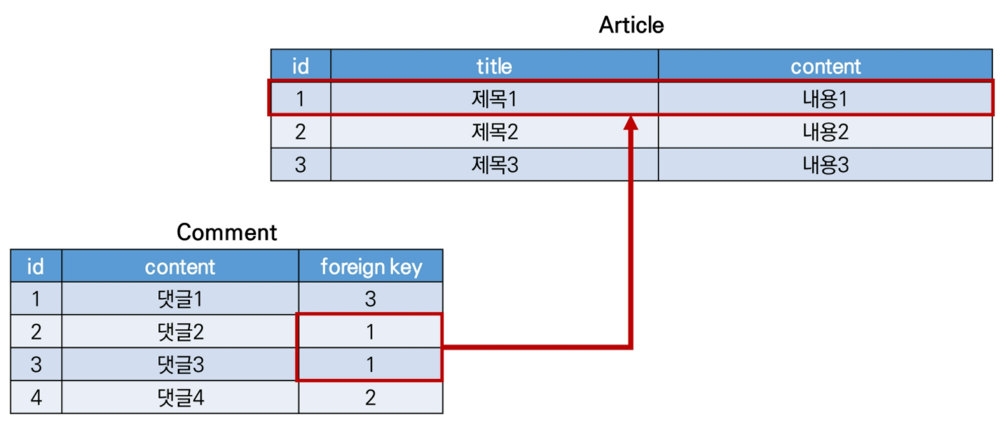

## Model Relationship I

### Foreign Key

- 개념

  - 다른 테이블 행 식별 키

  - 참조하는 테이블 : 1개의 키 / 참조되는 테이블 : 기본 키 (Primary Key)

  - 참조하는 테이블 행 1개 -> 참조되는 테이블 행 값 대응

  - 참조 테이블 행 여러 개 -> 참조되는 테이블 동일 행 참조 가능

    

- 특징

  - 참조 무결성

- Field

  - many-to-one relationship

  - 위치인자 필요 : 참조하는 model class, `on_delete` 옵션

    - 외래 키 참조 객체가 사라졌을 때 외래 키 가진 객체 어떻게 처리할 지 정의
    - `CASCADE` : 부모 객체 (참조 된) 삭제 시 참조하는 객체도 삭제

  - migrate 시 필드 이름에 `_id` 추가 -> 열 이름

    ```python
    # Comment 모델정의
    # articles/models.py
    
    class Comment(models.Model):
        article = models.ForeignKey(Article, on_delete=models.CASCADE, related_name='comments')
        content = models.CharField(max_length=200)
        created_at = models.DateTimeField(auto_now_add=True)
        updated_at = models.DateTimeField(auto_now=True)
        
        def __str__(self):
            return self.content
    ```

    - `related_name` 
      - 역참조 시 사용 이름 ('model_set' manager) 변경 옵션
      - `article.comment_set` -> `article.comments` 대체
      - migration 과정 필요

- 1 : N 관계 related manager

  - 역참조 `comment_set`
    - Article (1) -> Comment (N)
    - `article.comment_set` manager 생성
    - 댓글 몇개인지 보장 X
      - Article 클래스는 Comment와 관계 작성 X
  - 참조 `article`
    - Comment (N) -> Article (1)
    - 참조 게시물 존재 -> `comment.article` 접근 가능

### Comment Create

- `CommentForm` 작성

  ```python
  # articles/forms.py
  
  from .models import Article, Comment
  
  Class CommentForm(forms.ModelForm):
      class Meta:
          model = Comment
          fields = '__all__'
  ```

- details 페이지에서 `CommentForm` 출력

  ```python
  # articles/views.py
  
  from .forms import ArticleForm, CommentForm
  
  def detail(request, pk):
      article = get_object_or_404(Article, pk=pk)
      comment_form = CommentForm()
      context = {
          'article': article,
          'comment_form': comment_form,
      }
      return render(request, 'articles/detail.html', context)
  ```

  ```html
  <!-- articles/detail.html -->
  
  
  
  	<a href="">back</a>
  	<hr>
  	<form action="" method="POST">
      	
          {{ comment_form }}
          <input type="submit">
  	</form>
  
  ```

  ```python
  # articles/forms.py
  
  Class CommentForm(forms.ModelForm):
      class Meta:
          model = Comment
          exclude = ('article',)
  ```

- 댓글 작성 로직

  ```python
  # articles/urls.py
  
  app_name = 'articles'
  urlpatterns = [
      path('<int:pk>/comments/', views.comments_create, name='comments_create'),
  ]
  ```

  ```html
  <!-- articles/detail.html -->
  
  <form action="" method="POST">
      
      {{ comment_form }}
      <input type="submit">
  </form>
  ```

  ```python
  # articles/views.py
  
  @require_POST
  def comments_create(request, pk):
      article = get_object_or_404(Article, pk=pk)
      comment_form = CommentForm(request.POST)
      if comment_form.is_valid():
          comment = comment_form.save(commit=False)
          comment.article = article
          comment.save()
      return redirect('articles:detail', article.pk)
  ```

- `save(commit=False)`

  - Create but don't save the new instance
  - 아직 DB에 저장되지 않은 인스턴스 반환
  - 저장 전 객체 사용자 지정 처리 수행 시

### Comment Read

- 댓글 출력

  ```python
  # articles/views.py
  
  from .models import Article, Comment
  
  def detail(request, pk):
      article = get_object_or_404(Article, pk=pk)
      comment_form = CommentForm()
      comments = article.comment_set.all()
      context = {
          'article': article,
          'comment_form': comment_form,
          'comments': comments,
      }
      return render(request, 'articles/detail.html', context)
  ```

  ```html
  <!-- articles/detail.html -->
  
  
  
  	<a href="">back</a>
  	<hr>
  	<h4>댓글 목록</h4>
  	<ul>
      	
          	<li>{{ comment.content }}</li>
          
  	</ul>
  	<hr>
  
  ```

### Comment Delete

- 댓글 삭제 후 detail page에서 댓글 삭제 확인

  ```python
  # articles/urls.py
  
  app_name = 'articles'
  urlpatterns = [
      path('<int:article_pk>/comments/<int:comment_pk>/delete/', views.comments_delete, name='comments_delete'),
  ]
  ```

  ```html
  <!-- articles/detail.html -->
  
  
  	<h4>댓글 목록</h4>
  	<ul>
      	
          	<li>
                  {{ comment.content }}
          		<form action="" method="POST" class="d-inline">
              		
              		<input type="submit" value="DELETE">
          		</form>
              </li>
          
  	</ul>
  	<hr>
  
  ```

  ```python
  # articles/views.py
  
  @require_POST
  def comments_delete(request, article_pk, comment_pk):
      comment = get_object_or_404(Comment, pk=comment_pk)
      comment.delete()
      return redirect('articles:detail', article_pk)
  ```

- 인증된 사용자만 댓글 작성 및 삭제

  ```python
  # articles/views.py
  
  @require_POST
  def comments_create(request, pk):
      if request.user.is_authenticated:
      	article = get_object_or_404(Article, pk=pk)
      	comment_form = CommentForm(request.POST)
          if comment_form.is_valid():
              comment = comment_form.save(commit=False)
              comment.article = article
              comment.save()
      	return redirect('articles:detail', article.pk)
      return redirect('accounts:login')
  
  @require_POST
  def comments_delete(request, article_pk, comment_pk):
      if request.user.is_authenticated:
          comment = get_object_or_404(Comment, pk=comment_pk)
          comment.delete()
      return redirect('articles:detail', article_pk)
  ```

### Comments 추가사항

- 댓글 개수 출력

  - `{{ comments|length }}`
  - `{{ article.comment_set.all|length }}`
  - `{{ comments.count }}`

  ```html
  <!-- articles/detail.html -->
  
  <h4>댓글 목록</h4>
  
  	<p><b>{{ comments|length }}개의 댓글이 있습니다.</b></p>
  
  ```

- 댓글 없을 때 대체 콘텐츠 출력 : `DTL for-empty 태그`

  ```html
  <!-- articles/detail.html -->
  
  <ul>
      
      	<li>
      		{{ comment.content }}
              <form action="" method="POST" class="d-inline">
                  
                  <input type="submit" value="DELETE">
              </form>
      	</li>
      
      	<p>댓글이 없어요..</p>
      
  </ul>
  ```

## Customizing authentication in Django

### Substituting a custom User model

- User 모델 대체

  - `AUTH_USER_MODEL` 값 제공 -> default user model 재정의 (override)
  - 커스텀 유저 모델 설정

- `AUTH_USER_MODEL`

  - 프로젝트 진행 중 변경 X
  - 기본 값 : `auth.User`

- Custom User 모델 정의

  ```python
  # accounts/models.py
  # + 관리자 권한, AbstratUser 상속
  from django.contrib.auth.models import AbstractUser
  
  class User(AbstractUser):
      pass
  ```

  ```python
  # settings.py
  # auth 앱 User 모델 -> accounts 앱 User 모델 사용
  
  AUTH_USER_MODEL = 'accounts.User'
  ```

  ```python
  # accounts/admin.py
  # admin site에 Custom User 모델 등록
  
  from django.contrib import admin
  from django.contrib.auth.admin import UserAdmin
  from .models import User
  
  admin.site.register(User, UserAdmin)
  ```

### Custom user & Built-in auth forms

```python
from django.contrib.auth.forms import UserCreationForm
from myapp.models import CustomUser

class CustomUserCreationForm(UserCreationForm):
    class Meta(UserCreationForm.Meta):
        model = CustomUser
        fields = UserCreationForm.Meta.fields + ('custom_field',)
```

- UserCreationForm 확장

  ```python
  # accounts/forms.py
  
  from django.contrib.auth.forms import UserChangeForm, UserCreationForm
  
  class CustomUserCrationForm(UserCreationForm):
      class Meta(UserCreationForm.Meta):
          model = get_user_model()
          fields = UserCreationForm.Meta.fields + ('email',)
  ```

- signup view 수정

  ```python
  # accounts/views.py
  
  from .forms import CustomUserChangeForm, CustomUserCreationForm
  
  def signup(request):
      if request.user.is_authenticated:
          return redirect('articles:index')
      if request.method == 'POST':
          form = CustomUserCreationForm(request.POST)
          if form.is_valid():
              user = form.save()
              auth_login(request, User)
              return redirect('articles:index')
      else:
          form = CustomUserCreationForm()
      context = {
          'form': form,
      }
      return render(request, 'accounts/signup.html', context)
  ```

- `get_user_model()`

  - 현재 활성화된 User 모델 반환
  - `django.contrib.auth.get_user_model()` 참조

## Model Relationship II

### User-Article (1:N)

- User 모델 참조

  - `settings.AUTH_USER_MODEL`
    - User 모델 외래 키, 다대다 관계 정의
    - `models.py`에서 User 모델 참조
  - `get_user_model()`
    - 현재 활성화된 User 모델 반환
    - `models.py` 아닌 다른 모든 곳에서 유저 모델 참조 시

- 모델 관계 정의 후

  ```python
  # articles/models.py
  from django.conf import settings
  
  class Article(models.Model):
      user = models.ForeignKey(settings.AUTH_USER_MODEL, on_delete=models.CASCADE)
  ```

- 게시글 출력 필드 수정

  ```python
  # articles/forms.py
  
  class Article(forms.ModelForm):
      class Meta:
          model = Article
          fields = ('title', 'content',)
  ```

- CREATE

  ```python
  # articles/views.py
  
  @login_required
  @require_http_method(['GET', 'POST'])
  def create(request):
      if request.method == 'POST':
          form = ArticleForm(request.POST)
          if form.is_valid():
              article = form.save(commit=False)  # 게시글 작성 시 작성자 정보 추가 후 게시글 작성 재시도
              article.user = request.user
              article.save()
              return redirect('articles:detail', article.pk)
  ```

- DELETE

  ```python
  # articles/views.py
  
  @require_POST
  def delete(request, pk):
      article = get_object_or_404(Article, pk=pk)
      if request.user.is_authenticated:
          if request.user == article.user:  # 자신이 작성한 게시글만 삭제
              article.delete()
              return redirect('articles:index')
      return redirect('articles:detail', article.pk)
  ```

- UPDATE

  ```python
  # articles/views.py
  
  @login_required
  @require_http_method(['GET', 'POST'])
  def update(request, pk):
      article = get_object_or_404(Article, pk=pk)
      if request.user == article.user:  # 자신이 작성한 게시글만 수정
          if request.method == 'POST':
              form = ArticleForm(request.POST, instance=article)
              if form.is_valid():
                  form.save()
                  return redirect('articles:detail', article.pk)
          else:
              form = ArticleForm(instance=article)
      else:
          return redirect('articles:index')
      context = {
          'form': form,
      }
      return render(request, 'articles/update.html', context)
  ```

- READ

  ```html
  <!-- articles/index.html -->
  
  
  
  	...
  	
  		<p><b>작성자 : {{ article.user }}</b></p> <!-- 게시물 작성 user 출력 -->
  		<p>글 번호 : {{ article.pk }}</p>
  		<p>글 제목 : {{ article.title }}</p>
  		<p>글 내용 : {{ article.content }}</p>
  		<a href="">DETAIL</a>
  		<hr>
  	
  
  ```

  ```html
  <!-- articles/detail.html -->
  
    <!-- 작성자 아니면 수정/삭제 출력 X -->
  	<a href="">{UPDATE]</a>
  	<form action="" method="POST">
      	
          <input type="submit" value="DELETE">
  	</form>
  
  ```

### User-Comment (1:N)

- User ~ Comment 모델 관계 정의

  ```python
  # articles/models.py
  class Comment(models.Model):
      article = models.ForeignKey(Article, on_delete=models.CASCADE)
      user = models.ForeignKey(settings.AUTH_USER_MODEL, on_delete=models.CASCADE)
  ```

- 댓글 출력 필드 수정

  ```python
  # articles/forms.py
  
  class CommentForm(forms.ModelForm):
      class Meta:
          model = Comment
          exclude = ('article', 'user',)  # 댓글 작성 시 user ForeignKeyField 출력 X
  ```

- CREATE

  ```python
  # articles/views.py
  
  @require_POST
  def comments_create(request, pk):
      if request.user.is_authenticated:
          article = get_object_or_404(Article, pk=pk)
          comment_form = CommentForm(request.POST)
          if comment_form.is_valid():
              comment = comment_form.save(commit=False)
              comment.article = article
              comment.user = request.user  # 댓글 작성 시 작성자 정보 추가
              comment.save()
          ...
  ```

- READ

  ```html
  <!-- articles/detail.html -->
  
    <!-- 비로그인 시 댓글 form 출력 숨기기 -->
  	<form action="" method="POST">
      	
          {{ comment_form }}
          <input type="submit">
  	</form>
  
  	<a href="">[댓글을 작성하려면 로그인하세요]</a>
  
  
  
  	<li>
  		{{ comment.user }} - {{ comment.content }}
          <form action="" method="POST" class="d-inline">
              
              <input type="submit" value="DELETE">
          </form>
  	</li>
  
  	<p>댓글이 없어요..</p>
  
  ```

- DELETE

  ```html
  <!-- articles/detail.html -->
  
  
  	<li>
  		{{ comment.user }} - {{ comment.content }}
            <!-- 자신이 작성한 댓글만 삭제 버튼 보게 -->
              <form action="" method="POST" class="d-inline">
                  
                  <input type="submit" value="DELETE">
              </form>
          
  	</li>
  
  	<p>댓글이 없어요..</p>
  
  ```

  ```python
  # articles/views.py
  
  @require_POST
  def comments_delete(request, article_pk, comment_pk):
      if request.user_is_authenticated:
          comment = get_object_or_404(Comment, pk=comment_pk)
          if request.user == comment.user:  # 자신이 작성한 댓글만 삭제
              comment.delete()
      return redirect('articles:detail', article_pk)
  ```

  

  
