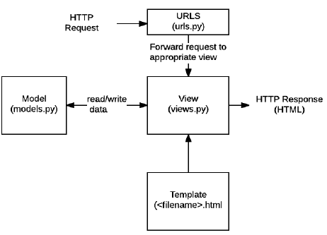
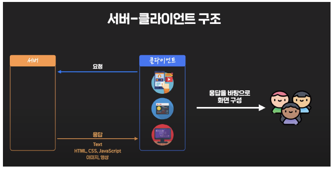
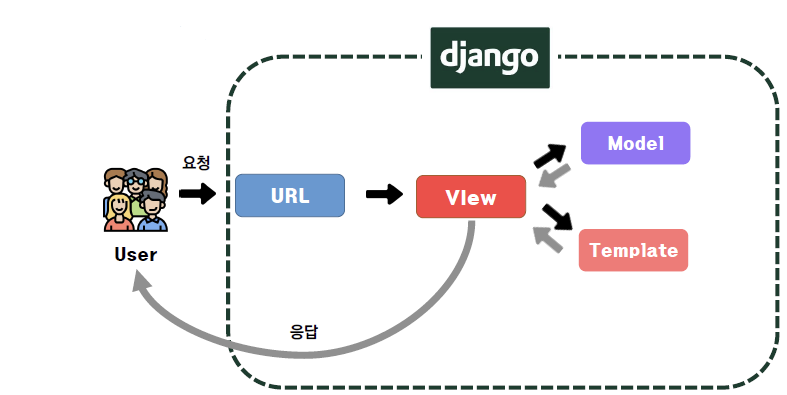
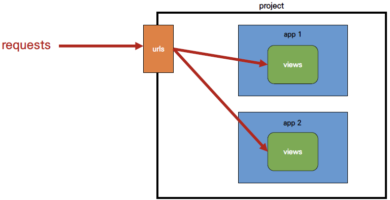
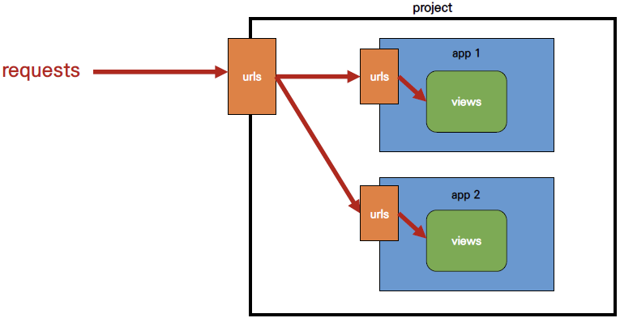
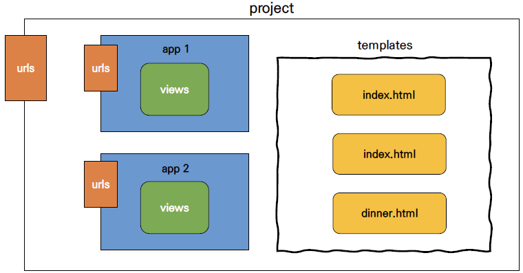
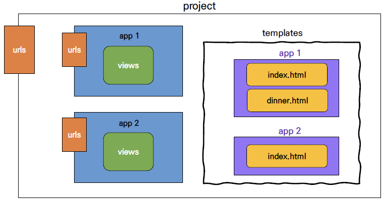

## Django

### Web Framework

- Python Web Framework
- Without reinvent the wheel

#### Framework

- 특정 운영 체제를 위한 응용 프로그램 표준 구조를 구현하는 클래스, 라이브러리 모임
- 재사용 가능한 코드 통합 -> 표준 코드 재작성 없이 같이 사용 가능

### Framework Architecture

- MVC Design Pattern (Model - View - Controller)
- User Interface에서 프로그램 로직 분리 -> 시각적 요소, 실행 부분을 서로 영향 없이 쉽게 고칠 수 있는 어플리케이션 제작
- MTV Pattern

#### MTV Pattern

- Model

  - 데이터 구조 정의, DB 기록 관리 (추가, 수정, 삭제)

- Template

  - 파일 구조, 레이아웃
  - 실제 내용 보여주기 (Presentation)

- View

  - HTTP 요청 수신, 응답 반환
  - Model -> 요청
  - Template에게 응답 서식 설정

- |    MVC     | MTV (Django) |
  | :--------: | :----------: |
  |   Model    |    Model     |
  |    View    |   Template   |
  | Controller |     View     |

- 

### Intro

```
# django 설치
$ pip install django

# 패키지 목록 확인
$ pip list

# 프로젝트 생성
$ django-admin startproject firstpjt .

# 서버 실행
$ python manage.py runserver
```

- 프로젝트 구조

  - `__init__.py` : 이 디렉토리를 하나의 Python 패키지로 다루도록
  - `asgi.py` : django 어플리케이션이 비동기식 웹 서버와 연결, 소통하도록
  - `settings.py` : 모든 설정
  - `urls.py` : url과 views 연결
  - `wsgi.py` : django 어플리케이션이 웹 서버와 연결, 소통하도록
  - `manage.py` : 커맨드라인 유틸리티

- 어플리케이션 구조

  - `admin.py` : 관리자용 페이지
  - `apps.py` : 앱 정보
  - `models.py` 
  - `tests.py` : 테스트 코드
  - `views.py` 

- Project & Application

  - Project : Application의 집합
  - Application : 실제 요청 처리

- 앱 등록

  - ```python
    # setting.py
    INSTALLED_APPS = [
        # 여기에 등록
    ]
    ```

### 요청, 응답





```python
# urls.py : HTTP 요청 (request)을 view로 전달
from django.contrib import admin
from django.urls import path
from articles import views

urlpatterns = [
    path('admin/', admin.site.urls),
    path('index/', views.index),
]

# views.py 
from django.shortcuts import render

def index(request):
    return render(request, 'index.html')
```

```html
<!-- articles/templates/index.html : app 폴더 안 templates 폴더-->
<h1>
    만나서 반가워요!
</h1>
```

```python
# settings.py
LANGUAGE_CODE = 'ko-kr' # 번역, USE_I18N 활성화 필요
TIME_ZONE = 'Asia/Seoul' # DB 연결 시간대 문자열 지정, USE_TZ True 필요
```

- `USE_I18N` : 번역 시스템 활성화 여부
- `USE_L10N` : True -> locale 형식으로 숫자, 날짜
- `USE_TZ` : True -> 시간대 인식 날짜, 시간

### Template

- Static Web Page

  - 서버에 미리 저장된 파일 -> 사용자 전달
  - 서버 : 추가적 처리 과정 없이 클라이언트에 응답
  - 모든 상황에서 모든 사용자에게 동일한 정보 표시
  - `HTML`, `CSS`, `JavaScript`
  - flat page

- Dynamic Web Page

  - 서버 : 추가적 처리 과정 이후 클라이언트에 응답
  - 방문자와 상호작용 -> 그때그때 다름
  - 서버 사이드 프로그래밍 언어 (`python`, `java`, `c++`)

- DJango Template

  - built-in system
  - Language
    - 조건, 반복, 변수 치환, 필터
    - 프레젠테이션 표현

- DTL Syntax

  - Variable

    - ```django
      {{ variable }}
      ```

    - `render()`를 사용하여 `views.py`에 정의한 변수를 `template` 파일로 넘겨서 사용

    - 밑줄로 시작 불가

    - `dot, .`으로 변수 속성 접근

    - `render()` 세번째 인자, `{'key': value}` 딕셔너리 형태 -> key : template 변수

  - Filter

    - ```django
      {{ variable|filter}}
      ```

  - Tag

    - ```django
      
      ```

  - Comments

    - ```django
      {# #}
       
      여러 줄 주석
      
      ```

```python
# urls.py
urlpatterns = [
    path('admin/', admin.site.urls),
    path('index/', views.index),
    path('greeting/', views.greeting),
]

# views.py
def greeting(request):
    return render(request, 'hello.html', {'name': 'Alice'})
```

```html
<!-- greeting.html -->
<p>
    안녕하세요 저는 {{ name }}입니다.
</p>
```


```python
# views.py
def greeting(request):
    foods = ['apples', 'banana', 'coconut',]
    info = {
        'name' : 'Alice'
    }
    context = {
        'foods' : foods,
        'info' : info,
    }
    return render(request, 'greeting.html', context)
```

```html
<!-- greeting.html -->
<p>
    안녕하세요 저는 {{ info.name }} 입니다. 
</p>
<p>
    제가 좋아하는 음식은 {{ foods }} 입니다.
</p>
<p>
    {{ foods.0 }}을 가장 좋아합니다.
</p>
<a href="/index/">뒤로</a>
```


```python
# urls.py
urlpatterns = [
    ...
    path('dinner/', views.dinner),
]

# views.py
import random

def dinner(request):
    foods = ['족발', '햄버거', '치킨', '초밥']
    pick = random.choice(foods)
    context = {
        'pick' : pick,
        'foods' : foods,
    }
    return render(request, 'dinner.html', context)
```

```html
<!-- dinner.html -->
<h1>
    오늘 저녁은 {{ pick }}!
</h1>
<p>
    {{ pick}}은 {{ pick|length }}글자
</p>
<p>
    {{ foods|join:", " }}
</p>

<p>
    메뉴판
</p>
<ul>
    
    	<li>{{ food }}</li>
    
</ul>
<a href="/index/">뒤로</a>
```


- Template Inheritance (템플릿 상속)

  - 재사용성

  - Tag

    - ```django
       
      ```

      - 자식 템플릿이 부모 템플릿 확장
      - 최상단에

    - ```django
      
      
      ```

      - 하위 템플릿에서 재지정할 수 있는 블록

  - ```python
    TEMPLATES = {
        ...
        'DIRS' : [BASE_DIR / 'templates'],
    }
    ```

  - ```html
    <!-- firstpjt/template/base.html -->
    
    ...
    
    
    ```

  - ```html
    <!-- index.html -->
    
    
    
    	<h1>
            만나서 반가워요!
    	</h1>
    	<a href="/greeting/">greeting</a>
    	<a href="/dinner/">dinner</a>
    	<a href="/dtl-practice/">dtl-practice</a>
    
    ```

  - 표현과 로직 (view) 분리

  - 중복 배제

### HTML Form

- form

  - 사용자 입력 방식 제공
    - `text`, `button`, `checkbox`, `file`, `hidden`, `image`, `password`, `radio`, `reset`, `submit`
  - 할당 데이터 -> 서버 전송
  - 속성
    - `action` : 입력 데이터 전송 URL 지정
    - `method` : 입력 데이터 전달 방식 지정

- input

  - 속성
    - `name`
    - 중복 가능, 
    - GET/POST 방식 : `?key=value&key=value`

- label

  - UI 항목 설명 (caption)
  - input과 연결
    - input에 id 부여
    - label에 input id와 동일한 for 필요
    - focus, activate 가능

- for

  - for 속성 값과 일치 id 문서의 첫 번째 요소 제어
  - `button`, `input (not hidden type)`, `select`, `textarea`

- id

  - 고유한 식별자
  - `linking`, `scrpiting`, `styling` 시 요소 식별

- HTTP

  - `HyperText Transfer Protocol`

  - 데이터 교환 기초 -> method

  - `GET`, `POST`, `PUT`, `DELETE`

    - `GET` : 정보 조회, 데이터 전송 시 Query String Parameters  통해서 전송

  - ```python
    # urls.py
    urlpatterns = [
        ...
        path('throw/', views.throw),
    ]
    
    # views.py
    def throw(request):
        return render(request, 'throw.html')
    ```

  - ```html
    <!-- throw.html -->
    
    
    
    
    	<h1>Throw</h1>
    	<form action="#" method="#">
            <label for="message">Throw</label>
            <input type="text" id="message" name="message">
            <input type="submit">
    	</form>
    
    ```

```python
# urls.py
urlpatterns = [
    ...
    path('catch/', views.catch),
]

# views.py
def catch(request):
    message = request.GET.get('message')
    context = {
        'message' : message,
    }
    return render(request, 'catch.html', context)
```

```html
<!-- catch.html -->



	<h1>Catch</h1>
	<h2>여기서 {{ message }}를 받았어!!</h2>
	<a href="/throw/">다시 던지러</a>

```

### URL

- Variable Routing

  - URL 주소를 변수로 사용

  - URL 일부 : 변수 지정 -> view 함수 인자로

  - ```python
    path('/accounts/user/<int:user_pk>/',...)
    ```

    - accounts/user/1
    - accounts/user/2

- Path Converters

  - str

    - `/`를 제외하고 비어 있지 않은 모든 문자열 매치
    - 작성 X : 기본 값

  - int

    - 0 or 양의 정수 매치

  - slug

    - ASCII 문자, 숫자, -, _ 
    - ex : `building-your-1st-django-site`

  - ```python
    # urls.py
    
    urlpatterns = [
        ...
        path('hello/<name>', views,hello),
    ]
    
    # views.py
    
    def hello(request, name):
        context = {
            'name' : name,
        }
        return render(request, 'hello.html', context)
    ```

  - ```html
    <!-- hello.html -->
    
    
    
    	<h1>만나서 반가워요 {{ name }}님!</h1>
    
    ```

- App URL Mapping

```python
# firstpjt/urls.py
from articles import views as articles_views
from pages import views as pages_views

urlpatterns = [
    ...,
    path('pages-index', pages_views.inde),
]
```

```python
# articles/urls.py
from django.urls import path
from . import views

urlpatterns = [
    path('index/', views.index),
    path('greeting/', views.greeting),
    path('dinner/', views.dinner),
    path('hello/<str:name>', views,hello),
    path('dtl-practice/', views.dtl_practice),
    path('throw/', views.throw),
    path('catch/', views.catch),
]

# pages/urls.py
from django.urls import path

urlpatterns = [
    
]
```

- Including other URL

  ```python
  # firstpjt/urls.py
  
  from django.contrib import admin
  from django.urls import path, include
  
  urlpatterns = [
      path('admin/', admin.site.urls),
      path('articles/', include('articles.urls')),
      path('pages/', include('pages.urls')),
  ]
  ```

  - `include()`
    - 다른 `URLconf` `(app/urls.py)`을 참조
    - URL 시점까지 일치하는 부분 자르기 -> 남은 문자열 부분 : include 된 `URLconf`로 전달
    - `from .module import ..`







- Naming

  - ```python
    path('index/', views.index, name='index'),
    ```

  - ```html
    <a href="">메인 페이지</a>
    ```

  - ```python
    # articles/urls.py
    
    urlpatterns = [
        path('index/', views.index, name='index'),
        path('greeting/', views.greeting, name='greeting'),
        path('dinner/', views.dinner, name='dinner'),
        path('hello/<str:name>', views,hello, name='hello'),
        path('dtl-practice/', views.dtl_practice, name='dtl_practice'),
        path('throw/', views.throw, name='throw'),
        path('catch/', views.catch, name='catch'),
    ]
    ```

- url template tag

  - ```django
    
    ```

  - 절대 경로 주소 반환

  - ```html
    <!-- index.html -->
    
    
    
    
    	<h1>만나서 반가워요!</h1>
    	<a href="">greeting</a>
    	<a href="">dinner</a>
    	<a href="">dtl_practice</a>
    	<a href="">throw</a>
    {% endblock % }
    
    <!-- dinner, dtl_practice, greeting, throw.html -->
    
    <a href="">뒤로</a>
    
    <!-- throw.html -->
    
    
    
    
    	<h1>Throw</h1>
    	<form action="" method="GET">
        </form>
    	<a href="">뒤로</a>
    {% endblock % }
    
    <!-- catch.html -->
    
    
    
    
    	<h1>Catch</h1>
    	<h2>여기서 {{ message }}을 받았어!!</h2>
    	<a href="">다시 던지러</a>
    {% endblock % }
    ```

### Namespace

- 서로 다른 app의 같은 이름 을 가진 url name : 이름 공간 설정 구분

- django : 중간에 폴더 임의

- ```python
  # pages/urls.py
  from django.urls import path
  from . import views
  
  urlpatterns = [
      path('index/', views.index, name='index',)
  ]
  
  # pages/views.py
  def index(request):
      return render(request, 'index.html')
  ```

- ```html
  <!-- pages/templates/index.html -->
  
  
  
  	<h1>두번째 앱의 index</h1>
  
  
  <!-- articles/templates/index.html -->
  
  
  
  
  	<h1>만나서 반가워요!</h1>
  	<a href="">greeting</a>
  	<a href="">dinner</a>
  	<a href="">dtl_practice</a>
  	<a href="">throw</a>
  
  	<h2><a href="">두번째 앱 index로 이동</a></h2>
  
  ```

  - 문제
    - articles 앱 index 페이지에서 pages index로 이동하는 링크 클릭 -> 현재 페이지 이동
      - URL namespace
    - pages index url로 이동해도 articles index 출력
      - Template namespace

- URL namespace

  - 이름이 지정된 URL을 고유하게 사용 가능

  - `urls.py`에 `"app_name"` attribute 값 작성

  - 참조 `:`

    - ```python
      app_name = 'articles'
      urlpatterns = [
          path('admin/', admin.site.urls),
          path('index/', views.index, name='index'),
      ]
      ```

    - ```html
      <a href="">메인 페이지</a>
      ```

  - ```python
    # articles.urls.py
    app_name = 'articles'
    urlpatterns = [
        ...
    ]
    
    # pages/urls.py
    app_name = 'pages'
    urlpatterns = [
        path('index/', views.index, name='index'),
    ]
    ```

  - ```html
    <!-- catch.html -->
    <a href="">다시 던지러</a>
    
    <!-- greeting, dtl_practice, dinner.html -->
    <a href="">뒤로</a>
    
    <!-- throw.html -->
    
    
    
    	<h1>Throw</h1>
    	<form action="" method="GET">
        	<label for="message">Throw</label>
            <input type="text" id="message" name="message">
            <input type="submit" value="던져">
    	</form>
    	<a href="">뒤로</a>
    
    
    <!-- articles/templates/index.html -->
    
    
    
    	<h1>만나서 반가워요!</h1>
    	<a href="">greeting</a>
    	<a href="">dinner</a>
    	<a href="">dtl_practice</a>
    	<a href="">throw</a>
    
    	<h2><a href="">두번째 앱 index로 이동</a></h2>
    
    ```

- Template namespace

  - templates 폴더 구조를 `app_name/template/app_name`으로 변경

  - ```python
    # articles/views.py
    def index(request):
        return render(request, 'articles/index.html')
    
    # pages/views.py
    return render(request, 'pages/index.html')
    ```





