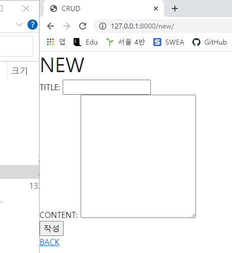

> - Article CR
>
> CR 을 갖춘 장고 프로젝트를 제작하고 결과 사진과 코드를 별도의 마크다운 파일에 작성하여 제출하시오 .
>
> - 기본 설정
>
> 1) 프로젝트 이름은 crud, 앱 이름은 articles 로 설정한다
> 2) 모든 템플릿에서 상속받아 사용할 base.html 을 작성한다 . base.html 이 위치한 templates 디렉토리는 프로젝트 및 앱 디렉토리와 동일한 위치에 생성한다. base.html 은 Bootstrap CDN 을 포함하고 있어야 한다 .

1. Read

   

2. Create

   

   
   
   ```python
   # urls.py
   from django.urls import path
   from . import views
   
   app_name = 'articles'
   urlpatterns = [
       path('', views.index, name='index'),
       path('new/', views.new, name='new'),
       path('create/', views.create, name='create'),
       path('detail/', views.detail, name='detail')
   ]
   
   ```

   ```python
   # views.py
   from django.shortcuts import redirect, render
   from .models import Article
   
   # Create your views here.
   def index(request):
   
       articles = Article.objects.all()
   
       context = {
           'articles' : articles,
       }
   
       return render(request, 'articles/index.html', context)
   
   def new(request):
       return render(request, 'articles/new.html')
   
   def create(request):
       if request.method == "POST":
           articles = Article()
   
           articles.title = request.POST.get('title')
           articles.content = request.POST.get('content')
   
           articles.save()
   
       return redirect('articles:index')
   
   def detail(request):
       return render(request, 'articles/detail.html')
   ```
   
   ```html
   <!-- index.html -->
   
   
   
   
     <h1>INDEX</h1>
     
     <a href="">NEW</a>
     <br>
     
     
     <br>
     <h2>제목: {{ article.title}}</h2>
     <p>내용: {{ article.content }}</p>
     <a href="">DETAIL</a>
     <br>
     <br>
     
   
      {{ articles.title }} 
   
   ```
   
   ```html
   <!-- new.html -->
   
   
   
     <h1>NEW</h1>
   
     <form action="" method="POST">
       
       <label for="title">TITLE:</label>
       <input type="text" id="title" name="title"><br>
       <label for="content">CONTENT:</label>
       <textarea name="content" id="content" cols="30" rows="10"></textarea><br>
       <input type="submit" value="작성">
     
     </form>
   
     <a href="">BACK</a>
     
   
   
   ```
   
   

