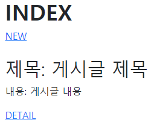
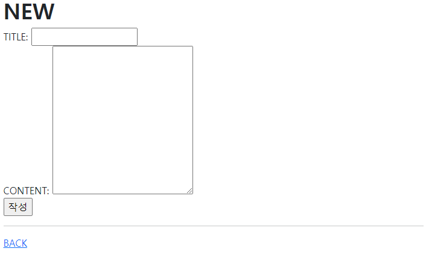

> - Article CR
>
> CR 을 갖춘 장고 프로젝트를 제작하고 결과 사진과 코드를 별도의 마크다운 파일에 작성하여 제출하시오 .
>
> - 기본 설정
>
> 1) 프로젝트 이름은 crud, 앱 이름은 articles 로 설정한다
> 2) 모든 템플릿에서 상속받아 사용할 base.html 을 작성한다 . base.html 이 위치한 templates 디렉토리는 프로젝트 및 앱 디렉토리와 동일한 위치에 생성한다. base.html 은 Bootstrap CDN 을 포함하고 있어야 한다 .

1. Read

   

   ```django
   
   
   
     <h1 class="fw-bold">INDEX</h1>
     <a href=>NEW</a>
     <br></br>
     <h2>제목: 게시글 제목</h2>
     <p>내용: 게시글 내용</p>
     <a href="">DETAIL</a>
   
   ```

2. Create

   

   ```django
   
   
   
     <h1 class="fw-bold">NEW</h1>
     <form action="" method="POST">
       <label for="title">TITLE: </label>
       <input type="text" name="title" id="title"><br>
       <label for "content">CONTENT: </label>
       <textarea name="content" id="content" cols="30" rows="10"></textarea><br>
       <input type="submit" value="작성">
     </form>
     <hr>
     <a href="">BACK</a>
   
   ```

   