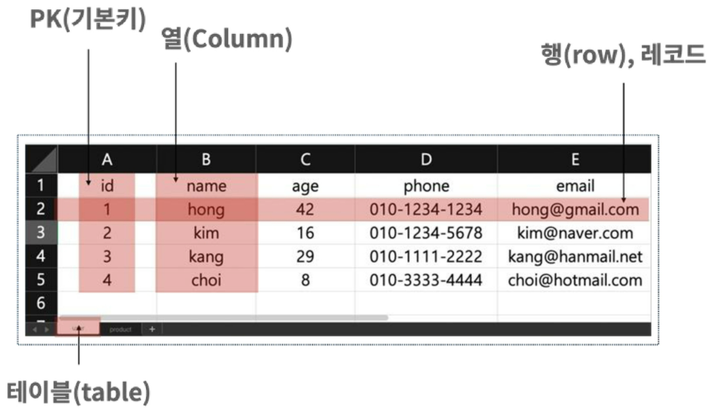
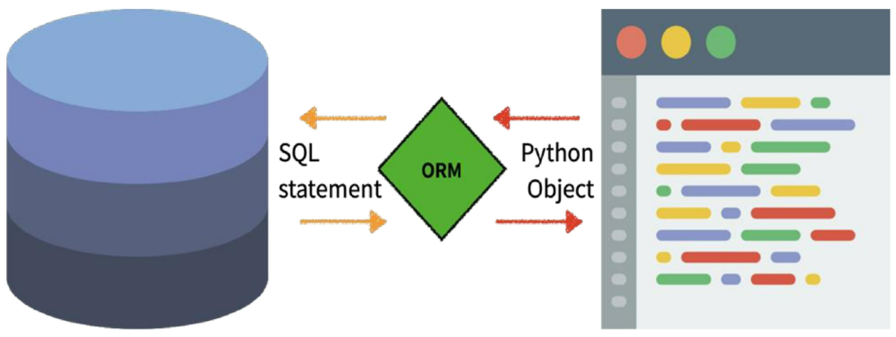

## Model

### Model

- 단일 데이터 정보 : 필드, 동작 포함
- 저장 DB 구조 (layout)
- model을 통해 데이터 접속, 관리
- 각각의 model : 하나의 DB 테이블에 mapping

### Database

- DB  : 체계화 데이터 모임
- Query : 데이터 조회 명령어 - 조건 -> 추출, 조작

### DB 기본 구조

- Schema : 자료 구조, 표현방법, 관계 정의
- Table 
  - field, column, attribute
  - record, row, tuple



## ORM

### ORM

- `Object-Relational-Mapping`
- OOP 언어 -> 시스템 간 (Django - SQL) 데이터 변환 프로그래밍 기술
- OOP 프로그래밍에서 RDMBS 연동 시 : DB ~ OOP 언어 간 호환 X 데이터 변환
- 내장 Django ORM



### 장단점

- 장점
  - SQL 몰라도 DB 조작 가능
  - 객체 지향적 접근 -> 생산성 high
- 단점
  - ORM 만으로 구현 X

### 사용 이유

- DB를 Object로 조작하기 위해

## Migrations

- model에 생긴 변화

  ```python
  # articles/models.py
  class Article(models.Model):
      title = models.CharField(max_length=10) # 필드 -> 클래스 속성, 속성 -> 열
      content = models.TextField() # 필드 -> 클래스 속성, 속성 -> 열
      created_at = models.DateTimeField(auto_now_add=True)
      updated_at = models.DateTimeField(auto_now=True)
  ```

  - 어떤 타입으로 정의
  - `CharField(max_length=None, **options)`
    - 길이 제한 문자열
    - `max_length` : 필수 인자
    - 필드 최대 길이, DB 레벨, 유효성 검사
  - `TextField(**options)`
    - 글자 수 많을 때
    - `max_length` : `textarea` 위젯  반영, 모델, DB 수준 적용 X
  - `auto_now_add`
    - 최초 생성 일자
    - django ORM이 최초 insert 시 현재 날짜, 시간
  - `auto_now`
    - 최초 수정 일자
    - django ORM이 save 할 때마다

### 명령어

- `makemigrations` 

- `migrate` : 마이그레이션 (설계도) DB 반영, 모델 변경 사항 ~ DB 스키마 동기화

- `sqlmigrate` : 마이그레이션 SQL 구문

  ```sql
  BEGIN;
  --
  -- Create model Article
  --
  CREATE TABLE "articles_article"
  ("id" integer NOT NULL PRIMARY KEY AUTOINCERMENT,
  "title" varchar(10) NOT NULL, "content" text NOT NULL);
  COMMIT;
  ```

- `showmigrations` : 전체 상태

  ```
  admin
   [X] 0001_initial
   [X] 0002_logentry_remove_auto_add
   [X] 0003_logentry_add_action_flag_choices_articles
  articles
   [X] 0001_initial
  auth
   [X] 0001_initial
   [X] 0002_alter_permission_name_max_length
   [X] 0003_alter_user_email_max_length
   [X] 0004_alter_user_username_opts
   [X] 0005_alter_user_last_login_null
   [X] 0006_require_contenttypes_0002
   [X] 0007_alter_validators_add_error_messages
   [X] 0008_alter_user_username_max_length
   [X] 0009_alter_user_last_name_max_length
   [X] 0010_alter_group_name_max_length
   [X] 0011_update_proxy_permissions
   [X] 0012_alter_user_first_name_max_length
  contenttypes
   [X] 0001_initial
   [X] 0002_remove_content_type_name
  core
   [X] 0001_initial
   [X] 0002_remove_mymodel_i
   [X] 0003_mymodel_bio
  sessions
   [X] 0001_initial
  ```

## Database API

- DB-abstract API, DB-access API 자동 제작 : 객체 CRUD

### API 구문

- `Article.objects.all()` : Class Name.Manager.QuerySet API
  - Manager
    - django model에 DB query 작업 제공 interface
    - 모든 django model class에 manager (objects) 추가 
  - QuerySet
    - DB로부터 전달받은 객체 목록
    - 조회, 필터, 정렬 가능

### Django Shell

- API 구문 테스트

## CRUD

- Create (생성), Read (읽기), Update (갱신), Delete (삭제)

```
# DB instance object 얻기 위한 query
# 하나 -> instance object, 여러 개 -> query set
>>> Article.objects.all()
<QuerySet []>
```

### Create

- ```
  # 특정 테이블에 새로운 행 추가
  >>> article = Article() # Article (class) 로부터 article (instance)
  >>> article
  <Article: Article object (None)>
  
  >>> article.title = 'first' # 인스턴스 변수 (title) 에 값 할당
  >>> article.content = 'django!' # 인스턴스 변수 (content) 에 값 할당
  
  # save
  >>> article.save()
  >>> article
  <Article: Article object (1)>
  >>> Article.objects.all()
  <QuerySet [Article: Article object (1)]
  
  # article (instance) -> 변수 접근 (저장 값 확인)
  >>> article.title
  'first'
  >>> article.content
  'django!'
  >>> article.created_at
  datetime.datetime(2021, 9, 03, 어쩌구 시간)
  ```

- ```
  >>> article.save()
  >>> article
  <Article: Article object (1)>>>> article = Article(title='second', content='django!!')
  
  >>> article
  <Article: Article object (None)>
  
  # save
  >>> article.save()
  >>> article
  <Article: Article object (2)>
  >>> Article.objects.all()
  <QuerySet [<Article: Article object (1)>, <Article: Article object (2)>]
  
  # 값 확인
  >>> article.pk
  2
  >>> article.title
  'second'
  >>> article.content
  'django!!'
  ```

- ```
  # 바로 query 리턴
  >>> Article.objects.create(title='third', content='django!!!')
  <Article: Article object (3)>
  ```

- `str` method

  ```python
  # articles/models.py
  class Article(models.Model):
      title = models.CharField(max_length=10) 
      content = models.TextField()
      created_at = models.DateTimeField(auto_now_add=True)
      updated_at = models.DateTimeField(auto_now=True)
      
      def __str__(self):
          return self.title
  ```

  - 문자열 return

### Read

- return new queryset

  ```
  >>> Article.objects.all()
  <QuerySet [<Article: Article object (1)>, <Article: Article object (2)>, <Article: Article object (3)>]
  ```

  ```
  >>> Article.objects.filter(content='django!')
  <QuerySet [<Article: first]>
  
  >>> Article.objects.filter(title='django!')
  <QuerySet [<Article: first]>
  ```

- not return queryset

  ```
  >>> Article.objects.get(pk=100)
  DoesNotExist: Article Matching query doex not exist
  
  >>> Article.objects.get(content='django!')
  ```

### Update

```
>>> article = Article.objects.get(pk=1)
>>> article.title
'first'

>>> article.title = 'byebye'
>>> article.save()

>>> article.title
'byebye'
```

### Delete

```
>>> article = Article.objects.get(pk=1)

>>> article.delete()
(1, {'articles.Article': 1})

>>> article = Article.objects.get(pk=1)
DoesNotExist: Article Matching query doex not exist
```

### Field Lookups

- SQL WHERE 지정
- `filter()`, `exclude()`, `get()`

## Admin Site

- `admin.py`
- django.contrib.auth module
- record 생성 여부 확인

### 생성

```
$ python manage.py createsuperuser
```

### 등록

```python
# articles/admin.py

from django.contrib import admin
from .models import Articles

class ArticleAdmin(admin.ModelAdmin):
    list_display = ('pk', 'title', 'content', 'created_at', 'updated_at,')

admin.site.register(Article)
```

- `__str__` 형태로 객체 표현
- `list_display` : `models.py` 정의한 attribute (column) 의 값 (record) 출력

## CRUD with views

### HTTP method

- `GET`
  - 특정 리소스 가져오도록 -> 데이터 가져올 때만
  - DB에 변화 X : Read
- `POST`
  - 서버로 데이터 전송 : 리소스 생성/변경 -> HTTP body에
  - 서버에 변경 사항 : Create, Update, Delete

### 사이트 간 요청 위조 (Cross-Site-Request-Forgery)

- 방어 : middleware, template tag
  - Security Token (CSRF Token)
    - 데이터에 난수 값 부여
    - token 유효 검증
    - `POST`, `PATCH`, `DELETE`

### Redirect

- 새 URL로 : HttpResponseRedirect 반환 -> 현재 경로 기준 전체 URL 재구성
- model, view name, absolute or relative URL